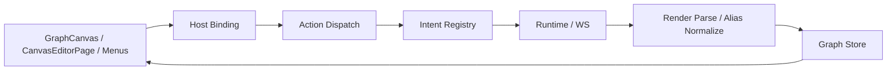
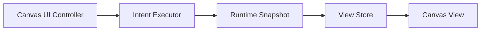

# Code Diet Bottleneck Map

이 폴더는 이 저장소를 "기능 추가"가 아니라 "복잡도 감량" 관점에서 읽기 위한 분석 묶음이다. 기준은 단순하다. 현재 구조가 과도기인지 여부와 별개로, 같은 사용자 흐름을 이해하거나 수정할 때 여러 레이어를 동시에 건드리게 만들면 병목 후보로 본다.

## 문제 요약

- 현재 병목의 중심은 `Canvas UI 오케스트레이션`, `Runtime/WS read-write 경계`, `CLI/bootstrap 표면 드리프트` 세 축이다.
- 가장 큰 공통 문제는 하나의 액션이 여러 레이어에서 다시 표현된다는 점이다.
- `read` 는 canonical runtime 쪽으로 모이고 있지만, `write` 는 아직 compatibility patch 경로가 강하게 남아 있다.
- UI 쪽은 `components`, `features`, `processes`, `store` 가 분리되어 있지만 실제 수정 단위는 자주 한 덩어리로 움직인다.
- CLI 쪽은 실제 시작 경로, 문서 설명, import identity 가 여러 시대의 구조를 동시에 반영하고 있다.

## 병목 분류 기준

| 병목 유형 | 의미 |
|---|---|
| 오버엔지니어링 | 현재 필요 이상으로 일반화되거나 추상화된 구조 |
| 불필요한 레이어 | 값 전달이나 재매핑만 하는 얇은 중간 계층 |
| 중복 오케스트레이션 | 같은 액션이나 규칙이 여러 파일에서 다시 구현됨 |
| 과도한 전환 계층 | 과도기 호환 코드를 중심으로 구조가 계속 유지됨 |
| 대형 파일/과잉 책임 | 한 파일이 여러 책임을 동시에 소유함 |
| 문서-코드 드리프트 | 문서가 현재 실행 경로나 코드 구조를 따라가지 못함 |

## 우선순위 Top 10 파일

| 우선순위 | 파일 | 도메인 | 병목 유형 | 왜 줄여야 하는가 |
|---|---|---|---|---|
| 1 | `app/components/GraphCanvas.tsx` | Canvas UI | 대형 파일/과잉 책임 | 렌더, selection, context menu, drag/create, overlay, keyboard, runtime binding 이 한 파일에 모여 있다. |
| 2 | `app/features/editor/pages/CanvasEditorPage.tsx` | Canvas UI | 중복 오케스트레이션 | 페이지 부트스트랩과 액션 핸들러가 `GraphCanvas` 및 action routing 과 역할이 겹친다. |
| 3 | `app/store/graph.ts` | Canvas UI | 대형 파일/과잉 책임 | graph state, workspace registry, text edit, overlay, optimistic routing 까지 한 store 에 들어가 있다. |
| 4 | `app/ws/routes.ts` + `app/ws/handlers/*` | Runtime/WS | 과도한 전환 계층 | route registry 는 얇아졌지만 domain handlers 가 runtime command 생성, compatibility patch orchestration, subscription 경계를 계속 안고 있다. |
| 5 | `app/features/editing/actionRoutingBridge/registry.ts` | Canvas UI | 오버엔지니어링 | intent normalize, gating, dispatch plan, optimistic metadata 가 한 registry 에 과밀하다. |
| 6 | `app/features/render/parseRenderGraph.ts` | Runtime/WS | 과도한 전환 계층 | legacy graph 파싱, canonical 보정, runtime projection overlay 를 동시에 수행한다. |
| 7 | `app/ws/filePatcher.ts` | Runtime/WS | 과도한 전환 계층 | whole-file AST patch 기반 write owner 가 아직 크게 남아 있다. |
| 8 | `libs/cli/src/bin.ts` | CLI/Bootstrap | 대형 파일/과잉 책임 | legacy CLI, headless resource command, server boot 경로가 한 router 에 섞여 있다. |
| 9 | `libs/shared/src/lib/canonical-query/render-canvas.ts` | Runtime/WS | 중복 오케스트레이션 | runtime snapshot 을 갖고 있으면서도 다시 legacy graph 를 만들어 앱에서 한 번 더 해석하게 만든다. |
| 10 | `scripts/desktop/dev.ts` | CLI/Bootstrap | 문서-코드 드리프트 | 실제 기본 시작 경로인데 기존 `cli.ts`/`scripts/dev/app-dev.ts` 와 병존해 부트스트랩 기준점이 흐려진다. |

## 상위 3개 도메인

- [Canvas UI 오케스트레이션](./canvas-ui-orchestration.md)
- [Runtime / WS Read-Write 경계](./runtime-read-write-boundary.md)
- [RuntimeWS 리팩터링 작업 문서](../features/m2/runtimews-refactoring/README.md)
- [CLI Bootstrap / Surface Drift](./cli-bootstrap-and-surface-drift.md)
- [전체 파일 인벤토리](./file-inventory.md)

## AS-IS 구조

현재 구조는 각 레이어가 독립적으로 보이지만, 실제로는 하나의 편집 액션이 원형 루프를 돌면서 여러 번 재해석된다.

### AS-IS 플로우 설명

- `UI`: 사용자의 클릭, 드래그, 메뉴 선택이 `GraphCanvas`, `CanvasEditorPage`, 각종 메뉴 surface 에서 시작된다.
- `Host Binding`: UI surface 별 이벤트를 host/runtime 친화적인 형태로 바꾸는 단계다.
- `Action Dispatch`: intent 를 한 번 더 envelope 로 감싸고 실행 경로를 정리한다.
- `Intent Registry`: 허용 여부, target 해석, optimistic plan, dispatch descriptor 생성이 이 계층에 몰린다.
- `Runtime / WS`: 실제 mutation 전송과 compatibility write, RPC 통신, runtime 처리 경계가 만난다.
- `Render Parse / Alias Normalize`: read 결과를 다시 UI 친화적인 graph shape 로 재구성한다.
- `Graph Store`: 최종 UI 상태를 저장하고, 다시 `UI` 가 이를 소비한다.

이 플로우의 문제는 단계 수 자체보다, 같은 의미가 단계마다 조금씩 다른 타입과 책임으로 다시 표현된다는 점이다. 그래서 한 액션의 변경이 UI, binding, registry, runtime, parser, store 를 동시에 건드리게 된다.

## TO-BE 구조

목표는 레이어 수를 무조건 줄이는 것이 아니라, 액션과 상태의 주인을 명확히 줄이는 것이다. 같은 의미를 여러 번 번역하지 않고, 한 번 정의한 intent 와 snapshot 을 다른 레이어가 그대로 소비하는 쪽이 감량 방향이다.

### TO-BE 플로우 설명

- `Canvas UI Controller`: UI 이벤트를 모으되, 화면 렌더링과 비즈니스 해석을 분리하는 상위 제어점이다.
- `Intent Executor`: intent 의미 해석과 실행 계획 생성의 단일 진입점이다. 현재의 registry/dispatch 중복 표현을 이 계층으로 수렴시킨다.
- `Runtime Snapshot`: runtime 이 mutation 의 단일 주인이 되고, read 결과도 runtime-native snapshot 으로 직접 제공한다.
- `View Store`: 화면에 필요한 최소 view state 만 가진다. shell state 와 편집기 document state 가 무한정 섞이지 않도록 좁힌다.
- `Canvas View`: React Flow 기반의 렌더 전용 surface 로 남고, runtime/registry 의 세부사항을 모른 채 상태를 소비한다.

이 구조의 핵심은 "레이어 삭제"가 아니라 "역할의 재정의"다. UI 는 UI 답게, runtime 은 runtime 답게, store 는 view state 답게 남겨서 각 계층이 한 번만 의미를 해석하도록 만드는 것이 목적이다.

## 우선 감량 후보

- `Canvas UI`: `GraphCanvas.tsx`, `CanvasEditorPage.tsx`, `graph.ts`
- `Runtime/WS`: `routes.ts`, `handlers/*`, `filePatcher.ts`, `parseRenderGraph.ts`, `render-canvas.ts`
- `CLI`: `bin.ts`, `cli.ts`, `scripts/dev/app-dev.ts`, `scripts/desktop/dev.ts`

## 보류해야 할 코어

- `libs/shared/src/lib/canvas-runtime/contracts/*`
- `libs/shared/src/lib/canonical-object-contract.ts`
- `app/processes/canvas-runtime/keyboard/*` 의 순수 key 처리 로직
- `app/features/canvas-ui-entrypoints/*/build*Model.ts` 류의 비교적 좁은 모델 계산기

## 왜 이런 구조가 나왔을까

완전히 잘못 설계되었다기보다, 서로 다른 전환이 한 저장소 안에서 겹친 결과로 보인다.

- 첫째, `file-first compatibility` 에서 `canonical runtime` 으로 옮겨가는 중간 단계가 길어지면서 read/write 기준 축이 이원화되었다.
- 둘째, 캔버스 편집기는 원래 상호작용 밀도가 높은 화면이라, 기능을 빠르게 붙일 때 `GraphCanvas`, `CanvasEditorPage`, `graph.ts` 같은 허브 파일에 책임이 계속 쌓이기 쉽다.
- 셋째, 레이어를 분리하려는 시도 자체는 많았다. `features`, `processes`, `entrypoints`, `bindings`, `registry` 는 모두 경계를 세우려는 흔적이다. 다만 확장성을 미리 준비하는 과정에서 실제 사용 빈도보다 추상화 레이어가 먼저 늘어난 부분이 있다.
- 넷째, CLI 와 부트스트랩도 웹 개발 경로, 데스크톱 경로, headless 경로가 차례대로 추가되면서 "새 경로를 올리고 옛 경로를 바로 지우지 못한" 흔적이 남아 있다.
- 다섯째, 문서도 같은 전환을 따라가다 보니 특정 시점의 설명이 유지된 채 다른 경로가 추가되어, 코드와 문서가 서로 다른 시대를 설명하게 되었다.

즉 이 구조는 한 번의 큰 실수보다는, `호환성 유지`, `기능 확장`, `아키텍처 전환`, `문서 누적` 이 동시에 일어나며 생긴 누적 복잡도에 가깝다.

## 리뷰

- 좋은 점: 이 저장소는 복잡하지만 무질서한 스파게티에 가깝다기보다, "어디를 분리하려 했는지" 가 보이는 복잡도다. 그래서 감량 방향을 잡기 어렵지 않다.
- 아쉬운 점: 현재는 경계 이름이 많지만 실제 소유권은 적다. 특히 편집 액션 하나가 여러 레이어를 돌아다니며 재해석되는 점이 유지보수 비용의 핵심이다.
- 가장 먼저 줄일 부분: `Canvas UI 오케스트레이션` 과 `Runtime/WS compatibility 경계` 다. 이 두 축을 정리하지 않으면 나머지 문서/CLI 정리도 쉽게 다시 흔들린다.
- 당장 지우지 말아야 할 부분: runtime contract, canonical object contract, 순수 projection/keyboard 계산기처럼 도메인 핵심을 담은 축이다. 현재 문제는 도메인 복잡도보다 과도기 레이어와 중복 번역 계층에 있다.
- 최종 평: 구조 자체는 "대수술이 필요한 붕괴 상태" 보다는 "기준 축을 다시 세워야 하는 과도기 상태" 에 가깝다. 그래서 리라이트보다, 주인 없는 중간 레이어를 줄이고 의미 해석 지점을 한 번씩만 남기는 정리가 더 효과적이다.
