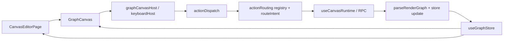
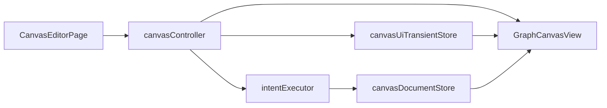

# Canvas UI Orchestration Bottleneck

## 문제 요약

- 이 영역의 핵심 병목은 화면, 상태, 액션 라우팅이 서로 다른 레이어에 나뉘어 보이지만 실제로는 같은 액션을 여러 번 다시 표현한다는 점이다.
- `GraphCanvas.tsx`, `CanvasEditorPage.tsx`, `graph.ts` 세 파일이 사실상 하나의 거대한 편집기 컨트롤러처럼 동작한다.
- `actionRoutingBridge`, `canvas-runtime bindings`, `canvas-ui-entrypoints` 는 경계를 세우려는 시도지만, 현재는 경계를 줄이기보다 액션 표현 단계를 늘리는 경우가 많다.

## 왜 복잡한가

- `GraphCanvas.tsx` 는 뷰를 넘어 drag/create, selection shell, overlay sync, keyboard host, context menu wiring 까지 소유한다.
- `CanvasEditorPage.tsx` 는 페이지 초기화뿐 아니라 runtime binding, reload, error mapping, intent handler boilerplate 를 다시 소유한다.
- `graph.ts` 는 graph state 외에 workspace registry, tabs, search, text edit, entrypoint runtime, optimistic state 를 같이 안고 있다.
- `actionRoutingBridge/registry.ts`, `routeIntent.ts`, `bindings/actionDispatch.ts` 가 같은 intent 를 서로 다른 타입과 envelope 로 다시 감싼다.
- `paneMenuItems.ts` 와 `nodeMenuItems.ts` 는 생성 가능한 타입 카탈로그를 서로 다르게 반복하고 있다.
- `workspaceRegistry.ts` 는 `components/editor` 아래에 있지만 실질적으로는 shell/app-state adapter 역할을 맡고 있다.

## AS-IS 구조

현재 구조에서 UI 액션은 `surface -> binding -> dispatch -> registry -> rpc -> parse -> store` 를 거치며, 중간 단계마다 타입과 책임이 조금씩 다시 정의된다.

## TO-BE 구조

- `CanvasEditorPage` 는 workspace 진입과 데이터 로드만 담당한다.
- `GraphCanvas` 는 React Flow 기반 view 와 DOM interaction 캡처에 집중한다.
- 액션 의미 해석은 `intentExecutor` 한곳으로 줄이고, `bindings` 는 얇은 adapter 로 축소한다.
- store 는 `canvasDocument`, `workspaceShell`, `canvasUiTransient` 로 분리한다.

## 병목 파일 리스트

### 화면 조립

| 파일 | 병목 유형 | AS-IS | TO-BE |
|---|---|---|---|
| `app/components/GraphCanvas.tsx` | 대형 파일/과잉 책임 | 뷰와 컨트롤러 역할이 혼합되어 있다. | `GraphCanvasView` 와 `useCanvasController` 성격으로 분리한다. |
| `app/features/editor/pages/CanvasEditorPage.tsx` | 중복 오케스트레이션 | workspace bootstrap 과 intent dispatch boilerplate 를 같이 가진다. | 페이지는 로드/네비게이션, 컨트롤러는 편집 동작으로 경계를 나눈다. |
| `app/components/FloatingToolbar.tsx` | 불필요한 레이어 | presentational 컴포넌트가 store 와 runtime 을 직접 참조한다. | toolbar state 는 controller 또는 binding 에서 주입받는다. |

### 상태 소유

| 파일 | 병목 유형 | AS-IS | TO-BE |
|---|---|---|---|
| `app/store/graph.ts` | 대형 파일/과잉 책임 | document state 와 shell state 와 transient UI state 가 한 store 에 있다. | 문서 상태와 세션/오버레이 상태를 분리한다. |
| `app/components/editor/workspaceRegistry.ts` | 불필요한 레이어 | `components` 아래에서 app-state migration, storage, RPC shape 변환을 맡는다. | `features/workspace-shell` 또는 `host` 쪽 adapter 로 이동한다. |

### 액션 라우팅

| 파일 | 병목 유형 | AS-IS | TO-BE |
|---|---|---|---|
| `app/features/editing/actionRoutingBridge/registry.ts` | 오버엔지니어링 | intent normalize, target resolve, optimistic plan 생성이 한 파일에 과밀하다. | registry 는 intent metadata 만, 실제 실행은 별도 executor 로 축소한다. |
| `app/processes/canvas-runtime/bindings/actionDispatch.ts` | 불필요한 레이어 | bridge registry 를 다시 생성하고 envelope 를 다시 변환한다. | binding 은 registry 를 재구성하지 말고 executor 호출만 맡는다. |
| `app/features/editing/actionRoutingBridge/routeIntent.ts` | 중복 오케스트레이션 | registry 결과를 다시 검증하고 dispatch plan 으로 바꾼다. | metadata 기반 단일 route/execute 경로로 합친다. |

### 메뉴/표면 카탈로그

| 파일 | 병목 유형 | AS-IS | TO-BE |
|---|---|---|---|
| `app/features/canvas-ui-entrypoints/pane-context-menu/paneMenuItems.ts` | 중복 오케스트레이션 | 생성 타입 목록이 pane 메뉴에 하드코딩되어 있다. | shared create catalog 를 참조한다. |
| `app/features/canvas-ui-entrypoints/node-context-menu/nodeMenuItems.ts` | 중복 오케스트레이션 | child/sibling 생성 타입 목록을 별도로 반복한다. | node/pane/toolbar 가 같은 create catalog 를 재사용한다. |
| `app/features/canvas-ui-entrypoints/selection-floating-menu/contribution.ts` | 불필요한 레이어 | registry 일부를 추출하기 위한 얇은 wrapping 이 남아 있다. | 실질적 확장 포인트가 생길 때까지 inline 또는 단순 export 로 축소한다. |

## 우선 감량 후보

- `app/components/GraphCanvas.tsx`
- `app/features/editor/pages/CanvasEditorPage.tsx`
- `app/store/graph.ts`
- `app/features/editing/actionRoutingBridge/registry.ts`
- `app/processes/canvas-runtime/bindings/actionDispatch.ts`
- `app/features/canvas-ui-entrypoints/pane-context-menu/paneMenuItems.ts`
- `app/features/canvas-ui-entrypoints/node-context-menu/nodeMenuItems.ts`

## 보류해야 할 코어

- `app/processes/canvas-runtime/keyboard/normalizeKeyEvent.ts`
- `app/processes/canvas-runtime/keyboard/keymap.ts`
- `app/features/canvas-ui-entrypoints/node-context-menu/buildNodeContextMenuModel.ts`
- `app/features/editing/editability.ts` 의 순수 판단 로직

이 코어들은 여전히 응집도가 비교적 높고, 현재 복잡도의 원인은 이 파일들보다 상위 오케스트레이션 계층에 있다.

