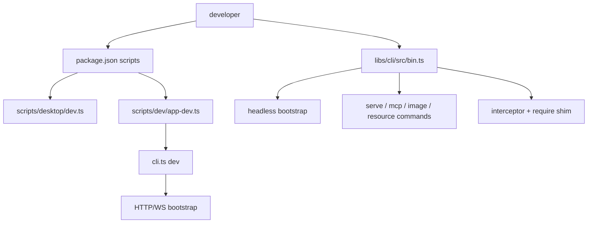
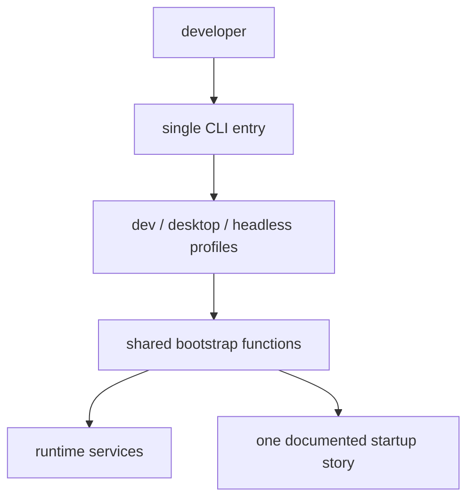

# CLI Bootstrap And Surface Drift Bottleneck

## 문제 요약

- 이 영역의 핵심 병목은 "Magam 이 어디서 시작되는가" 에 대한 기준점이 하나가 아니라는 점이다.
- `libs/cli/src/bin.ts`, `cli.ts`, `scripts/dev/app-dev.ts`, `scripts/desktop/dev.ts` 가 서로 다른 시대의 시작 경로를 동시에 유지한다.
- import identity 도 `magam`, `@magam/core`, interceptor/shim 방식이 섞여 있어 새 진입자가 시스템의 기본 표면을 파악하기 어렵다.

## 왜 복잡한가

- `libs/cli/src/bin.ts` 는 legacy CLI, headless resource command, HTTP server, MCP server, image command 를 한 router 에 모은다.
- `cli.ts` 는 별도 bun 기반 dev orchestration 을 유지하고 있고, `scripts/dev/app-dev.ts` 가 그 위를 한 번 더 감싼다.
- `scripts/desktop/dev.ts` 는 현재 기본 dev 경로인데도 기존 web-first bootstrap 과 병존한다.
- `libs/cli/src/headless/bootstrap.ts` 는 실질적인 headless runtime 기준점이지만, 각 command 가 다시 얇은 wrapping 으로 흩어진다.
- `libs/cli/src/commands/init.ts` 와 `new.ts` 는 서로 다른 import story 를 생성한다.
- `libs/core/src/index.ts` 는 authoring DSL 과 runtime/internal helper 를 한 barrel 에 노출한다.

## AS-IS 구조

문제는 경로가 많다는 사실 자체보다, 어떤 경로가 기준 경로이고 어떤 경로가 과도기 alias 인지 문서와 코드에서 명확히 드러나지 않는다는 점이다.

## TO-BE 구조

- 외부 진입점은 하나로 두고, dev/desktop/headless 는 profile 수준의 옵션으로만 분기한다.
- `scripts/*` 는 직접 진실의 원천이 아니라 `libs/cli` bootstrap 을 호출하는 얇은 alias 가 된다.
- import identity 는 하나의 공식 story 만 남기고 나머지는 제거 또는 deprecated 처리한다.

## 병목 파일 리스트

| 파일 | 병목 유형 | AS-IS | TO-BE |
|---|---|---|---|
| `libs/cli/src/bin.ts` | 대형 파일/과잉 책임 | 서로 다른 제품 시대의 command surface 가 한 router 에 섞여 있다. | 단일 command registry 와 alias 체계로 줄인다. |
| `cli.ts` | 과도한 전환 계층 | bun 전용 legacy dev orchestration 이 별도로 남아 있다. | `libs/cli` bootstrap 호출 alias 로 축소하거나 제거한다. |
| `scripts/dev/app-dev.ts` | 불필요한 레이어 | `cli.ts dev` 를 감싸는 wrapper 가 한 층 더 있다. | 공식 dev bootstrap 함수 호출만 맡는 thin alias 로 줄인다. |
| `scripts/desktop/dev.ts` | 문서-코드 드리프트 | 실제 기본 dev 경로인데 기존 startup 문서와 분리되어 있다. | 공식 시작 경로로 문서와 스크립트를 정렬한다. |
| `libs/cli/src/headless/bootstrap.ts` | 오버엔지니어링 | headless 기준점은 맞지만 각 command 가 중복 wrapping 한다. | declarative resource command registry 의 기반으로 축소한다. |
| `libs/cli/src/commands/canvas.ts` | 문서-코드 드리프트 | `requireCanvas` 처럼 현재 bootstrap 옵션과 맞지 않는 호출이 남아 있다. | 실제 지원 surface 와 일치하도록 정리한다. |
| `libs/cli/src/commands/init.ts` | 과도한 전환 계층 | `magam` alias 기반 초기화 story 를 계속 생성한다. | 하나의 import identity 만 남긴다. |
| `libs/cli/src/commands/new.ts` | 문서-코드 드리프트 | `@magam/core` 템플릿을 생성하지만 `init.ts` 와 서사가 다르다. | 동일한 authoring import 체계로 맞춘다. |
| `libs/cli/src/core/executor.ts` | 불필요한 레이어 | temp file + require shim 으로 실행 경로를 추가로 감싼다. | 표준 module resolution path 를 하나로 줄인다. |
| `libs/core/src/index.ts` | 오버엔지니어링 | authoring API 와 internal/runtime export 가 한 barrel 에 섞여 있다. | authoring surface 와 internal surface 를 분리한다. |

## 문서-코드 불일치

- `libs/cli/README.md` 와 `docs/features/database-first-canvas-platform/ai-cli-headless-surface/README.md` 는 `document` command 를 설명하지만 현재 `libs/cli/src/bin.ts` 는 존재하지 않는 `./commands/document` 를 import 한다.
- `docs/features/cli-commands/README.md` 는 routing 기준점을 `libs/cli/src/cli.ts` 로 설명하지만 실제 router 는 `libs/cli/src/bin.ts` 에 있다.
- `docs/guide/dev-startup-flow.md` 와 `ADR-0004` 계열 문서는 `bun dev -> scripts/dev/app-dev.ts -> cli.ts dev` 흐름을 설명하지만 실제 기본 스크립트는 `scripts/desktop/dev.ts` 쪽이다.
- `docs/features/technical-design/README.md` 는 `packages/`, NestJS/socket.io, `magam` import 중심 설명이 남아 있는데 현재 구조는 `libs/`, raw HTTP/WS, mixed import identity 를 사용한다.
- `libs/core/README.md` 는 여전히 Nx 생성 라이브러리 설명이다.

## 우선 감량 후보

- `libs/cli/src/bin.ts`
- `cli.ts`
- `scripts/dev/app-dev.ts`
- `scripts/desktop/dev.ts`
- `libs/cli/src/commands/init.ts`
- `libs/cli/src/commands/new.ts`

## 보류해야 할 코어

- `libs/cli/src/headless/options.ts`
- `libs/cli/src/headless/json-output.ts`
- `libs/cli/src/messages.ts`
- `libs/shared` 기반의 canonical service bootstrap 자체

즉 감량 대상은 CLI 의 존재 자체가 아니라, 시작 경로와 import story 가 중복되는 표면이다.

