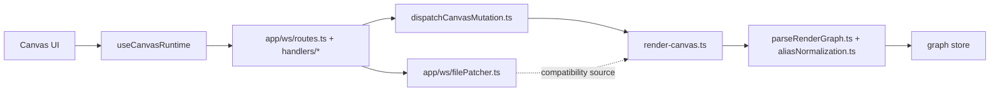
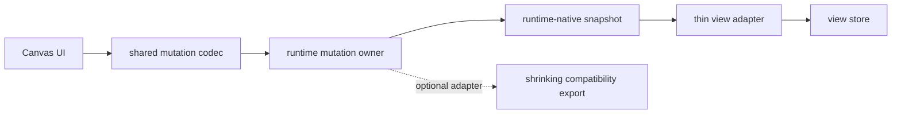

# Runtime Read-Write Boundary Bottleneck

## 문제 요약

- 현재 이 저장소는 `read 는 canonical runtime`, `write 는 compatibility patch` 라는 이중 구조를 여전히 크게 안고 있다.
- 그 결과 클라이언트, WS 계층, shared runtime 이 모두 비슷한 shape 변환을 각각 다시 수행한다.
- 가장 큰 병목은 `app/ws/routes.ts` 뒤의 `app/ws/handlers/canvasHandlers.ts`, `app/ws/handlers/compatibilityHandlers.ts`, 그리고 `app/ws/filePatcher.ts` 가 여전히 과도한 write/read orchestration 을 안고 있다는 점이다.

## 왜 복잡한가

- `app/ws/routes.ts` 는 더 이상 구현 허브가 아니지만, `app/ws/handlers/canvasHandlers.ts` 와 `app/ws/handlers/compatibilityHandlers.ts` 가 runtime command 생성, compatibility patch, version lock 성격을 여전히 많이 안고 있다.
- `app/ws/filePatcher.ts` 는 여전히 whole-file AST rewrite 기반으로 mutation 을 처리해 write cost 와 인지부하를 유지한다.
- `app/hooks/useCanvasRuntime.ts` 에서도 sourceId, content kind, placement, body block shape 를 다시 해석한다.
- `libs/shared/src/lib/canonical-query/render-canvas.ts` 는 runtime projection 이 있는데도 다시 legacy render graph 를 만든다.
- `app/features/render/parseRenderGraph.ts` 는 legacy graph 를 파싱한 뒤 runtime projection 을 overlay 해 다시 canonical 쪽으로 맞춘다.
- `app/features/render/aliasNormalization.ts` 는 canonical contract 가 shared 에 있음에도 app 쪽에서 alias inference 를 계속 수행한다.

## Runtime/WS 는 지금 왜 필요한가

현재 코드 기준으로 보면 이 레이어는 "있으면 좋은 부가 통신층" 이 아니라, 편집기의 핵심 경계 몇 가지를 동시에 맡고 있다.

### 1. mutation 진입점

- 클라이언트는 `app/hooks/useCanvasRuntime.ts` 에서 WebSocket JSON-RPC 요청을 보내고, 서버는 `app/ws/routes.ts` 를 통해 도메인 handler 로 이를 넘긴다.
- 이 경계에서 `canvas.runtime.mutate`, `undo`, `redo`, legacy `node.*` / `file.*` 성격의 요청이 runtime 또는 compatibility patch 로 라우팅된다.
- 즉 지금은 브라우저가 shared runtime 을 직접 호출하지 않고, WS methods 가 mutation gateway 역할을 한다.

### 2. push 기반 invalidation 과 동기화

- `useCanvasRuntime.ts` 는 `canvas.subscribe` 와 `file.subscribe` 를 함께 유지하고, `canvas.changed` / `file.changed` 알림을 받으면 현재 뷰를 invalidate 한다.
- `app/ws/server.ts` 는 `canvas.changed`, `file.changed`, `files.changed` notification 을 브로드캐스트한다.
- 특히 watcher 기반 `file.changed` 는 외부 편집, 다른 경로의 변경, compatibility 파일 변경을 즉시 감지해 브라우저에 알려주는 역할을 한다.
- 따라서 현재 WS 는 단순 request/response transport 가 아니라 "변경 사실을 먼저 밀어주는 구독 채널" 이기도 하다.

### 3. 버전/동시성 계약

- `app/ws/handlers/compatibilityHandlers.ts` 는 `baseVersion` 검사와 file mutex 를 통해 compatibility source 충돌을 막는다.
- runtime mutation 쪽도 `canvasRevision` 과 command metadata 를 함께 다뤄 optimistic UI 와 reload 판단에 쓰인다.
- 즉 이 레이어는 단순 transport 가 아니라 변경 충돌을 조정하는 contract boundary 다.

### 4. canonical runtime 과 compatibility source 사이의 브리지

- runtime mutation 만으로 끝나지 않고, 현재는 필요 시 `app/ws/filePatcher.ts` 를 통해 TSX compatibility source 도 함께 갱신한다.
- 이 때문에 WS methods 는 한쪽으로는 canonical runtime 을 호출하고, 다른 한쪽으로는 file patch 경로를 유지하는 이중 owner 가 되었다.

### 5. projection 조회 집결점

- `app/ws/handlers/canvasHandlers.ts` 는 `buildHierarchyProjection`, `buildRenderProjection`, `buildEditingProjection` 호출을 domain query surface 로 묶어 반환한다.
- 즉 쓰기뿐 아니라 "현재 runtime 스냅샷을 어떤 shape 로 읽어올지" 도 WS 경계에서 조립한다.

정리하면, 현재 `Runtime/WS` 는 다음 다섯 역할을 동시에 가진다.

- mutation gateway
- push invalidation channel
- 동시성/버전 계약 경계
- canonical-runtime / compatibility-source bridge
- projection assembly endpoint

## 왜 통신 구조가 필요한가

여기서 더 근본적으로 보면, 현재 앱에 필요한 것은 "서버" 자체보다 "renderer 밖에서 privileged 작업을 처리하는 host boundary" 다.

지금 코드에서 UI 가 직접 할 수 없는 일은 다음과 같다.

- 파일 시스템 접근
  - workspace probe, file tree, canvas source 생성, TSX compatibility file patch
- 로컬 DB 접근
  - app-state persistence, canonical persistence, runtime revision/history 조회
- OS 통합
  - 파일 브라우저 열기, 경로 reveal/open
- 파일 감시
  - chokidar 기반 workspace 변경 감지
- runtime mutation/projection 조립
  - canonical repository + runtime projection + compatibility source 를 함께 다루는 작업

이런 작업들은 브라우저 renderer 안에 직접 두기 어렵거나 두면 안 된다. 그래서 지금 구조는 UI 와 privileged 작업 사이에 통신 경계를 둔 것이다.

### 지금은 왜 "서버" 모양인가

현재 구현은 host boundary 를 다음처럼 서버 프로토콜 형태로 잡고 있다.

- web mode
  - `app/features/host/rpc/webAdapter.ts` 가 `/api/*` 로 호출한다.
- desktop mode
  - `app/features/host/rpc/desktopAdapter.ts` 도 Electron IPC 대신 `http://127.0.0.1:<port>` 로 호출한다.
- push channel
  - `useCanvasRuntime.ts` 는 별도 WS 포트에 붙어서 subscribe/notification 을 받는다.

즉 현재는 `web 과 desktop 이 같은 RPC surface 를 공유` 하도록 맞추는 과정에서 host boundary 가 `localhost HTTP + WS` 로 구현된 상태다.

### 중요한 구분

- 필요한 것
  - privileged host boundary
  - mutation/projection service
  - change notification channel
- 지금 선택된 구현
  - local HTTP server
  - local WS server

이 둘은 같은 말이 아니다.

## standalone 앱에서도 서버가 필요한가

`standalone` 을 전제로 하면, 답은 "반드시 localhost 서버일 필요는 없다" 쪽에 가깝다.

### 필요한 것

- renderer 와 분리된 host layer
- 파일/DB/OS 접근 권한
- 변경 알림 채널

### 필요하지 않은 것

- 반드시 HTTP 서버 프로세스일 것
- 반드시 WS full-RPC 일 것
- renderer 가 모든 host 기능을 네트워크처럼 호출해야 할 것

Electron standalone 기준으로는 다음 대안이 가능하다.

### 1. Electron IPC 기반 host bridge

- 가장 자연스러운 standalone 방향이다.
- renderer 는 preload 를 통해 typed IPC API 를 호출한다.
- main 또는 별도 worker process 가 file system, DB, runtime mutation, watcher 를 맡는다.
- 현재 `desktop/main.ts` 는 디렉터리 선택/경로 열기 정도만 IPC 로 노출하고 있고, 실제 데이터 경로는 아직 localhost HTTP/WS 에 기대고 있다.

### 2. In-process service + subscription bridge

- HTTP 없이 같은 프로세스 내부 service module 을 직접 호출한다.
- 변경 알림만 event emitter 또는 IPC subscription 으로 보낼 수 있다.
- 이 경우 transport 는 사라지지만 host boundary 는 유지된다.

### 3. 지금처럼 localhost HTTP/WS 유지

- web 과 desktop 이 같은 adapter surface 를 공유하기 쉽다.
- 테스트와 디버깅도 단순하다.
- 대신 standalone 에서는 네트워크 모양의 오버헤드와 경계 혼동이 계속 남는다.

## 현재 코드 기준 결론

- 이 프로젝트에 필요한 것은 `server` 가 아니라 `host/service boundary` 다.
- 지금은 그 boundary 를 `HTTP + WS` 로 구현해 놓았을 뿐이다.
- standalone 을 강하게 가져갈수록, `desktop-primary` 경로는 localhost 서버보다 `IPC + in-process service` 가 더 자연스럽다.
- 반대로 `web-secondary` 를 계속 유지한다면, web 쪽은 여전히 HTTP API surface 가 필요할 가능성이 높다.

즉 앞으로의 핵심 결정은 이것이다.

- `web 과 desktop 이 완전히 같은 transport 를 강제해야 하는가`
- 아니면 `같은 logical RPC surface` 만 유지하고, transport 는 mode 별로 다르게 가져갈 것인가

내 판단은 후자가 더 맞다.

- logical surface 는 공유한다.
- web 은 HTTP/SSE
- desktop 은 IPC/event bridge
- runtime/service layer 는 공통

## AI CLI 협업 시 왜 공용 runtime 이 필요한가

질문을 다시 `Runtime/WS 는 필요한가` 로 좁히면, AI CLI 협업 시점에는 `WS` 보다 먼저 `공용 runtime` 의 필요성이 생긴다.

이유는 단순하다. 그 순간부터 이 앱은 사람이 쓰는 UI 와 외부 CLI 가 같은 캔버스를 편집하는 멀티-라이터 환경이 되기 때문이다.

### 공용 runtime 이 필요한 이유

- 같은 명령 의미를 공유해야 한다.
  - UI 와 CLI 가 각각 다른 방식으로 node 생성, 이동, content 수정, body block 편집을 구현하면 결과 모델이 쉽게 어긋난다.
- revision / conflict 기준점이 필요하다.
  - AI CLI 와 사용자 UI 가 동시에 수정할 수 있으므로, 누가 어떤 revision 위에서 편집했는지 공용 기준이 있어야 한다.
- 변경 provenance 가 필요하다.
  - 사람 수정인지, CLI 에이전트 수정인지, 어떤 command 가 어떤 결과를 만들었는지 추적 가능해야 한다.
- projection 일관성이 필요하다.
  - mutation 결과를 UI 가 다시 읽을 때, CLI 와 UI 가 같은 runtime snapshot/projection 을 바라봐야 한다.
- undo/redo 와 history 경계가 필요하다.
  - AI 가 만든 변경도 같은 history 모델 안에 들어와야, 사용자 입장에서 조작 가능성이 유지된다.

### 공용 runtime 이 없으면 생기는 문제

- CLI 는 파일을 직접 patch 하고, UI 는 runtime mutation 을 쓰는 이중 모델이 더 심해진다.
- 같은 의도를 서로 다른 레이어에서 다시 구현하게 된다.
- 충돌과 변경 순서를 file watcher 수준에서만 처리하게 되어 semantic conflict 를 다루기 어렵다.
- AI 가 만든 변경이 UI 에서는 "파일이 바뀌었다" 정도로만 보이고, 명령 단위 의미를 잃는다.

### 결론

- `AI CLI 협업` 이 생기면 `Runtime` 은 더 필요해진다.
- 하지만 그 사실이 `WS full-RPC` 를 정당화하는 것은 아니다.
- 필요한 것은 `공용 runtime/service boundary` 이고, `WS` 는 그 위의 transport 선택지 중 하나일 뿐이다.

즉 질문에 대한 가장 정확한 답은 이것이다.

- AI CLI 협업이 없다면 `Runtime/WS` 축소를 더 강하게 밀 수 있다.
- AI CLI 협업이 있다면 `Runtime` 은 남겨야 한다.
- 그래도 `WS` 는 transport/subscription 전용으로 축소 가능하다.

이렇게 가면 standalone 성격에 맞게 서버를 줄이면서도, web 지원은 유지할 수 있다.

## AS-IS 구조

현재는 runtime path 와 compatibility path 가 병렬로 살아 있어서, 한 액션의 "진짜 모델"이 어디인지 즉시 답하기 어렵다.

## TO-BE 구조

- mutation 의 단일 주인은 runtime 이어야 한다.
- client, WS, runtime 이 각각 들고 있는 shape 변환은 `shared codec` 으로 한 번만 정의한다.
- read 쪽은 legacy graph 생성 후 재파싱하지 않고 runtime-native snapshot 을 직접 소비한다.

## 이 레이어를 줄일 수 있는가

줄일 수 있다. 다만 "Runtime 을 없애는 것" 과 "WS transport 를 얇게 만드는 것" 을 분리해서 봐야 한다.

### 줄이기 어려운 부분

- `runtime mutation owner`
  - canvas mutation, undo/redo, projection 생성은 장기적으로도 필요하다.
  - 지금도 shared contract 와 repository port 가 분리돼 있어서, 이 축은 줄이기보다 더 선명하게 남겨야 한다.
- `push invalidation`
  - 현재 편집기는 `canvas.changed`, `file.changed`, `files.changed` 알림에 기대고 있다.
  - 외부 파일 변경과 다른 경로의 mutation 을 즉시 반영하려면 polling 보다 push 채널이 유리하다.

### 줄일 수 있는 부분

- `WS methods 의 과잉 책임`
  - mutation gateway 와 projection endpoint 는 남겨도 되지만, compatibility patch, shape translation, diagnostics 조립까지 같이 소유할 필요는 없다.
- `client-side shape translation`
  - `useCanvasRuntime.ts` 에 남아 있는 `sourceId`, `contentKind`, `placement`, body block 변환은 shared codec 으로 이동할 수 있다.
- `compatibility patch 의 1급 write owner 상태`
  - 장기적으로 `filePatcher.ts` 는 core write path 가 아니라 shrinking adapter 로 밀어낼 수 있다.
- `legacy graph + parse + overlay 구조`
  - runtime snapshot 을 직접 view store 가 소비하게 만들면 read 경로의 중간 단계를 줄일 수 있다.

### 현실적인 결론

- `Runtime` 자체는 지금 프로젝트에 필요하다.
- 하지만 `WS 레이어` 는 지금보다 훨씬 얇아질 수 있다.
- 더 크게는 `localhost 서버 모양` 자체도 desktop-primary 에서는 줄일 수 있다.
- 가장 현실적인 축소 방향은 "WS 를 제거" 가 아니라 "WS 를 thin transport + subscription channel 로 축소" 하는 것이다.

### server 축소 관점의 현실적인 방향

- web-secondary
  - HTTP API 는 유지
  - push 는 SSE 또는 subscription-only WS
- desktop-primary
  - mutation/query 는 IPC 또는 in-process bridge 로 이동
  - push 는 IPC event subscription 으로 이동
  - localhost HTTP/WS 는 compatibility/dev 용으로만 축소

즉 `transport 축소` 와 `host boundary 제거` 는 다르다. 줄여야 하는 것은 서버 모양이지, host boundary 자체가 아니다.

즉 장기적으로 남길 것은 다음이다.

- runtime contracts
- runtime mutation / projection
- push notification channel

장기적으로 줄일 것은 다음이다.

- compatibility patch owner 역할
- client/WS/runtime 에 흩어진 중복 shape translation
- legacy graph build 후 parse/overlay 하는 read 경로
- 파일/캔버스 버전 조정 로직이 WS methods 한곳에 과밀한 상태

한 줄로 요약하면, 지금 `Runtime/WS` 는 "필요한 레이어" 이긴 하지만 "필요한 역할보다 너무 많은 역할을 가진 레이어" 다.

## 병목 파일 리스트

| 파일 | 병목 유형 | AS-IS | TO-BE |
|---|---|---|---|
| `app/ws/routes.ts` + `app/ws/handlers/*` | 과도한 전환 계층 | route registry 는 얇아졌지만 domain handlers 가 runtime 과 compatibility 경계를 함께 조정한다. | route registry 는 유지하고 handler/domain/service 경계를 더 줄인다. |
| `app/ws/filePatcher.ts` | 과도한 전환 계층 | whole-file AST patch 가 계속 핵심 write 경로로 남아 있다. | export/legacy adapter 성격으로 축소한다. |
| `app/hooks/useCanvasRuntime.ts` | 중복 오케스트레이션 | client 가 content/placement/source id 변환을 다시 한다. | shared codec 또는 server response 를 그대로 소비한다. |
| `app/features/render/parseRenderGraph.ts` | 과도한 전환 계층 | legacy graph parse 와 runtime overlay 를 함께 수행한다. | 얇은 view adapter 로 축소한다. |
| `app/features/render/aliasNormalization.ts` | 과도한 전환 계층 | app 쪽에서 canonical alias inference 를 다시 수행한다. | shared domain 으로 이동하거나 legacy path 축소와 함께 제거한다. |
| `libs/shared/src/lib/canonical-query/render-canvas.ts` | 중복 오케스트레이션 | runtime snapshot 이 있으면서도 다시 legacy graph 를 만든다. | runtime-native snapshot export 로 수렴한다. |
| `libs/shared/src/lib/canvas-runtime/application/dispatchCanvasMutation.ts` | 대형 파일/과잉 책임 | translation, inverse replay, snapshot capture 가 한 곳에 밀집한다. | runtime 핵심은 유지하되 codec/history helper 로 잘라낸다. |
| `libs/shared/src/lib/canvas-runtime/projections/buildRenderProjection.ts` | 대형 파일/과잉 책임 | projection 별로 중복 조회와 변환이 발생한다. | shared loaded snapshot 위에서 projection 을 계산한다. |
| `libs/shared/src/lib/canvas-runtime/projections/buildEditingProjection.ts` | 대형 파일/과잉 책임 | editing projection 만의 로딩 비용이 별도 존재한다. | 공통 snapshot 기반의 순수 projection 으로 맞춘다. |
| `libs/shared/src/lib/canvas-runtime/projections/buildHierarchyProjection.ts` | 대형 파일/과잉 책임 | hierarchy projection 도 겹치는 데이터를 다시 읽는다. | canvas snapshot 의 파생 projection 으로 줄인다. |

## Transitional vs Core

| 구분 | 파일/영역 | 판단 |
|---|---|---|
| Transitional, shrink first | `app/ws/routes.ts` + `app/ws/handlers/*` | route registry 아래의 과도기 호환 경계가 아직 크다. |
| Transitional, shrink first | `app/ws/filePatcher.ts` | file-first write owner 흔적이 크다. |
| Transitional, shrink first | `app/features/render/parseRenderGraph.ts` | legacy read shape 를 보정하는 비용이 크다. |
| Transitional, shrink first | `app/features/render/aliasNormalization.ts` | app-side canonicalization 이 아직 남아 있다. |
| Transitional, shrink first | `libs/shared/src/lib/canonical-query/render-canvas.ts` | legacy graph 와 runtime snapshot 이 공존한다. |
| Core, keep but slim | `libs/shared/src/lib/canvas-runtime/application/dispatchCanvasMutation.ts` | 장기적으로도 runtime mutation owner 는 필요하다. |
| Core, keep but slim | `libs/shared/src/lib/canvas-runtime/contracts/*` | 안정된 계약 축으로 유지해야 한다. |
| Core, keep but slim | `libs/shared/src/lib/canonical-object-contract.ts` | object contract 의 기준점 역할을 한다. |
| Core, keep but slim | `libs/shared/src/lib/canvas-runtime/projections/*` | projection 자체는 필요하지만 입력 모델을 단순화해야 한다. |

## 우선 감량 후보

- `app/ws/routes.ts`
- `app/ws/handlers/canvasHandlers.ts`
- `app/ws/handlers/compatibilityHandlers.ts`
- `app/ws/filePatcher.ts`
- `app/features/render/parseRenderGraph.ts`
- `app/features/render/aliasNormalization.ts`
- `libs/shared/src/lib/canonical-query/render-canvas.ts`

## 보류해야 할 코어

- `libs/shared/src/lib/canvas-runtime/contracts/*`
- `libs/shared/src/lib/canonical-object-contract.ts`
- `libs/shared/src/lib/canvas-runtime/history/*`
- `libs/shared/src/lib/canonical-mutation/*`

이 영역은 복잡하지만 "없애야 할 복잡도" 와 "도메인 복잡도" 를 구분해야 한다. 현재 감량 타깃은 도메인 핵심이 아니라 과도기 경계와 중복 번역 계층이다.

## 리뷰

- 현재 `Runtime/WS` 는 존재 이유가 분명하다. mutation, 구독, invalidation, version contract, projection 조회를 한곳에서 엮고 있기 때문이다.
- 문제는 "왜 있느냐" 가 아니라 "왜 এত 많은 역할을 한곳에서 하느냐" 에 가깝다.
- 따라서 다음 리팩터링의 목표는 `WS 제거` 가 아니라 `WS 역할 재정의` 여야 한다.
- 추천 방향은 `runtime 을 코어로 고정`, `WS 는 transport/subscription 으로 축소`, `compatibility patch 는 shrinking adapter 로 후퇴` 이다.
- 한 단계 더 나아가면 `server 유지` 보다 `host boundary 재정의` 가 더 정확한 목표다. standalone 중심이라면 desktop 은 IPC 쪽으로, web 은 HTTP 쪽으로 transport 를 분화하는 편이 구조적으로 더 맞다.
