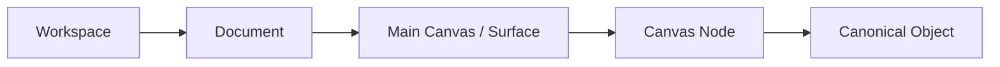
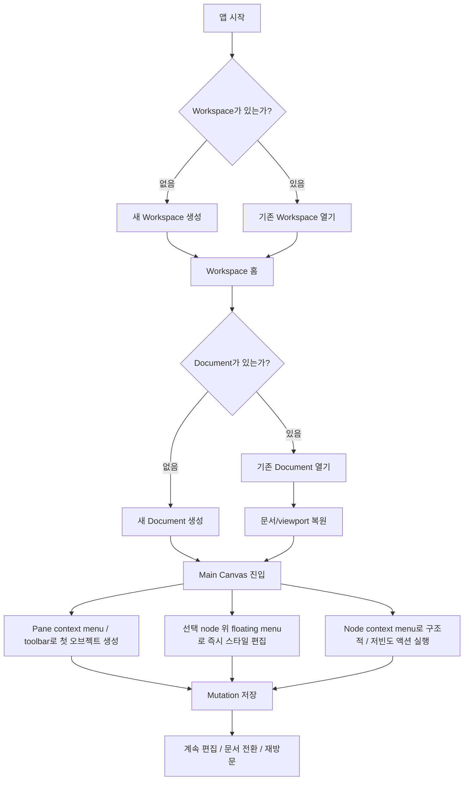
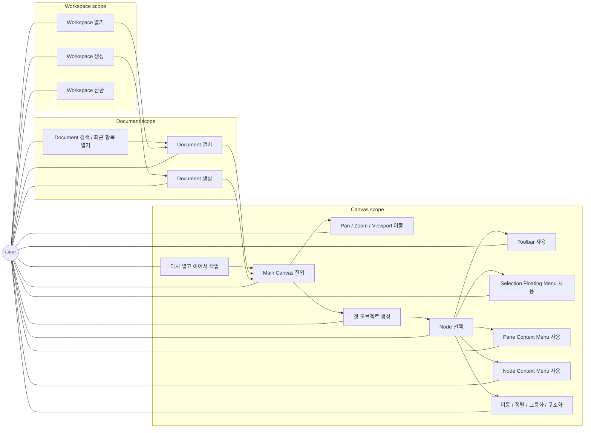
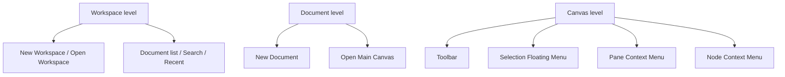
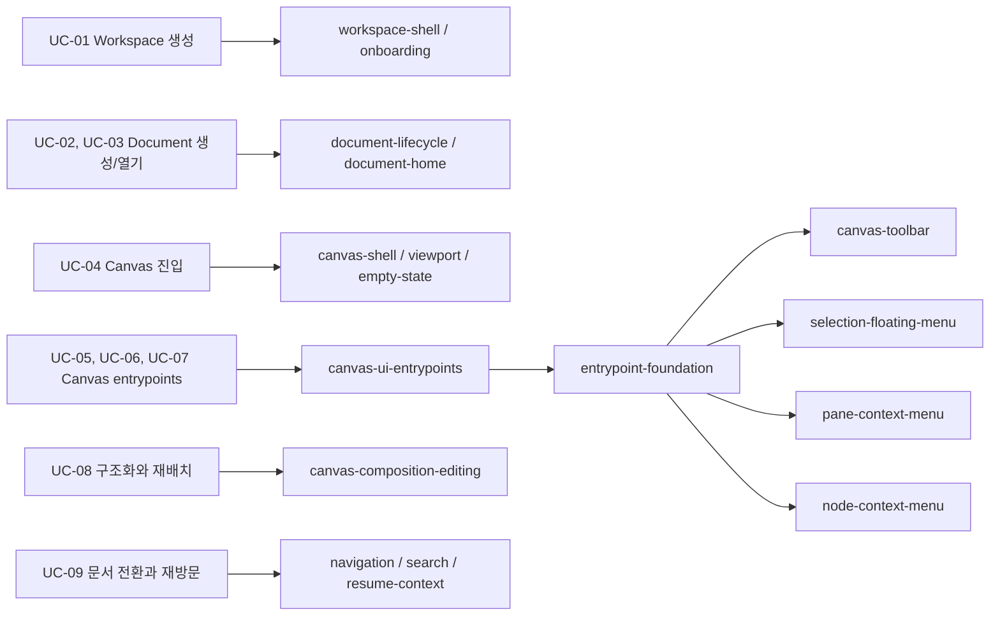

# Database-First Canvas Platform Use Cases

## 1. 문서 목적

이 문서는 `database-first-canvas-platform`을 **사용자 UI use case** 관점에서 정리한다.

지금까지의 문서는 storage, canonical model, mutation/query, CLI 중심이었다. 하지만 사용자는 그 구조를 직접 보지 않는다. 사용자는 다음 순서로 제품을 경험한다.

1. workspace를 만든다.
2. document를 만든다.
3. canvas에 들어간다.
4. toolbar, pane context menu, node context menu를 통해 오브젝트를 만들고 편집한다.
5. 선택한 node 위에 붙는 floating contextual menu로 즉시 스타일과 타입을 조정한다.
6. 다시 돌아왔을 때 같은 workspace/document/canvas 흐름을 이어서 사용한다.

이 문서의 목적은 그 흐름을 먼저 정의하고, 그 다음에 어떤 feature slice가 필요한지 역으로 판단할 수 있게 만드는 것이다.

## 2. 작업 가정

아직 고정되지 않은 부분이 있으므로, use case 문서를 위해 아래 가정을 둔다.

- `workspace`는 사용자가 작업을 시작하는 최상위 컨테이너다.
- `document`는 사용자가 여는 개별 작업 단위다.
- document를 새로 만들면 기본 `primary surface` 또는 `main canvas`가 자동 생성된다.
- 하나의 document는 장기적으로 여러 surface를 가질 수 있지만, 초기 핵심 흐름은 `document 1개 -> main canvas 1개`다.
- 초기 사용자 흐름은 사람 UI 기준으로 정의하고, AI/CLI는 같은 canonical mutation path를 쓰는 보조 경로로 본다.

## 3. 사용자 정신모델

사용자에게 보이는 기본 구조는 아래처럼 이해하는 편이 자연스럽다.

사용자 관점에서 중요한 해석은 다음과 같다.

- workspace는 "내가 작업하는 공간"이다.
- document는 "한 개의 보드/문서"다.
- canvas는 "실제로 보고 만지는 공간"이다.
- object는 사용자가 직접 보지 않더라도, 캔버스 편집 결과가 연결되는 canonical data다.

즉 사용자는 canvas를 직접 만지지만, 시스템은 그 결과를 document/surface/object 경계에 맞춰 저장해야 한다.

## 4. 핵심 사용자 여정

이 여정에서 feature slice 논의에 바로 영향을 주는 지점은 세 군데다.

- workspace/document 생성 진입점
- canvas에 처음 들어가는 진입점
- canvas 안에서 toolbar, floating menu, pane menu, node menu가 어떤 순서로 등장하는지

## 5. 사용자가 무엇을 할 수 있는가

아래 다이어그램은 사용자 actor 기준으로, 현재 database-first canvas platform에서 우선 정의해야 하는 핵심 use case를 묶어서 보여준다.

이 다이어그램에서 중요한 해석은 다음과 같다.

- 사용자 use case는 `workspace -> document -> canvas` 순서로 중첩된다.
- `toolbar`, `selection floating menu`, `pane context menu`, `node context menu`는 독립 기능이 아니라 canvas 사용 중 노출되는 조작 surface다.
- 이 중 고빈도 편집은 selection floating menu가, 저빈도 구조 명령은 node context menu가 맡는 편이 자연스럽다.
- `다시 열고 이어서 작업`은 별도 편의 기능이 아니라 document/canvas 모델의 핵심 use case다.

## 6. 상세 Use Case

### UC-01. 사용자는 새 Workspace를 만든다

상황:

- 첫 실행이거나, 현재 사용할 workspace가 없다.

사용자 행동:

- `New Workspace`를 누른다.
- 이름과 기본 설정을 입력한다.

시스템 반응:

- workspace row를 생성한다.
- 해당 workspace의 기본 홈 화면으로 이동한다.
- 아직 document가 없으면 empty state를 보여준다.

왜 중요한가:

- database-first에서는 workspace가 단순 폴더가 아니라 query/search/binding/plugin 범위의 기준이 된다.

### UC-02. 사용자는 Workspace 안에서 첫 Document를 만든다

상황:

- workspace는 있지만 아직 작업할 document가 없다.

사용자 행동:

- `New Document`를 누른다.
- 제목과 문서 유형을 선택한다.

시스템 반응:

- document row를 생성한다.
- 기본 `main surface` 또는 `main canvas`를 함께 생성한다.
- 사용자를 바로 편집 가능한 canvas로 이동시킨다.

왜 중요한가:

- 사용자는 "문서를 만들었는데 아직 canvas가 없다"는 상태를 길게 경험하면 안 된다.

### UC-03. 사용자는 기존 Document를 다시 연다

상황:

- workspace 안에 이미 여러 document가 있다.

사용자 행동:

- 최근 문서 목록, 검색, 탐색 목록 중 하나로 document를 연다.

시스템 반응:

- document metadata와 primary surface를 로드한다.
- 마지막 viewport 또는 마지막 작업 지점을 복원한다.
- 사용자가 즉시 편집을 이어갈 수 있게 한다.

왜 중요한가:

- database-first의 장점은 "다시 열기"와 "부분 로드"가 자연스러워져야 드러난다.

### UC-04. 사용자는 Canvas에 들어가 기본 조작을 이해한다

상황:

- document를 열었고, main canvas가 보인다.

사용자 행동:

- pan/zoom을 한다.
- 빈 영역을 클릭하거나 드래그해 공간을 파악한다.
- 선택 상태가 없는 empty canvas를 본다.

시스템 반응:

- canvas shell이 viewport와 selection 상태를 관리한다.
- 빈 canvas 상태에서는 "첫 오브젝트를 어떻게 만들지"가 분명히 보여야 한다.

왜 중요한가:

- toolbar와 pane context menu는 이 empty-canvas 경험에서 가장 먼저 발견돼야 하는 진입점이다.
- 이후 node를 선택한 순간에는 floating contextual menu가 가장 먼저 보여야 한다.

### UC-05. 사용자는 첫 오브젝트를 만든다

상황:

- canvas는 비어 있거나, 새 요소를 추가하려는 상태다.

사용자 행동:

- toolbar의 create entrypoint를 사용하거나
- 빈 canvas에서 pane context menu를 연다.

시스템 반응:

- object create intent를 canonical mutation으로 변환한다.
- 필요한 경우 `object.create + canvas-node.create`를 함께 실행한다.
- 새 오브젝트를 canvas에 즉시 보여준다.

왜 중요한가:

- 사용자 입장에서 "document를 만들었다" 다음의 핵심 행동은 "canvas에 무언가를 놓았다"다.
- 따라서 toolbar와 pane menu는 secondary UX가 아니라 핵심 onboarding UX다.

### UC-06. 사용자는 선택한 Node를 즉시 스타일링한다

상황:

- 이미 생성된 node가 있고, 사용자는 선택 직후 빠르게 모양과 텍스트 속성을 바꾸고 싶다.

사용자 행동:

- node를 선택한다.
- 선택된 node 근처 또는 selection bounding box 위에 나타난 floating contextual menu를 사용한다.
- 오브젝트 유형 변경, 폰트 스타일, 폰트 크기(자동/수동), 볼드, 텍스트 정렬, 컬러 같은 속성을 즉시 바꾼다.

시스템 반응:

- selection 기준 anchor 위치에 floating menu를 띄운다.
- 현재 node의 semantic role / capability / content contract 기준으로 가능한 속성만 보여준다.
- 수정 결과를 canonical mutation으로 변환해 저장한다.

왜 중요한가:

- 사용자는 node를 선택한 직후 "바로 만질 수 있어야" 한다.
- 이 고빈도 편집이 우클릭 메뉴 깊숙이 있으면 direct manipulation 감각이 무너진다.

### UC-07. 사용자는 기존 Node를 문맥적으로 편집한다

상황:

- 이미 생성된 node가 하나 이상 있다.

사용자 행동:

- node를 선택한다.
- node context menu를 연다.
- rename, child create, sibling create, group action 같은 문맥적 명령을 실행한다.

시스템 반응:

- node가 연결된 `canvas_node`, `canonical_object`, relation context를 해석한다.
- semantic role / capability / selection 상태에 따라 노출 가능한 action만 보여준다.
- 선택된 action을 canonical mutation으로 변환해 저장한다.

왜 중요한가:

- node context menu는 "현재 대상을 기준으로 무엇을 할 수 있는지"를 보여주는 핵심 surface다.
- toolbar와 달리, node menu는 object semantics와 relation context를 직접 반영해야 한다.
- 다만 고빈도 스타일 편집은 node menu보다 floating menu가 우선이어야 한다.

### UC-08. 사용자는 Canvas를 구조화한다

상황:

- node가 여러 개 있고, 단순 생성보다 정리와 구조화가 더 중요해졌다.

사용자 행동:

- 이동, 정렬, grouping, reparent, frame/container 진입을 수행한다.

시스템 반응:

- layout/placement mutation을 저장한다.
- 필요한 경우 object relation과 canvas composition을 함께 갱신한다.
- runtime-only UI state와 persisted state를 혼동하지 않는다.

왜 중요한가:

- canvas 사용성은 "생성"보다 "구조화" 단계에서 품질이 드러난다.

### UC-09. 사용자는 Workspace 안에서 여러 Document를 오가며 이어서 작업한다

상황:

- 한 workspace 안에 여러 document가 있다.

사용자 행동:

- document list, recent list, search를 통해 문서를 바꿔가며 작업한다.

시스템 반응:

- 문서 전환은 빠르게 일어나야 한다.
- 각 document의 viewport, 최근 상태, 선택 context는 안전하게 복원되거나 폐기돼야 한다.

왜 중요한가:

- workspace/document/navigation은 canvas 자체와 별도 slice가 되어야 하는 근거가 된다.

## 7. 사용자에게 보이는 UI Entry Points

이 문서 기준으로, 사용자가 직접 마주치는 entrypoint는 최소 아래처럼 계층화된다.

이 구조가 중요한 이유는 다음과 같다.

- workspace/document level은 navigation shell의 문제다.
- canvas level은 direct manipulation shell의 문제다.
- toolbar와 floating menu, pane/node context menu는 같은 canvas level에 있지만, 역할과 의존성은 다르다.

## 8. Use Case에서 바로 나오는 slice 후보

아직 final slice를 확정하는 문서는 아니지만, use case만 놓고 보면 아래 후보들이 드러난다.

현재 시점의 판단:

- `canvas-ui-entrypoints`는 여전히 별도 slice로 유지할 가치가 크다.
- 그리고 그 내부도 `entrypoint-foundation` 이후 `canvas-toolbar`, `selection-floating-menu`, `pane-context-menu`, `node-context-menu`로 쪼개는 편이 병렬 작업에 유리하다.
- 하지만 그것만으로는 부족하고, 적어도 `workspace/document shell`, `canvas shell`, `composition editing` 계열을 함께 봐야 사용자 use case가 완성된다.

## 9. Feature Slice 논의를 위한 질문

이 문서를 기준으로 다음 질문을 검토하면 된다.

1. workspace 생성/선택은 하나의 slice로 묶을지, document lifecycle과 분리할지
2. document 생성 시 항상 `main canvas`를 자동 생성할지, 문서 홈을 거치게 할지
3. canvas empty state에서 가장 먼저 노출할 create entrypoint는 toolbar인지, pane context menu인지, 둘 다인지
4. selection floating menu에 어떤 고빈도 액션을 넣고, node context menu에는 어떤 저빈도 액션을 남길지
5. node context menu를 어떤 semantic role / capability 기준으로 열지
6. `canvas-ui-entrypoints`와 `canvas-composition-editing`를 분리할지, 하나의 runtime slice로 묶을지
7. 문서 전환과 최근 작업 복원을 navigation slice로 분리할지, canvas shell 안에 둘지

## 10. 결론

database-first 전환의 핵심은 storage만 DB로 옮기는 것이 아니다. 사용자 입장에서는 "workspace를 만들고, document를 만들고, canvas에 들어가고, 그 안에서 자연스럽게 만들고 고친다"는 흐름이 먼저 성립해야 한다.

이 관점에서 보면 현재 중요한 것은 다음 세 축이다.

- workspace/document 진입 흐름
- canvas shell과 empty-state
- toolbar / selection floating menu / pane context menu / node context menu를 포함한 canvas entrypoint

즉, feature slice는 기술 레이어만으로 자르면 부족하고, 최소한 이 use case 흐름을 끊지 않는 방식으로 다시 점검해야 한다.
