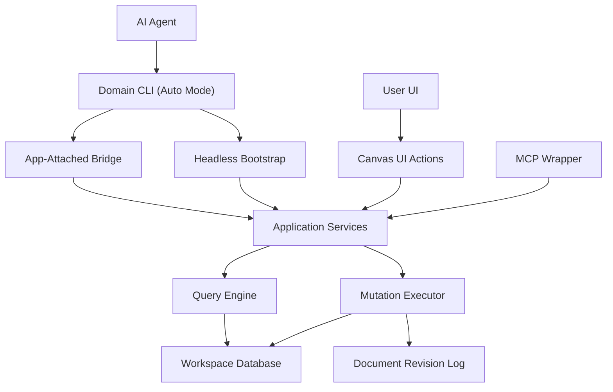

# Database-First Canvas Platform AI/CLI Tooling 설계

## 1. 문서 목적

이 문서는 `database-first-canvas-platform`에서 **AI-first 편집 경로를 어떤 CLI contract로 고정할지**를 정의한다.

핵심 목적은 세 가지다.

- shell 접근이 가능한 AI 에이전트가 database-first 문서를 안정적으로 조회하고 수정할 수 있게 한다.
- canonical model, canvas composition, plugin runtime 경계를 CLI surface에서도 그대로 보존한다.
- 이후 MCP/API를 붙이더라도 같은 domain service와 contract를 재사용할 수 있게 한다.

이 문서는 transport보다 **도메인 경계와 명령 계약**을 먼저 고정하는 데 집중한다.

## 2. 설계 결정

### 결정 1. CLI를 AI의 첫 번째 인터페이스로 둔다

database-first 전환 이후에도 AI는 여전히 빠른 로컬 워크플로우가 필요하다. shell 접근이 가능한 환경에서는 CLI가 가장 단순하고 디버깅 가능성이 높다.

따라서 v1의 우선순위는 다음과 같다.

1. domain CLI
2. CLI와 같은 service를 재사용하는 MCP wrapper
3. 필요 시 더 높은 수준의 intent/planner interface

CLI의 기본 실행 모드는 hybrid로 둔다.

- 앱이 실행 중이지 않으면 headless mode로 동작한다.
- 앱이 실행 중이고 해당 명령이 live session 정보를 필요로 하면 app-attached mode를 우선 사용한다.
- 사용자는 가능하면 실행 모드를 의식하지 않고 같은 command surface를 사용한다.

### 결정 2. raw DB access가 아니라 domain CLI를 노출한다

AI는 테이블이나 SQL을 직접 다루지 않는다. 대신 `workspace`, `document`, `object`, `canvas`, `binding`, `plugin-instance` 같은 domain 단위 contract를 사용한다.

이유는 다음과 같다.

- canonical model과 canvas composition 경계를 보존할 수 있다.
- validation, revision, audit log를 mutation 경로에 강제할 수 있다.
- UI와 AI가 같은 mutation executor를 재사용할 수 있다.

### 결정 3. MCP는 별도 구현이 아니라 얇은 transport wrapper다

기존 Magam 문서의 방향과 동일하게, MCP는 shell이 없는 환경에 CLI/service contract를 노출하는 얇은 래퍼로 본다.

즉, database-first 이후의 우선 순위도 다음과 같다.

- domain service가 canonical contract다.
- CLI는 그 첫 번째 transport다.
- MCP는 동일 contract를 노출하는 두 번째 transport다.

### 결정 4. CLI는 headless를 기본으로 하되, app-attached를 선택적으로 사용한다

CLI가 앱 프로세스에 종속되면 AI-first 자동화, CI, background task, shell script 활용성이 크게 떨어진다.

반대로 모든 명령을 headless만으로 제한하면 selection, live viewport, session-local state 같은 runtime 정보에 접근하기 어렵다.

따라서 권장 모델은 hybrid다.

- core query/mutation 명령은 앱 비실행 상태에서도 headless로 동작한다.
- session/live state가 필요한 명령은 앱이 실행 중이면 app-attached로 자동 전환한다.
- app-attached를 사용하더라도 command envelope와 domain validation은 headless와 동일해야 한다.

## 3. 목표

- AI가 giant file 없이 필요한 범위만 부분 조회한다.
- AI와 UI가 동일한 query/mutation engine을 사용한다.
- mutation 결과가 replay 가능하고 revision에 기록된다.
- plugin instance 조작도 동일한 tool contract 안에 포함한다.
- machine-readable JSON 응답을 기본값으로 제공한다.
- 앱이 실행 중이지 않아도 core query/mutation이 가능해야 한다.

## 4. 비목표

- 자연어 한 줄로 대형 변경을 수행하는 planner CLI를 v0 범위에 넣지 않는다.
- raw SQL 실행, raw table write, 임의 DB shell 제공을 범위에 넣지 않는다.
- plugin TS/TSX source authoring과 bundle publishing을 AI v0의 기본 경로에 넣지 않는다.
- live selection 동기화를 core contract의 필수 전제로 두지 않는다.
- 모든 명령이 app-attached를 필요로 하도록 설계하지 않는다.

## 5. 핵심 원칙

### 5.1 Resource-oriented, domain-first

명령은 DB 테이블이 아니라 도메인 자원 중심으로 노출한다.

- `workspace`
- `document`
- `surface`
- `object`
- `relation`
- `canvas-node`
- `canvas-edge`
- `binding`
- `plugin`
- `plugin-instance`
- `search`
- `mutation`

### 5.2 JSON-first

AI 사용을 고려해 모든 명령은 `--json`을 지원하고, script-friendly stdout 형식을 기본으로 삼는다.

human-friendly pretty output는 부가 모드이고, machine-readable contract가 우선이다.

### 5.3 jq-friendly JSON

CLI는 `jq`와 잘 맞는 JSON 출력 정책을 가져가는 것이 좋다. 다만 `jq`는 core contract가 아니라 **CLI 소비 편의 기능**으로 둔다.

원칙:

- `--json` 출력에는 순수 JSON만 포함한다.
- 성공/실패 모두 일정한 envelope를 유지한다.
- list 응답은 가능하면 `items`, `nextCursor`, `meta` 구조를 유지한다.
- 필드 이름은 축약보다 명확성을 우선한다.
- pretty print와 human-friendly 로그는 `--json` 모드에 섞지 않는다.

`jq`는 CLI 결과를 후처리하는 도구로 권장하되, query의 핵심 partiality는 여전히 서버 측 `filter`, `include`, `limit`, `cursor`, `bounds`가 담당해야 한다.

### 5.4 Partial read by default

CLI는 전체 document dump보다 필요한 일부만 읽는 것을 우선한다.

예:

- 특정 document metadata만 조회
- 특정 surface의 viewport bounds 안의 node만 조회
- 특정 object 집합만 조회
- 특정 query/filter 결과만 조회

### 5.5 Mutation is explicit and validated

모든 쓰기 작업은 validation, revision append, structured result를 거친다.

잘못된 입력을 조용히 무시하지 않는다.

### 5.6 Same executor as UI

UI direct manipulation과 AI CLI mutation은 같은 application service와 mutation executor를 재사용해야 한다.

CLI가 별도 우회 경로가 되면 경계가 무너지고 drift가 발생한다.

### 5.7 Hybrid execution, single contract

headless와 app-attached는 서로 다른 제품이 아니라 **같은 domain command를 실행하는 두 실행 모드**다.

원칙:

- command 이름, 인자, JSON 응답 형식은 실행 모드와 무관하게 유지한다.
- 차이는 transport와 접근 가능한 runtime context에만 있어야 한다.
- core query/mutation은 항상 headless fallback이 가능해야 한다.
- session/local selection/live viewport처럼 runtime 의존 정보만 app-attached 전용으로 둔다.

## 6. 레이어 배치



### 해석

- CLI는 auto mode에서 app-attached와 headless 중 적절한 실행 경로를 선택한다.
- CLI와 UI는 같은 service 계층을 사용한다.
- mutation executor가 canonical invariants를 지킨다.
- MCP는 CLI를 다시 구현하는 레이어가 아니라 같은 service를 노출하는 transport다.

### 실행 모드

#### Headless mode

앱이 실행 중이지 않아도 동작하는 기본 경로다.

- CLI가 workspace 설정과 DB 연결 정보를 읽는다.
- query service와 mutation executor를 in-process로 부팅한다.
- `workspace`, `document`, `object`, `canvas`, `plugin-instance`, `search`, `mutation` 계열의 core 명령은 이 모드에서 항상 동작 가능해야 한다.

#### App-attached mode

앱이 실행 중일 때 live session 정보를 활용하는 경로다.

- CLI가 로컬 앱 세션 또는 daemon endpoint를 발견한다.
- 같은 domain command를 앱 프로세스 안의 service에 위임한다.
- selection, live viewport, session-local state 같은 런타임 의존 명령은 이 모드를 우선 사용한다.

#### Auto mode

사용자 기본 경험은 auto mode로 둔다.

- core query/mutation 명령은 headless를 기본으로 사용해도 충분하다.
- session-aware 명령은 호환 가능한 앱 세션이 발견되면 app-attached를 자동 사용한다.
- 앱 세션이 없으면 core 명령은 headless로 계속 동작하고, session 전용 명령만 구조화된 에러를 반환한다.
- 필요하면 `--headless`, `--attach`, `--auto` 같은 override를 둘 수 있다.

## 7. 도메인 경계와 명령 책임

| 자원 | 진실의 종류 | 대표 명령 | 하지 말아야 할 일 |
|------|-------------|-----------|--------------------|
| `workspace` | 상위 범위와 인덱스 | `list`, `get`, `search` | document/canvas 내부 배치를 직접 수정하지 않음 |
| `document` | 문서 메타, revision 경계 | `list`, `get`, `create`, `update-meta` | object graph 세부 의미를 직접 소유하지 않음 |
| `surface` | scene root, viewport | `get`, `query-nodes`, `update-viewport` | canonical object 의미를 직접 수정하지 않음 |
| `object` | canonical 의미 데이터 | `get`, `query`, `create`, `update-core`, `update-content`, `patch-capability`, `delete` | canvas 위치, z-order를 직접 수정하지 않음 |
| `relation` | object graph 관계 | `list`, `create`, `remove`, `reorder` | canvas edge routing을 직접 수정하지 않음 |
| `canvas-node` | 배치와 표현 | `get`, `query`, `create`, `move`, `resize`, `reparent`, `update-style`, `remove` | canonical object의 `semanticRole`, `content.kind`, capability payload를 직접 수정하지 않음 |
| `canvas-edge` | 시각 연결 | `get`, `query`, `create`, `update`, `remove` | object relation의 의미 진실을 직접 수정하지 않음 |
| `binding` | object/query와 node 연결 | `get`, `create`, `update`, `remove` | plugin bundle이나 object payload를 직접 소유하지 않음 |
| `plugin` | registry/catalog | `list`, `get` | v0에서 임의 코드 업로드를 허용하지 않음 |
| `plugin-instance` | 문서 내 widget 인스턴스 | `get`, `create`, `update-props`, `update-binding`, `remove` | plugin source를 직접 수정하지 않음 |
| `search` | text/semantic retrieval | `objects`, `documents`, `plugin-instances` | mutation을 수행하지 않음 |
| `mutation` | 원자적 batch 실행 | `apply`, `dry-run` | raw table write를 허용하지 않음 |

## 8. 권장 CLI surface v0

v0에서는 **간단한 자원 명령 + 공통 batch mutation 명령** 조합을 권장한다.

### 8.1 조회 명령

```bash
magam workspace list --json
magam document get --workspace acme --document roadmap --json
magam surface query-nodes --document roadmap --surface main --bounds 0,0,1600,900 --json
magam object query --workspace acme --semantic-role sticky-note --has-capability attach --include sourceMeta,capabilities,capabilitySources --json
magam object query --workspace acme --content-kind media --include sourceMeta,capabilities.content --json
magam search objects --workspace acme --text "launch checklist" --semantic-role topic --json
magam plugin list --workspace acme --json
```

위 명령은 app 비실행 상태에서도 headless로 동작 가능한 core surface다.

### 8.2 단일 의도 mutation 명령

```bash
magam canvas-node move --document roadmap --node node_123 --x 240 --y 160 --reason "align with parent" --json
magam canvas-node reparent --document roadmap --node node_123 --parent group_1 --reason "group related items" --json
magam object update-content --workspace acme --object obj_123 --kind markdown --patch @stdin --reason "refresh markdown copy" --json
magam object patch-capability --workspace acme --object obj_123 --capability frame --patch @stdin --reason "highlight review card" --json
magam plugin-instance update-props --document roadmap --instance widget_7 --patch @stdin --json
```

### 8.3 공통 batch mutation 명령

여러 연산을 원자적으로 적용해야 할 때는 `mutation apply`를 canonical path로 둔다.

```bash
magam mutation apply --workspace acme --document roadmap --json < mutation-batch.json
magam mutation apply --workspace acme --document roadmap --dry-run --json < mutation-batch.json
```

단일 subcommand도 내부적으로는 같은 `MutationBatch` executor로 번역하는 것을 권장한다.

## 9. Query contract

조회 명령은 아래 특성을 공통으로 가진다.

- `id` 기반 조회를 지원한다.
- `filter` 기반 조회를 지원한다.
- `semanticRole`, `primaryContentKind`, `hasCapability`, `alias` 같은 canonical filter를 우선 지원한다.
- `include` 필드로 필요한 projection만 요청할 수 있다.
- `limit`, `cursor` 기반 pagination을 지원한다.
- canvas 계열은 `surface`, `bounds`, `depth`, `parentNodeId` 기준 부분 조회를 지원한다.

### 9.1 권장 응답 형태

query 응답은 `jq`와 script 사용성을 위해 가능한 한 일정한 envelope를 유지하는 편이 좋다.

```json
{
  "ok": true,
  "data": {
    "items": [
      {
        "id": "obj_123",
        "semanticRole": "sticky-note",
        "primaryContentKind": "text",
        "alias": "Sticky",
        "sourceMeta": {
          "sourceId": "note-1",
          "kind": "canvas"
        },
        "capabilities": {
          "frame": { "shape": "speech" },
          "attach": { "target": "api-server", "position": "bottom", "offset": 12 },
          "content": { "kind": "text", "value": "Draft API" }
        },
        "capabilitySources": {
          "frame": "alias-default",
          "attach": "explicit",
          "content": "explicit"
        }
      }
    ],
    "nextCursor": null
  },
  "meta": {
    "workspaceId": "ws_01",
    "queryKind": "object.query"
  }
}
```

권장 `jq` 사용 예:

```bash
magam surface query-nodes --document roadmap --surface main --json \
  | jq '.data.items[] | {id, nodeType}'

magam object query --workspace acme --semantic-role sticky-note --json \
  | jq '.data.items[] | {id, semanticRole, contentKind: .primaryContentKind}'
```

이 예시는 후처리 편의를 보여주기 위한 것이고, query 범위 축소 자체는 여전히 CLI 인자와 domain filter가 담당한다.

### 예시 projection

```json
{
  "include": ["semanticRole", "primaryContentKind", "capabilities.content", "capabilitySources", "sourceMeta"]
}
```

### 예시 bounds query

```json
{
  "surfaceId": "main",
  "bounds": { "x": 0, "y": 0, "width": 1600, "height": 900 },
  "include": ["layout", "style", "canonicalObjectRef", "canonicalObject.semanticRole", "canonicalObject.primaryContentKind"]
}
```

## 10. Mutation contract

### 10.1 Mutation envelope

모든 쓰기 작업은 결국 하나의 공통 envelope로 수렴하는 것이 좋다.

```json
{
  "workspaceRef": "acme",
  "documentRef": "roadmap",
  "actor": {
    "kind": "agent",
    "id": "codex"
  },
  "reason": "refresh sticky copy and emphasize review state",
  "preconditions": {
    "documentRevision": 42
  },
  "operations": [
    {
      "op": "object.content.update",
      "objectId": "obj_123",
      "expectedContentKind": "markdown",
      "patch": { "source": "## Review\n- Reconcile launch checklist" }
    },
    {
      "op": "object.capability.patch",
      "objectId": "obj_123",
      "capability": "frame",
      "patch": { "fill": "#FDE68A", "stroke": "#92400E" }
    },
    {
      "op": "canvas.node.move",
      "nodeId": "node_123",
      "patch": { "x": 240, "y": 160 }
    }
  ]
}
```

### 10.2 필수 속성

- `actor`: revision과 audit를 위해 필수다.
- `reason`: agent action의 의도를 추적하기 위해 권장한다.
- `preconditions.documentRevision`: optimistic concurrency를 위해 권장한다.
- `operations`: domain operation 배열이다.

### 10.3 권장 operation 특징

- intent 중심 이름을 사용한다.
- `object.core`, `object.content`, `object.capability`, `canvas.node`처럼 patch surface를 명확히 분리한다.
- `semanticRole`, `content.kind`, capability allow-list를 기준으로 patch 가능한 필드와 금지 필드를 분리한다.
- validation failure는 구조화된 일급 에러로 반환한다.
- multi-entity 변경은 한 batch 안에서 atomic 하게 적용한다.

대표 validation error 예:

- `INVALID_CAPABILITY`
- `INVALID_CAPABILITY_PAYLOAD`
- `CONTENT_CONTRACT_VIOLATION`
- `PATCH_SURFACE_VIOLATION`

## 11. 응답 형식

### 11.1 성공 응답

```json
{
  "ok": true,
  "data": {
    "mutationId": "mut_01",
    "documentRevisionBefore": 42,
    "documentRevisionAfter": 43,
    "changed": {
      "objects": ["obj_123"],
      "nodes": ["node_123"],
      "edges": [],
      "bindings": [],
      "pluginInstances": []
    },
    "warnings": []
  },
  "meta": {
    "workspaceId": "ws_01",
    "documentId": "doc_01"
  }
}
```

### 11.2 실패 응답

```json
{
  "ok": false,
  "error": {
    "code": "DOCUMENT_REVISION_CONFLICT",
    "message": "expected revision 42 but current revision is 44",
    "details": {
      "expected": 42,
      "actual": 44
    },
    "retryable": true
  }
}
```

### 11.3 응답 원칙

- 실패를 성공처럼 포장하지 않는다.
- 가능한 경우 기계가 분기할 수 있는 `code`를 반환한다.
- 사람도 바로 이해할 수 있는 `message`를 함께 준다.
- mutation 결과에는 변경된 자원 집합과 새 revision을 포함한다.

## 12. Selection-aware 명령의 위치

selection-aware 명령은 유용하지만 core contract의 시작점으로 두지 않는다.

이유는 다음과 같다.

- selection은 runtime session state다.
- persisted document contract보다 수명이 짧다.
- live UI 연결이 없는 환경에서는 동일하게 동작할 수 없다.

따라서 권장 순서는 다음과 같다.

1. persisted query/mutation contract 먼저 고정
2. live session이 필요할 때만 selection-aware extension 추가

예:

```bash
magam session get-selection --session dev_123 --json
magam session apply-to-selection --session dev_123 --mutation @stdin --json
```

이 명령은 v1 확장 후보로 두되, document/object/canvas 핵심 contract의 선행 조건으로 두지 않는다.

selection-aware 명령의 실행 정책은 다음과 같다.

- 앱이 실행 중이면 CLI가 app-attached mode로 자동 전환한다.
- 앱이 실행 중이지 않으면 headless로 대체하지 않는다.
- 대신 `APP_SESSION_REQUIRED` 같은 구조화된 에러를 반환한다.

## 13. Plugin 관련 제한

AI-first CLI는 v0에서 plugin을 다음 범위로 제한하는 것이 안전하다.

- 설치된 plugin catalog 조회
- 특정 export로 plugin instance 생성
- instance props/binding 수정
- instance 제거

다음은 별도 운영 surface로 분리하는 편이 좋다.

- raw plugin source 업로드
- bundle build/publish
- capability grant 변경
- sandbox policy 변경

## 14. v0 우선 구현 순서

### Step 1. Read surface

- `workspace list/get`
- `document list/get`
- `surface get/query-nodes`
- `object get/query` with `semanticRole`, `content.kind`, `hasCapability`
- `search objects/documents`

### Step 2. Core mutations

- `canvas-node create/move/reparent/remove`
- `canvas-edge create/remove`
- `object create/update-core`
- `object update-content`
- `object patch-capability`
- `binding create/update/remove`
- `plugin-instance create/update-props/remove`

### Step 3. Shared batch executor

- `mutation apply`
- `dry-run`
- revision precondition
- structured changed-set/result

### Step 4. MCP wrapper

- 위 CLI/service contract를 동일 스키마로 MCP tool에 노출
- shell 없는 환경에서는 MCP가 동일 기능을 transport만 바꿔 제공

## 15. 오픈 질문

- document reference를 slug 기반으로 허용할지, uuid만 허용할지
- `mutation apply`의 operation schema를 JSON Schema로 외부 공개할지
- semantic search 결과를 canonical object만 반환할지, canvas projection도 함께 반환할지
- plugin instance 생성 시 binding validation을 동기 강제할지, 경고 후 placeholder로 둘지

## 16. 결론

database-first 전환 이후 AI-first의 핵심은 “DB를 CLI로 열어준다”가 아니다. 핵심은 **AI가 제품의 도메인 경계 안에서 partial query와 validated mutation을 수행하게 하는 것**이다.

그래서 우선 고정해야 할 것은 다음이다.

- CLI를 첫 번째 transport로 둔다.
- CLI는 raw storage가 아니라 domain contract를 노출한다.
- UI, CLI, MCP는 같은 query/mutation service를 공유한다.
- selection-aware나 planner UX는 그 위에 얹는 후속 레이어로 둔다.
