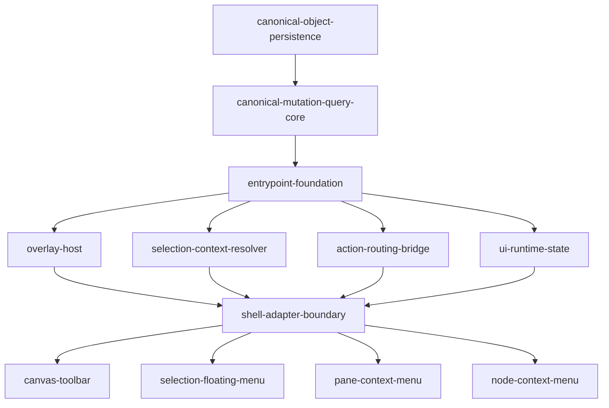
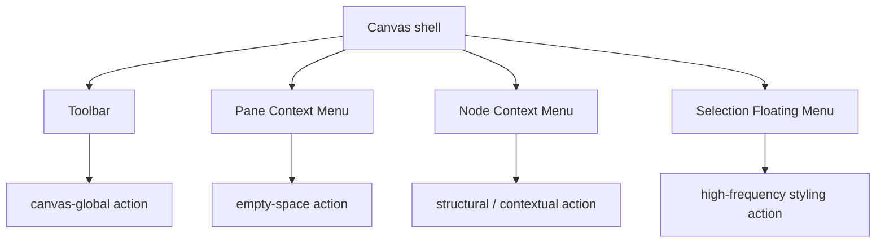
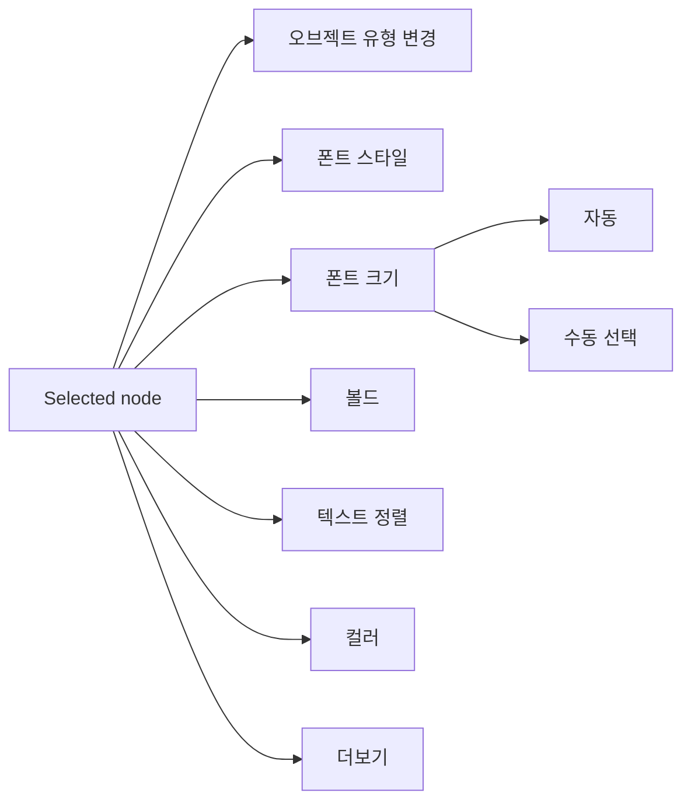

# Canvas UI Entrypoints

## 개요

이 slice는 `database-first-canvas-platform`에서 사용자 UI/UX 관점의 canvas 진입점을 정리한다.

현재 누락된 핵심 surface는 다음 세 가지다.

- canvas toolbar
- selection floating contextual menu
- canvas node context menu

여기에 더해 empty canvas에서 여는 pane context menu도 함께 정리돼야 한다.

이 surface들은 단순 UI 추가가 아니라, database-first runtime 위에서 canonical mutation/query 경계를 지키는 entrypoint surface로 설계돼야 한다.

이 slice의 목적은 이 surface들을 한 번에 모두 구현하는 것이 아니라, 먼저 기반 구조를 고정하고 이후 병렬 가능한 후속 feature로 분리할 수 있게 만드는 것이다.

## 왜 별도 slice인가

현재 umbrella는 persistence, mutation/query, CLI, app-attached, plugin runtime 중심으로 잘 분리되어 있다. 하지만 실제 사용자가 직접 만지는 편집 surface는 별도 구현 단위로 정리되어 있지 않다.

이 상태로 toolbar와 selection floating menu, node context menu를 바로 붙이면 다음 문제가 생긴다.

- runtime shell에 overlay UI 책임이 다시 집중된다.
- renderer tag나 ad-hoc client state에 기대는 분기가 되살아난다.
- 향후 `toolbar`, `selection-floating-menu`, `pane-context-menu`, `node-context-menu`를 병렬 작업 단위로 떼기 어렵다.

따라서 이 slice는 UI surface 자체보다 먼저, 그 surface가 기대는 host/resolver/routing 경계를 정의한다.

## 하위 Feature Slices

`canvas-ui-entrypoints`는 다시 아래 6개 하위 slice로 나눈다.

### 1. `entrypoint-foundation`

- 폴더: `./entrypoint-foundation/`
- 문서: `./entrypoint-foundation/README.md`
- 목표: overlay host, selection context resolver, action routing, runtime UI state contract를 먼저 고정

`entrypoint-foundation`은 다시 아래 4개 하위 slice로 쪼갠다.

- `overlay-host`
- `selection-context-resolver`
- `action-routing-bridge`
- `ui-runtime-state`

### 2. `shell-adapter-boundary`

- 폴더: `./shell-adapter-boundary/`
- 문서: `./shell-adapter-boundary/README.md`
- 목표: `processes/canvas-runtime` composition root와 fixed slot contract를 열어 `GraphCanvas`, `FloatingToolbar`, `useContextMenu`, `WorkspaceClient`의 shared shell ownership을 먼저 흡수

### 3. `canvas-toolbar`

- 폴더: `./canvas-toolbar/`
- 문서: `./canvas-toolbar/README.md`
- 목표: create, interaction mode, viewport quick control 같은 전역 canvas toolbar를 구현

### 4. `selection-floating-menu`

- 폴더: `./selection-floating-menu/`
- 문서: `./selection-floating-menu/README.md`
- 목표: 선택된 node 위에 붙는 고빈도 직접 편집 액션 바 구현

### 5. `pane-context-menu`

- 폴더: `./pane-context-menu/`
- 문서: `./pane-context-menu/README.md`
- 목표: 빈 canvas에서 여는 생성/뷰 관련 context menu 구현

### 6. `node-context-menu`

- 폴더: `./node-context-menu/`
- 문서: `./node-context-menu/README.md`
- 목표: 선택 node 기준의 구조적/저빈도 contextual action 구현

## 범위

### 포함

- DB-backed canvas runtime에서의 toolbar surface 계약
- selection floating contextual menu surface 계약
- node context menu surface 계약
- 같은 host를 공유하는 pane context menu 분리 기준
- selection, viewport, semantic role, capability/content contract 기반 action exposure
- persisted state와 runtime-only UI state의 경계
- `processes/canvas-runtime` composition root와 fixed contribution slot
- `GraphCanvas` / `FloatingToolbar` / context menu / dispatch shell의 consumer boundary
- 후속 병렬 분리를 위한 ownership 단위 정의

### 제외

- inspector 전체 설계
- keyboard shortcut 세부 설계
- export dialog 내부 UX
- plugin 전용 custom context menu
- collaborative presence, CRDT/OT

## 선행조건

이 slice는 아래 선행 작업이 있다는 전제에서 성립한다.

- `canonical-object-persistence`
- `canonical-mutation-query-core`
- DB-backed canvas composition 기반 구조

핵심은 toolbar, floating menu, context menu가 별도 write path를 만들면 안 되고, 이미 정의된 canonical mutation/query core를 사용해야 한다는 점이다.

또 하나 중요한 점은, `canonical-object-persistence`에서 schema modeling과 canonical entity boundary가 먼저 잠기면 UI는 그 위에서 parallel-safe하게 움직일 수 있다는 점이다. 즉 UI는 persistence를 기다리는 것이 아니라, persistence와 mutation/query contract를 소비하는 쪽으로 병렬 진행 가능해야 한다.

## 핵심 결정

### 결정 1. toolbar, selection floating menu, node context menu는 서로 다른 runtime entrypoint feature다

이 셋은 persistence 자체도 아니고 mutation/query core 자체도 아니다. 이미 존재하는 domain action을 사용자에게 어떤 진입점으로 노출할지의 문제다.

따라서 이 slice는 action 자체를 새로 정의하기보다, 아래를 고정한다.

- 어떤 문맥에서 어떤 action을 노출할지
- 어떤 runtime state를 읽을 수 있는지
- 어떤 방식으로 canonical mutation path에 연결할지

### 결정 2. 개별 기능보다 entrypoint host를 먼저 만든다

toolbar, selection floating menu, context menu는 모두 overlay UI가 domain action을 노출하는 surface다. 각각을 별개 구현으로 먼저 시작하면 dismiss, focus, position, context resolution이 쉽게 중복된다.

먼저 필요한 것은 다음 공통 기반 구조다.

- runtime shell이 제공하는 entrypoint host
- selection/viewport/target resolution contract
- runtime-only UI state store
- domain mutation routing

### 결정 3. foundation 다음으로 canvas runtime composition root를 먼저 만든다

foundation contract가 있어도 `GraphCanvas.tsx`, `FloatingToolbar.tsx`, `useContextMenu.ts`, `WorkspaceClient.tsx`가 계속 직접 feature owner면 병렬 레인이 결국 같은 shell 파일에서 다시 만난다.

따라서 surface 구현 전 아래를 먼저 분리한다.

- `GraphCanvas`는 surface mount host가 된다.
- `FloatingToolbar`는 presenter가 된다.
- context menu는 shared hook가 아니라 surface registry를 소비한다.
- dispatch wiring은 `WorkspaceClient` 밖 adapter로 옮긴다.
- 후속 feature는 fixed slot에 자기 `contribution.ts`만 채운다.

### 결정 4. selected node의 고빈도 편집은 floating contextual menu가 우선이다

Miro/FigJam 류의 UX를 기준으로 보면, 선택된 node에 대해 가장 자주 쓰는 조작은 우클릭 메뉴 깊숙이 있으면 안 된다.

선택 즉시 selection bounding box 또는 node 근처에 붙는 floating contextual menu가 먼저 보여야 한다.

이 메뉴가 담당하는 대표 액션:

- 오브젝트 유형 변경
- 폰트 스타일
- 폰트 크기
  - 자동
  - 수동 선택
- 볼드
- 텍스트 정렬
- 컬러
- 더보기

즉 node를 "자유롭게 다룬다"는 감각은 toolbar보다도, 선택 직후 뜨는 floating menu의 속도와 적중률에서 결정된다.

Miro benchmark를 기준으로 보면, 이 메뉴는 "선택 후 즉시 보이는 1차 액션 바"로 보는 편이 맞다. 즉 inspector를 열기 전, 우클릭 메뉴를 열기 전, 가장 먼저 만지는 퀵 액션 표면이다.

### 결정 5. node context menu는 renderer type이 아니라 canonical metadata로 연다

database-first 이후 node menu는 `ShapeNode`, `StickyNode` 같은 renderer 이름으로 분기하면 안 된다.

메뉴 노출 기준은 다음 metadata여야 한다.

- `semanticRole`
- `primaryContentKind`
- capability bag
- canvas node kind
- container/group/frame 여부
- 현재 selection 및 relation context

## 기반 구조

### 1. Persisted state와 runtime-only UI state 분리

toolbar, floating menu, context menu는 세션 중 UI 상태를 많이 다루지만, 그 결과는 persisted mutation으로 이어질 수 있다.

| 구분 | 예시 |
|------|------|
| persisted | `canvas_nodes.layout`, `canvas_nodes.parent_node_id`, `surfaces.viewport_state`, `objects.semantic_role` |
| runtime-only | 현재 selection, hover target, 열린 menu, floating menu anchor, active tool, drag preview, optimistic pending state |

### 2. Entrypoint context resolver

각 UI surface가 독자적으로 heuristic을 계산하면 곧 drift가 생긴다. 공통 resolver가 아래 정보를 제공해야 한다.

- 현재 surface id / viewport snapshot
- selection snapshot
- target node의 `canvas_node`, `canonical_object`, relation context
- semantic role / content / capability 기반 editability summary
- container/group/frame 여부
- 실행 가능한 action 집합 또는 gating 근거
- floating menu를 어느 위치에 띄울지에 대한 anchor 정보

### 3. Action routing은 canonical mutation path만 사용

toolbar나 menu는 mutation의 owner가 아니다. 둘은 intent를 발생시키는 surface다.

| UI 진입점 | 사용자 의도 | 권장 실행 경로 |
|----------|-------------|----------------|
| toolbar create | 새 native object 생성 | `object.create` + `canvas-node.create` |
| selection floating menu style edit | 선택된 node의 고빈도 스타일/속성 수정 | `object.patch-capability` 또는 `object.update-content` |
| selection floating menu type/shape convert | 선택된 node의 shape 또는 object type 전환 | `object.update-core` + 필요 시 `canvas-node` renderer hint 갱신 |
| pane context menu create | 빈 surface 위치에 생성 | `object.create` + `canvas-node.create` |
| node context menu add child | 관계를 가진 새 노드 생성 | `object.create` + `object-relation.create` + `canvas-node.create` |
| node context menu rename | canonical label/content 수정 | `object.update-core` 또는 `object.update-content` |
| toolbar fit/zoom | view 조정 | runtime viewport action, 필요 시 `surface.update-viewport` |

### 4. Overlay host / slot contract

후속 feature를 병렬화하려면 overlay shell은 core가 소유하고, 개별 feature는 contribution만 소유하는 편이 안전하다.

- core
  - entrypoint host
  - positioning
  - outside click / dismiss
  - focus management
  - z-index / portal layering
- feature
  - toolbar section
  - selection floating menu items
  - pane menu items
  - node menu items
  - action enable/disable rule

### 5. Shell adapter boundary

후속 surface가 병렬 작업 가능하려면 foundation 위에 한 번 더 shell adoption boundary가 필요하다.

- shell-adapter-boundary
  - `processes/canvas-runtime` composition root
  - fixed contribution slot
  - `GraphCanvas` host binding
  - `FloatingToolbar` presenter binding
  - context menu registry binding
  - `WorkspaceClient` dispatch binding
- surface feature
  - feature-owned model
  - menu/control inventory
  - gating rule
  - fixed-slot `contribution.ts`

## 하위 slice 의존성

해석:

- schema/modeling은 `canonical-object-persistence`에서 먼저 잠긴다.
- UI는 `canonical-mutation-query-core`의 action contract를 공유해야 한다.
- 실제 UI 병렬 작업의 첫 블로커는 `entrypoint-foundation`이고, 두 번째 블로커는 `shell-adapter-boundary`다.
- foundation 내부도 다시 4개 하위 slice로 병렬 분리 가능하다.
- `shell-adapter-boundary`가 shared shell ownership을 한 번 흡수한 뒤, `canvas-toolbar`, `selection-floating-menu`, `pane-context-menu`, `node-context-menu`가 feature-owned 파일 위에서 병렬 진행된다.

## UX surface 관계

해석:

- toolbar는 canvas 전체에 대한 전역 진입점이다.
- pane menu는 빈 공간에서 새 요소를 추가할 때의 진입점이다.
- node context menu는 구조 변경, group action, relation action 같은 저빈도지만 중요한 명령을 담는다.
- selection floating menu는 선택된 node를 빠르게 "바로 고치는" 고빈도 조작 surface다.

## Selection Floating Menu v1

v1에서 이 메뉴는 아래 원칙을 따른다.

- 기본 노출은 고빈도 액션만 둔다.
- selection이 1개이거나, homogeneous multi-selection일 때만 적극 노출한다.
- 현재 selection에 적용 불가능한 control은 숨기거나 disable한다.
- `더보기`는 저빈도 속성이나 object-family 전용 action으로 들어가는 secondary overflow다.

## 병렬 작업 분해안

### 1. Entrypoint Foundation

책임:

- overlay host
- selection context resolver
- target/anchor positioning contract
- runtime-only UI state
- domain action routing bridge

이 slice는 실제로 아래 4개 하위 slice로 나뉜다.

- `overlay-host`
- `selection-context-resolver`
- `action-routing-bridge`
- `ui-runtime-state`

### 2. Shell Adapter Boundary

책임:

- `processes/canvas-runtime` composition root
- fixed contribution slot
- `GraphCanvas` host binding
- `FloatingToolbar` presenter binding
- context menu registry binding
- `WorkspaceClient` dispatch binding

의존성:

- overlay host
- selection context resolver
- action routing
- runtime-only UI state

### 3. Canvas Toolbar

선행:

- `shell-adapter-boundary`

책임:

- interaction mode 전환
- create tool 선택
- viewport quick controls
- canvas-global quick actions

의존성:

- selection/viewport resolver
- action routing
- runtime-only tool state

### 4. Selection Floating Menu

선행:

- `shell-adapter-boundary`

책임:

- single selection 또는 homogeneous multi-selection에 대한 고빈도 스타일 편집
- 오브젝트 유형 변경
- 폰트 스타일
- 폰트 크기
  - 자동
  - 수동 선택
- 볼드
- 텍스트 정렬
- 컬러
- 더보기 overflow
- selection anchor 기준 위치 계산
- 지원 불가능한 속성은 숨기거나 disable 처리

의존성:

- selection resolver
- capability/content editability summary
- floating anchor positioning

### 5. Pane Context Menu

선행:

- `shell-adapter-boundary`

책임:

- 빈 캔버스(surface) 우클릭 액션
- blank-area create
- surface-level view action
- selection 비의존 action

의존성:

- surface target resolution
- viewport/state bridge
- object create routing

### 6. Node Context Menu

선행:

- `shell-adapter-boundary`

책임:

- node target resolution
- semantic role / capability 기반 메뉴 노출
- relation-aware action
- selection-aware action
- object-bound node와 pure canvas node의 분기 처리

대표 액션 예시:

- rename
- child create / sibling create
- group or container scoped action
- object/content edit 진입
- duplicate / delete / lock 같은 저빈도 contextual action
- 선택 확장 또는 group selection

의존성:

- canonical metadata resolver
- relation query
- mutation batch executor

## 구현 순서

### Step 1. `entrypoint-foundation`

- 1A. `overlay-host`
- 1B. `selection-context-resolver`
- 1C. `action-routing-bridge`
- 1D. `ui-runtime-state`

위 4개는 foundation 범위 안에서 병렬 진행 가능하다.

### Step 2. `shell-adapter-boundary`

- 2A. `GraphCanvas` host boundary
- 2B. `FloatingToolbar` presenter boundary
- 2C. context menu registry boundary
- 2D. dispatch adapter boundary

위 작업은 shared shell hot spot을 한 번에 흡수하는 선행 작업이다.

### Step 3. Parallel feature split

- 레인 A: `canvas-toolbar`
- 레인 B: `selection-floating-menu`
- 레인 C: `pane-context-menu`
- 레인 D: `node-context-menu`

네 레인은 `shell-adapter-boundary`가 shared shell ownership을 먼저 고정했다는 전제에서 병렬화 가능하다.

### Step 4. Follow-up expansion

- shortcut
- inspector
- plugin-owned contextual actions
- session-aware app-attached extension

## 완료 기준

1. database-first runtime에서 `entrypoint-foundation`, `shell-adapter-boundary`, `canvas-toolbar`, `selection-floating-menu`, `pane-context-menu`, `node-context-menu`를 별도 feature로 분리할 근거가 명확하다.
2. 분리 전 선행 구조 변경이 무엇인지 구현자가 혼동하지 않는다.
3. node context menu의 노출 기준이 renderer tag가 아니라 canonical metadata라는 점이 문서에 고정된다.
4. foundation과 `shell-adapter-boundary` 이후 후속 작업을 최소 4개 병렬 레인(`canvas-toolbar`, `selection-floating-menu`, `pane-context-menu`, `node-context-menu`)으로 나눌 수 있다.

## 관련 문서

- `docs/features/database-first-canvas-platform/README.md`
- `docs/features/database-first-canvas-platform/implementation-plan.md`
- `docs/features/database-first-canvas-platform/canonical-mutation-query-core/README.md`
- `docs/features/database-first-canvas-platform/app-attached-session-extension/README.md`
- `docs/features/database-first-canvas-platform/canvas-ui-entrypoints/entrypoint-foundation/README.md`
- `docs/features/database-first-canvas-platform/canvas-ui-entrypoints/entrypoint-foundation/overlay-host/README.md`
- `docs/features/database-first-canvas-platform/canvas-ui-entrypoints/entrypoint-foundation/selection-context-resolver/README.md`
- `docs/features/database-first-canvas-platform/canvas-ui-entrypoints/entrypoint-foundation/action-routing-bridge/README.md`
- `docs/features/database-first-canvas-platform/canvas-ui-entrypoints/entrypoint-foundation/ui-runtime-state/README.md`
- `docs/features/database-first-canvas-platform/canvas-ui-entrypoints/entrypoint-foundation/ui-runtime-state/implementation-plan.md`
- `docs/features/database-first-canvas-platform/canvas-ui-entrypoints/shell-adapter-boundary/README.md`
- `docs/features/database-first-canvas-platform/canvas-ui-entrypoints/shell-adapter-boundary/implementation-plan.md`
- `docs/features/database-first-canvas-platform/canvas-ui-entrypoints/shell-adapter-boundary/tasks.md`
- `docs/features/database-first-canvas-platform/canvas-ui-entrypoints/canvas-toolbar/README.md`
- `docs/features/database-first-canvas-platform/canvas-ui-entrypoints/canvas-toolbar/implementation-plan.md`
- `docs/features/database-first-canvas-platform/canvas-ui-entrypoints/canvas-toolbar/tasks.md`
- `docs/features/database-first-canvas-platform/canvas-ui-entrypoints/selection-floating-menu/README.md`
- `docs/features/database-first-canvas-platform/canvas-ui-entrypoints/selection-floating-menu/implementation-plan.md`
- `docs/features/database-first-canvas-platform/canvas-ui-entrypoints/selection-floating-menu/tasks.md`
- `docs/features/database-first-canvas-platform/canvas-ui-entrypoints/pane-context-menu/README.md`
- `docs/features/database-first-canvas-platform/canvas-ui-entrypoints/pane-context-menu/implementation-plan.md`
- `docs/features/database-first-canvas-platform/canvas-ui-entrypoints/pane-context-menu/tasks.md`
- `docs/features/database-first-canvas-platform/canvas-ui-entrypoints/node-context-menu/README.md`
- `docs/features/database-first-canvas-platform/canvas-ui-entrypoints/node-context-menu/implementation-plan.md`
- `docs/features/database-first-canvas-platform/canvas-ui-entrypoints/node-context-menu/tasks.md`
- `docs/features/object-capability-composition/README.md`
