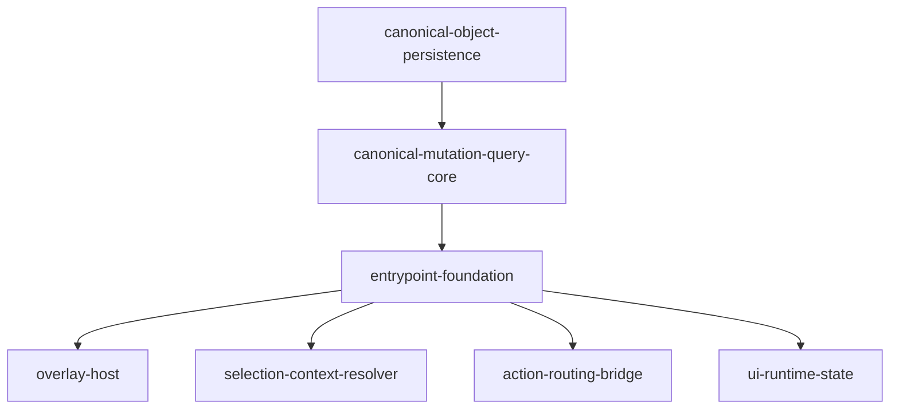

# Entrypoint Foundation

## 개요

이 sub-slice는 `canvas-ui-entrypoints` 아래의 공통 기반 구조를 담당한다.

핵심 목표는 이후 `shell-adapter-boundary`가 `processes/canvas-runtime` composition root와 fixed slot contract를 열 수 있도록, shared host와 contract를 먼저 잠그는 것이다.

## 범위

- overlay host
- selection context resolver
- target / anchor positioning contract
- runtime-only UI state
- canonical mutation action routing bridge

## 하위 Feature Slices

`entrypoint-foundation`은 다시 아래 4개 하위 slice로 나눈다.

### 1. `overlay-host`

- 폴더: `./overlay-host/`
- 문서: `./overlay-host/README.md`
- 목표: overlay stacking, positioning, dismiss, focus lifecycle 공통 host를 고정

### 2. `selection-context-resolver`

- 폴더: `./selection-context-resolver/`
- 문서: `./selection-context-resolver/README.md`
- 목표: selection, target node, canonical metadata, relation context를 공통 shape로 해석

### 3. `action-routing-bridge`

- 폴더: `./action-routing-bridge/`
- 문서: `./action-routing-bridge/README.md`
- 목표: UI intent를 canonical mutation/query action contract로 연결

### 4. `ui-runtime-state`

- 폴더: `./ui-runtime-state/`
- 문서: `./ui-runtime-state/README.md`
- 목표: active tool, open overlay, floating anchor, optimistic UI 같은 session state를 정리

## 비범위

- `processes/canvas-runtime` composition root 열기
- `GraphCanvas` / `FloatingToolbar` host/presenter consumer 분리
- toolbar 실제 버튼 구성
- floating menu 실제 액션 세트
- pane/node context menu item 세트

## 왜 먼저인가

이 sub-slice가 없으면 모든 UI surface가 같은 runtime shell 안에서 position, dismiss, selection 해석, action dispatch를 중복 구현하게 된다.

다만 foundation만으로는 shared shell 파일 hot spot이 사라지지 않으므로, foundation 다음에는 `shell-adapter-boundary`가 이어져야 한다.

## 하위 slice 의존성

해석:

- foundation은 `canonical-mutation-query-core` 위에서 정의된다.
- foundation 내부도 다시 4개 하위 slice로 병렬 분리 가능하다.
- 이후 `shell-adapter-boundary`가 이 4개 foundation slice를 조합해서 `processes/canvas-runtime` composition root와 fixed slot contract를 만든다.
- 그 다음 `canvas-toolbar`, `selection-floating-menu`, `pane-context-menu`, `node-context-menu`가 feature-owned 파일 위에서 병렬 진행된다.

## 완료 기준

- 이후 `shell-adapter-boundary`가 shared host와 resolver를 재사용해 `canvas-runtime` composition root를 만들 수 있다.
- foundation contract가 stable input으로 고정돼 fixed slot 기반 adoption을 시작할 수 있다.
- foundation 내부 4개 하위 slice가 서로 책임 충돌 없이 분리된다.
