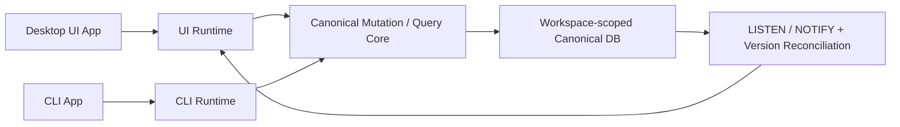
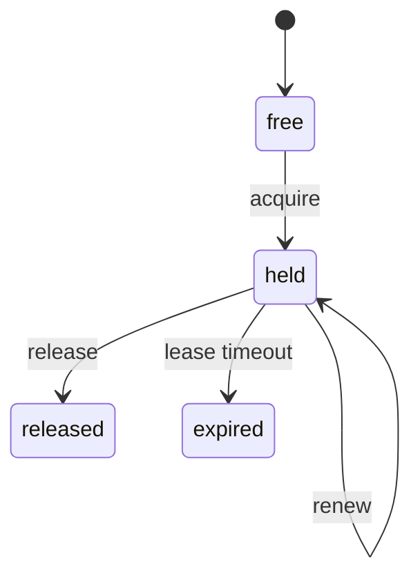

# DB-Mediated UI/CLI Runtime

## 개요

이 feature는 다음 실행 모델을 구현 가능한 계약 수준으로 고정한다.

```text
UI 앱 <-> 런타임 <-> Workspace-scoped Canonical DB <-> 런타임 <-> CLI 앱
```

핵심은 분명하다.

- UI 앱과 CLI 앱 사이에 direct IPC, WebSocket, local socket attach를 두지 않는다.
- 하나의 workspace가 하나의 canonical DB 파일을 가진다.
- 하나의 workspace 안에는 여러 canvas가 존재한다.
- canvas는 작업 진입과 탐색 단위이지만, 동시성 제어의 주 단위는 아니다.
- 실제 독립 편집 단위는 `canvas node`다.
- CLI 편집도 node 단위 소유권과 revision precondition을 따라야 한다.

이 문서는 schema나 migration을 고정하지 않는다. Drizzle ORM으로 구현 가능한 수준의 **도메인 및 엔티티 계약**만 정리한다.

## 문제 정의

우리가 해결해야 할 문제는 다음이다.

- UI runtime과 CLI runtime이 직접 통신하지 않아도 같은 workspace를 안전하게 편집해야 한다.
- 하나의 workspace 안에 여러 canvas가 있어도 충돌 단위가 workspace 전체나 canvas 전체로 과도하게 커지면 안 된다.
- 외부에서 canonical DB 파일이 수정되었을 때 UI는 그 변경을 빠르게 감지하고 stale projection을 오래 붙잡지 않아야 한다.
- CLI 편집은 lock 없이 direct write하는 경로를 가지면 안 된다.
- 충돌 기준은 canvas 전체가 아니라 실제 독립 편집 단위에 맞아야 한다.

이 문서에서 더 중요한 목표는 "모든 편집을 막는 것"보다 아래 두 가지다.

- 사용자가 UI에서 계속 반응성 있게 작업할 수 있을 것
- 외부 DB 변경이 생겼을 때 UI가 이를 빠르게 반영할 것

이 기준에서 보면 canvas 전체 revision은 너무 거칠다.

- 하나의 node를 움직이는 작업과 다른 node의 body를 수정하는 작업이 같은 revision head를 두고 충돌한다.
- 같은 canvas 안에서 병렬 가능한 작업까지 불필요하게 직렬화된다.
- "canvas는 메타데이터, node가 실질 편집 단위"라는 현재 제품 구조와 맞지 않는다.

따라서 이 문서는 coordination의 기본 단위를 `canvas`가 아니라 `node`로 둔다.

## 현재 제품 기준

이 문서가 따르는 현재 제품 기준은 아래 두 문장이다.

- `workspace = storage boundary`
- `canvas = editing surface metadata`

그리고 이번 feature에서 추가로 고정하는 문장은 아래와 같다.

- `node = coordination boundary`

즉 이 문서에서 canvas는 다음 역할만 가진다.

- sidebar와 editor가 여는 화면 단위
- node들을 묶는 composition container
- title, ordering, shell metadata 같은 관리 단위

반대로 충돌 제어, lock lease, stale check의 기본 기준은 node다.

## 범위

- workspace-scoped DB 위의 node-centric coordination domain 정의
- UI/CLI가 공유할 node revision/version/lock/audit 계약 정의
- canvas metadata 변경과 node 변경의 책임 분리
- UI invalidation/reload/editability contract 정의
- CLI runtime apply flow 정의
- 문서/코드에서 제거해야 할 구식 도메인 가정 명시

## 명시적 변경 방향

이 문서는 아래 세 가지를 명시적으로 구분한다.

### 무엇을 할 것인가

- workspace-scoped canonical DB를 유일한 coordination boundary로 사용한다.
- node revision/version을 primary concurrency primitive로 사용한다.
- canvas는 metadata revision만 갖도록 축소한다.
- UI 변경 감지는 PostgreSQL `LISTEN / NOTIFY + version reconciliation`로 통일한다.
- UI는 optimistic editing을 유지하고, commit 시 target-level precondition으로 stale write를 막는다.

### 무엇을 제거할 것인가

- canvas-wide revision을 primary concurrency primitive로 쓰는 가정
- `document`를 primary runtime noun으로 쓰는 계약
- `AgentJob` 같은 actor-specific persisted coordination entity
- app-attached subscription / custom watcher / ad-hoc notification 중심 변경 감지 전략
- 일반 node edit까지 broad canvas lock으로 막는 가정
- shared editable object를 in-place 수정하는 write path

### 무엇을 추가할 것인가

- `WorkspaceRuntimeVersionEntity`
- `CanvasMetadataVersionEntity`
- `NodeRevisionEntity`
- `NodeVersionEntity`
- `CanvasLockLeaseEntity`
- `NodeLockLeaseEntity`
- `MutationAuditEntryEntity`의 `node-set | canvas-metadata` target shape
- commit 이후 PostgreSQL `NOTIFY`와 UI reconciliation 규칙

## 비범위

- Drizzle schema 파일 작성
- migration SQL 초안 작성
- UI overlay, toast, panel의 실제 구현
- CLI subcommand와 background worker 구현
- transport broker 또는 live attach 재도입

## TODO

이 문서 기준으로 후속 작업이 명시적으로 수행해야 할 TODO는 아래와 같다.

- [ ] 기존 코드베이스의 WebSocket subscription 기반 canvas invalidation contract를 하드 제거한다.
- [ ] 기존 코드베이스의 custom watcher / ad-hoc notification 기반 변경 감지 경로를 하드 제거한다.
- [ ] UI 변경 감지 기본 경로를 PostgreSQL `LISTEN / NOTIFY + version reconciliation` 하나로 수렴한다.
- [ ] canvas-wide revision/history를 primary concurrency primitive로 쓰는 경로를 하드 제거한다.
- [ ] `document` 중심 runtime 용어와 API/contract를 canvas/node terminology로 정리한다.
- [ ] shared editable object in-place write 경로를 제거하고 copy-on-write만 남긴다.

## 핵심 전제

### 1. canonical mutation executor는 하나다

UI와 CLI는 같은 canonical mutation/query core를 사용해야 한다.

- UI의 drag, resize, rename, body edit도 같은 mutation executor로 들어간다.
- CLI의 `mutation apply`도 같은 executor로 들어간다.
- transport만 다르고 write contract는 하나여야 한다.

### 2. workspace는 저장 경계고 canvas는 조정 경계가 아니다

workspace는 DB 파일, 검색, 자산, object 저장의 경계다.

canvas는 다음을 소유한다.

- node membership
- surface/layout composition
- canvas shell metadata

하지만 concurrency conflict의 기본 기준은 아니다.

### 3. node가 독립 편집 단위다

우리 앱에서 실제로 독립적으로 움직이고 편집되는 것은 canvas node다.

- 한 node의 위치 변경
- 한 node의 body edit
- 한 node가 참조하는 canonical object의 content/capability edit

이 작업들은 기본적으로 다른 node의 작업과 독립적으로 진행될 수 있어야 한다.

editable canonical object는 여기서 template-like source로 취급한다.

- canonical object는 재사용 가능한 base/template가 될 수 있다.
- 하지만 editable write는 shared object를 직접 수정하지 않는다.
- node가 참조하는 editable object를 수정하려 하면 copy-on-write로 node-local clone을 만든 뒤 그 clone에 쓴다.
- 따라서 일반 편집 경로의 충돌 기준은 shared object가 아니라 해당 node와 그 node가 소유한 cloned object다.

즉 이 문서에서는 shared editable object revision을 기본 모델로 채택하지 않는다.

### 4. canvas-wide coordination은 예외 경로다

canvas-wide lock이나 canvas metadata revision이 필요할 때는 있다.

- canvas title 변경
- surface reorder
- 전체 canvas 구조 변경
- 여러 node를 한 번에 재배치하는 broad mutation

하지만 이것이 기본 경로가 되면 안 된다. 기본은 node-scoped coordination이고, canvas-scoped coordination은 예외 경로다.

### 5. lock과 revision precondition은 둘 다 필요하다

- lock은 "누가 지금 이 대상을 작업 중인가"를 보호한다.
- revision/version precondition은 "내가 읽은 기준이 아직 유효한가"를 보호한다.

둘 중 하나라도 맞지 않으면 write는 reject된다.

다만 이 문서의 기본 UX는 pessimistic blocking이 아니라 optimistic editing이다.

- UI 편집은 가능하면 먼저 허용한다.
- disjoint node 변경은 서로 막지 않는다.
- 실제 reject는 target-level precondition mismatch가 드러나는 commit 시점에만 일어난다.
- 동시성 제어의 목적은 반응성을 낮추는 것이 아니라 stale write 범위를 좁히는 것이다.

## 전체 구조



핵심은 다음과 같다.

- UI와 CLI는 서로를 호출하지 않는다.
- 둘 다 같은 core를 통해 workspace DB와만 상호작용한다.
- invalidate/reload도 DB 변화를 관찰해서 처리한다.
- 변경 감지의 기본 메커니즘은 PostgreSQL `LISTEN / NOTIFY`다.
- 알림 자체를 truth로 쓰지 않고, 알림 수신 후 version row를 다시 읽는 방식으로 반영한다.

## 변경 감지 원칙

UI 변경 감지는 별도 subscription 서버나 app-attached channel이 아니라 PostgreSQL 기능으로 처리한다.

- 기본 신호: PostgreSQL `LISTEN / NOTIFY`
- 기준 truth: persisted version entities
- UI 반영 방식: notify 수신 후 version reconciliation

즉 `NOTIFY`는 "무언가 바뀌었다"는 wake-up signal이고, 실제 반영 여부는 DB 재조회로 확인한다.

### 왜 이 방식을 쓰는가

- DB가 유일한 coordination boundary로 유지된다.
- 외부 CLI 편집도 같은 DB 메커니즘으로 감지할 수 있다.
- 별도 WebSocket subscription contract를 추가로 정의할 필요가 없다.
- file watcher보다 canonical truth와 더 가깝다.

### 최소 규칙

- mutation commit이 성공하면 관련 version row 갱신과 함께 `NOTIFY`를 보낸다.
- UI는 workspace 범위 알림을 `LISTEN`한다.
- 알림 payload는 최적화 힌트일 뿐 authoritative data가 아니다.
- UI는 알림을 받으면 `WorkspaceRuntimeVersionEntity`부터 다시 읽는다.
- reconnect, app resume, window focus 시에도 같은 reconciliation을 다시 수행한다.

## 이 문서에서 남길 도메인

이 문서는 아래 도메인만 다룬다.

- `WorkspaceBoundary`
- `CanvasShellMetadata`
- `CanvasNodeCoordination`
- `NodeLockLease`
- `MutationAudit`

## 이 문서에서 제거할 도메인

이 문서에서 coordination과 직접 관계없는 도메인 설명은 제거 대상으로 본다.

- `DocumentAggregate` 중심 설명
- 문서/세션/chat 중심의 옛 runtime 서술
- plugin catalog/runtime 세부 설명
- app-attached selection/session attach 전제
- canvas 전체를 primary revision unit으로 보는 설명

명시적 정리 방향:

- `document`는 호환 명명으로 남아 있을 수 있어도, 이 문서의 1급 도메인 용어는 아니다.
- `canvas`는 editor shell metadata 용어로만 남기고, revision/lock 기본 단위로 사용하지 않는다.
- coordination README는 workspace/canvas/node/lock/audit 외의 주변 도메인 설명을 싣지 않는다.

## Coordination Domain

이 문서에서 고정하는 핵심 엔티티는 다음 일곱 가지다.

- `WorkspaceRuntimeVersionEntity`
- `CanvasMetadataVersionEntity`
- `NodeRevisionEntity`
- `NodeVersionEntity`
- `CanvasLockLeaseEntity`
- `NodeLockLeaseEntity`
- `MutationAuditEntryEntity`

아래 TypeScript shape는 schema가 아니라 **도메인 계약**이다.

### 공통 값 객체

```ts
type ActorKind = "ui-session" | "cli-runner" | "system";
type LockStatus = "held" | "released" | "expired";
type MutationSource = "ui" | "cli" | "system";

interface LockOwnerRef {
  actorKind: ActorKind;
  actorId: string;
  displayName?: string;
}

interface NodeRef {
  workspaceId: string;
  canvasId: string;
  nodeId: string;
  objectId?: string;
}

interface CoordinationErrorPayload {
  code:
    | "LOCK_NOT_AVAILABLE"
    | "LOCK_LEASE_EXPIRED"
    | "NODE_REVISION_PRECONDITION_FAILED"
    | "NODE_VERSION_PRECONDITION_FAILED"
    | "CANVAS_METADATA_STALE"
    | "TARGET_NOT_FOUND"
    | "MUTATION_APPLY_FAILED";
  message: string;
  retryable: boolean;
  details?: Record<string, unknown>;
}
```

### WorkspaceRuntimeVersionEntity

역할:

- workspace DB 자체가 바뀌었는지 감지하는 coarse-grained token
- UI가 "어떤 canvas든 외부 변경이 발생했다"는 사실을 빠르게 감지하는 루트

```ts
interface WorkspaceRuntimeVersionEntity {
  workspaceId: string;
  versionToken: string;
  updatedAt: Date;
}
```

불변식:

- workspace DB에 coordination 관련 commit이 발생하면 갱신된다.
- 이 값은 conflict 기준이 아니라 invalidation root 용도다.

### CanvasMetadataVersionEntity

역할:

- canvas shell metadata의 최신 상태를 추적한다.
- title, ordering, surface-level shell 정보처럼 node 외부의 canvas 메타데이터만 담당한다.

```ts
interface CanvasMetadataVersionEntity {
  workspaceId: string;
  canvasId: string;
  metadataRevisionNo: number;
  versionToken: string;
  updatedAt: Date;
}
```

불변식:

- canvas metadata 변경에만 증가한다.
- 일반 node content/layout 변경 때문에 증가하지 않는다.

### NodeRevisionEntity

역할:

- node 단위 mutation이 commit될 때 append되는 revision history
- 실질적인 충돌 판정과 replay 기준점

```ts
interface NodeRevisionEntity {
  id: string;
  workspaceId: string;
  canvasId: string;
  nodeId: string;
  objectId?: string;
  revisionNo: number;
  parentRevisionNo?: number;
  appliedBy: LockOwnerRef;
  mutationSource: MutationSource;
  mutationBatchId: string;
  auditEntryId: string;
  createdAt: Date;
}
```

불변식:

- `revisionNo`는 node 단위로 단조 증가한다.
- revision은 append-only다.
- 다른 node의 변경은 이 node의 revision 번호를 올리지 않는다.

### NodeVersionEntity

역할:

- 현재 node head 상태를 나타내는 lightweight token
- UI의 부분 invalidation과 CLI conditional apply의 기준

```ts
interface NodeVersionEntity {
  workspaceId: string;
  canvasId: string;
  nodeId: string;
  objectId?: string;
  headRevisionNo: number;
  versionToken: string;
  lastMutationBatchId: string;
  lastMutationSource: MutationSource;
  lastAppliedBy: LockOwnerRef;
  updatedAt: Date;
}
```

불변식:

- 하나의 active node에는 하나의 current version만 존재한다.
- node mutation이 commit되면 `headRevisionNo`와 `versionToken`이 같이 갱신된다.

### CanvasLockLeaseEntity

역할:

- canvas metadata 또는 broad structural mutation을 위한 예외적 독점 편집권

```ts
interface CanvasLockLeaseEntity {
  id: string;
  workspaceId: string;
  canvasId: string;
  owner: LockOwnerRef;
  leaseToken: string;
  status: LockStatus;
  expectedMetadataRevisionNo: number;
  acquiredAt: Date;
  renewedAt?: Date;
  expiresAt: Date;
  releasedAt?: Date;
}
```

불변식:

- active canvas lock이 있으면 그 canvas의 broad mutation은 다른 actor가 시작할 수 없다.
- canvas lock은 default가 아니라 exception path다.

### NodeLockLeaseEntity

역할:

- 특정 node에 대한 기본 독점 편집권
- 실제 AI/CLI 작업과 대부분의 UI write가 따라야 하는 기본 lock

```ts
interface NodeLockLeaseEntity {
  id: string;
  workspaceId: string;
  canvasId: string;
  nodeId: string;
  objectId?: string;
  owner: LockOwnerRef;
  leaseToken: string;
  status: LockStatus;
  expectedRevisionNo: number;
  acquiredAt: Date;
  renewedAt?: Date;
  expiresAt: Date;
  releasedAt?: Date;
}
```

불변식:

- 같은 node에 active node lock은 하나만 존재할 수 있다.
- 서로 다른 node lock은 같은 canvas 안에서도 공존 가능하다.
- canvas lock이 active이면 신규 node lock 획득은 reject될 수 있다.

### MutationAuditEntryEntity

역할:

- 어떤 actor가 어떤 target에 대해 어떤 precondition으로 mutation을 시도했고 결과가 어땠는지 남기는 감사 기록

```ts
interface MutationAuditEntryEntity {
  id: string;
  workspaceId: string;
  canvasId: string;
  mutationBatchId: string;
  mutationSource: MutationSource;
  actor: LockOwnerRef;
  relatedLockLeaseIds?: string[];
  target:
    | {
        kind: "node-set";
        expectedNodes: Array<{
          nodeId: string;
          expectedRevisionNo: number;
          expectedVersionToken: string;
        }>;
      }
    | {
        kind: "canvas-metadata";
        expectedMetadataRevisionNo: number;
        expectedMetadataVersionToken: string;
      };
  outcome: "committed" | "rejected" | "rolled-back";
  result?:
    | {
        kind: "node-set";
        nodes: Array<{
          nodeId: string;
          resultRevisionNo: number;
          resultVersionToken: string;
        }>;
      }
    | {
        kind: "canvas-metadata";
        metadataRevisionNo: number;
        metadataVersionToken: string;
      };
  error?: CoordinationErrorPayload;
  createdAt: Date;
}
```

불변식:

- audit는 성공/실패 모두 남길 수 있어야 한다.
- node-set target이면 conflict는 node별 mismatch를 보여줄 수 있어야 한다.
- canvas-metadata target이면 metadata precondition mismatch를 분리해 보여줄 수 있어야 한다.

## Coordination 규칙

### 1. revision 기본 단위는 node다

- node layout 변경은 해당 node revision만 증가시킨다.
- node body/content 변경은 해당 node revision만 증가시킨다.
- copy-on-write 이후 node가 소유하는 cloned object 변경도 해당 node revision 경로 안에서 관리한다.
- 다른 node의 변경은 unrelated node를 stale하게 만들지 않는다.

### 2. canvas는 metadata revision만 가진다

canvas에 revision이 전혀 없는 것은 아니다. 다만 그 의미는 제한적이다.

- title 변경
- surface shell 변경
- canvas ordering 변경
- canvas-level setting 변경

이 경우에만 `CanvasMetadataVersionEntity`가 증가한다.

### 3. multi-node mutation은 node set precondition으로 처리한다

여러 node를 함께 바꾸는 작업은 canvas revision 하나로 막지 않는다.

- multi-node 편집 자체는 허용한다.
- UI 반응성 때문에 기본 경험은 optimistic해야 한다.
- 대상 node 목록을 명시한다.
- 각 node의 expected revision/version을 함께 검증한다.
- 일부라도 mismatch면 transaction 전체를 reject한다.

즉 atomicity는 유지하되, conflict 범위는 target node set으로 제한한다.

### 4. canvas-wide lock은 마지막 수단이다

다음 경우에만 canvas lock을 쓴다.

- canvas metadata 자체를 바꾸는 경우
- 구조적으로 전체 canvas를 재배치하는 경우
- 대상 node 집합을 사전에 안정적으로 좁힐 수 없는 broad mutation

그 외에는 node lock만 사용한다.

### 5. mutation은 transaction 단위로 원자적이어야 한다

성공 commit 시 transaction 안에서 최소 다음이 같이 보장되어야 한다.

- target node set의 revision/version precondition 검증
- canvas metadata target이면 metadata revision/version precondition 검증
- mutation batch apply
- 각 changed node의 `NodeRevisionEntity` append
- 각 changed node의 `NodeVersionEntity` 갱신
- canvas metadata target이면 `CanvasMetadataVersionEntity` 갱신
- workspace invalidation token 갱신
- `MutationAuditEntryEntity` committed 기록

실패 시에는 partial write 없이 rollback되어야 한다.

## 상태 머신

### Lock 상태 머신



## UI Runtime Contract

UI runtime은 canvas 전체 projection을 보여주지만, invalidation과 editability는 node 중심으로 처리해야 한다.

### 1. load contract

UI가 canvas를 열면 최소 다음을 같이 읽는다.

- canvas shell metadata
- visible node projection
- `CanvasMetadataVersionEntity`
- visible node 범위의 `NodeVersionEntity`
- active node lock 집합
- 필요 시 active canvas lock

### 2. invalidation contract

UI는 PostgreSQL `LISTEN / NOTIFY`를 기본 변경 감지 메커니즘으로 사용한다.

- UI는 workspace 범위 channel을 `LISTEN`한다.
- `NOTIFY`를 받으면 먼저 `WorkspaceRuntimeVersionEntity`를 다시 읽는다.
- workspace token이 바뀌면 "외부 DB 수정이 발생했다"는 신호로 취급한다.
- workspace token이 바뀌면 active canvas 범위의 node version과 canvas metadata version을 다시 조회한다.
- local node version과 DB node version이 다른 node만 stale target로 판정한다.
- changed node만 부분 reload 가능하면 부분 reload를 우선한다.
- canvas metadata version이 바뀐 경우에만 canvas shell 전체 reload를 수행한다.
- reload는 가능하면 whole-canvas reset보다 node-level patch refresh를 우선한다.

### 2.1 fallback rule

`LISTEN / NOTIFY`는 wake-up signal이지 history transport가 아니다.

- UI가 알림을 놓칠 수 있으므로 reconnect 시 full reconciliation이 필요하다.
- app resume 또는 window focus 시에도 reconciliation을 다시 수행한다.
- 필요하면 low-frequency polling을 fallback safety net으로 둘 수 있지만, primary contract는 아니다.

### 3. editability contract

- active `NodeLockLeaseEntity`가 있으면 해당 node의 move/resize/content edit를 비활성화한다.
- active `CanvasLockLeaseEntity`가 있으면 canvas metadata edit와 broad action을 비활성화한다.
- lock owner가 자기 자신인 경우에만 editing affordance를 유지한다.

### 4. conflict UX contract

충돌 메시지는 canvas 전체가 아니라 node 기준으로 설명돼야 한다.

- 어떤 node가 외부 변경으로 오래되었는가
- 어떤 node가 다른 작업에 의해 잠겨 있는가
- 어떤 broad action이 canvas metadata lock 때문에 막혔는가

UI는 unrelated node까지 모두 dirty/conflict처럼 취급하면 안 된다.

## CLI Runtime Apply Contract

CLI runtime은 direct DB writer가 아니라 node-scoped coordination executor다.

### 표준 흐름

1. mutation target을 `node set` 또는 `canvas-metadata`로 정규화한다.
2. 대상이 node set이면 각 node의 `NodeLockLeaseEntity`를 획득한다.
3. 대상이 canvas metadata면 `CanvasLockLeaseEntity`를 획득한다.
4. target node들의 current revision/version 또는 canvas metadata revision을 읽는다.
5. canonical mutation/query core를 사용해 mutation batch를 구성한다.
6. transaction 안에서 target별 precondition을 다시 검증한다.
7. 검증이 통과하면 mutation batch를 apply한다.
8. changed node마다 새 `NodeRevisionEntity`를 append하고 `NodeVersionEntity`를 갱신한다.
9. canvas metadata target이면 `CanvasMetadataVersionEntity`를 갱신한다.
10. `WorkspaceRuntimeVersionEntity`를 갱신하고 관련 channel에 `NOTIFY`를 보낸다.
11. `MutationAuditEntryEntity(outcome=committed)`를 남긴다.
12. 관련 lock을 release한다.

### 실패 흐름

- node lock 획득 실패
  - error code는 `LOCK_NOT_AVAILABLE`
- canvas metadata lock 획득 실패
  - error code는 `LOCK_NOT_AVAILABLE`
- target node revision/version mismatch
  - transaction rollback
  - audit는 `rejected`
  - error code는 `NODE_REVISION_PRECONDITION_FAILED` 또는 `NODE_VERSION_PRECONDITION_FAILED`
- canvas metadata revision/version mismatch
  - transaction rollback
  - audit는 `rejected`
  - error code는 `CANVAS_METADATA_STALE`
- validation/apply 실패
  - transaction rollback
  - audit는 `rolled-back`
  - error code는 `MUTATION_APPLY_FAILED`
- lease 만료
  - apply 전에 감지되면 즉시 중단
  - stale lease로는 commit할 수 없다

### 명시적 경계

- CLI 프로세스의 진행 상태는 이 문서의 도메인 엔티티가 아니다.
- queue, runner lifecycle, background orchestration은 별도 운영 레이어 문제다.
- 이 문서의 관심사는 오직 persisted coordination contract다.

## 왜 node revision이 더 맞는가

현재 제품 구조와 충돌 특성을 기준으로 보면, node revision이 canvas revision보다 더 자연스럽다.

- 독립 이동 가능한 단위가 node다.
- 독립 body edit 가능한 단위가 node다.
- 사용자가 "같은 canvas를 열었다"는 사실만으로 같은 충돌 집합에 묶이면 안 된다.
- canvas는 실질 편집 payload보다 shell metadata에 가깝다.

즉 canvas-first UX와 node-first coordination은 충돌하지 않는다.

- 사용자는 canvas를 연다.
- 시스템은 node를 기준으로 충돌을 판정한다.

이 조합이 가장 명시적이다.

그리고 이 모델은 canvas app의 일반적인 optimistic UX와도 맞다.

- 편집은 먼저 허용한다.
- 외부 변경은 나중에 감지한다.
- 감지 후에는 전체 canvas를 막지 않고 영향받은 target만 갱신하거나 충돌 처리한다.

## Hard Migration 방향

다음 항목은 점진 호환보다 하드 마이그레이션 대상으로 보는 편이 맞다.

- canvas-wide revision을 primary concurrency primitive로 쓰는 가정 제거
- `document`를 primary runtime noun으로 쓰는 문서/계약 제거
- `AgentJob` 같은 actor-specific persisted coordination entity 제거
- canvas 단위 stale check를 기본으로 두는 UI invalidation 가정 제거
- broad mutation이 아닌 일반 node edit에도 canvas lock을 요구하는 가정 제거
- shared editable object를 in-place 수정하는 write path 제거
- app-attached subscription / custom watcher 중심의 변경 감지 가정 제거

## 현재 코드베이스에 맞춰 제거/정리할 가정

현재 코드베이스는 이미 `workspace-scoped DB + multi-canvas`로 이동했으므로, 이 문서와 후속 구현은 아래 정리를 전제로 해야 한다.

- `document` 중심 용어를 새로운 계약의 중심에 두지 않는다.
- canvas 전체 revision을 primary concurrency primitive로 더 확장하지 않는다.
- `document_revisions` 같은 기존 명명은 호환성 부채로만 취급하고, 새 계약 이름으로 승격하지 않는다.
- `AgentJob`과 같은 actor-specific persisted entity를 coordination 기본 모델에서 제거한다.
- coordination 문서에서 plugin, chat, session attach 같은 주변 도메인 서술을 제거한다.
- workspace 안에 여러 canvas가 있다는 사실을 전제로 entity naming과 invalidation 모델을 정리한다.

## Open Questions

- multi-node batch에서 lock 획득 순서를 어떻게 표준화해 deadlock 위험을 줄일지
- UI partial reload 단위를 node projection 조각으로 둘지, surface chunk로 둘지
- canvas metadata mutation과 node mutation이 한 transaction에 같이 들어올 때 audit target을 어떻게 쪼갤지
- 기존 canvas-wide runtime history/undo 모델을 node-scoped history로 어떻게 하드 마이그레이션할지
- 현재 남아 있는 `document_*` 물리 명명을 언제 canvas/node terminology로 정리할지

## 완료 기준

- shared DB coordination 모델이 workspace-scoped DB와 multi-canvas 구조에 맞게 고정된다.
- canvas는 metadata, node는 coordination boundary라는 기준이 문서에 명시된다.
- revision/version/lock/audit가 node 중심 엔티티로 재정의된다.
- UI invalidation/reload/editability contract가 node-scoped conflict 기준으로 정리된다.
- CLI apply flow가 node set precondition과 node lock lease를 기준으로 닫힌 수명주기로 정리된다.
