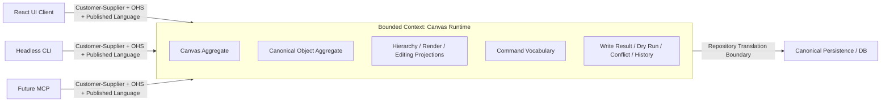

# Canvas Runtime Bounded Context (캔버스 런타임 경계 컨텍스트)

작성일: 2026-03-26  
상태: Draft  
범위: `m2 / canvas-runtime-contract`  
목표: `canvas runtime`를 DDD의 bounded context(경계 컨텍스트)로 정의하고, ownership(소유 경계)과 context map(컨텍스트 관계도)을 명시한다.

## 1. 현재 점수

현재 점수: `8/10`

근거:

- runtime language가 `Canvas`, `CanvasNode`, `Canonical Object`, `Projection`, `Mutation` 중심으로 어느 정도 정리되어 있다.
- `EVENT-STORMING.md`를 통해 aggregate, event, policy, projection 경계가 어느 정도 드러났다.
- UI/CLI/MCP가 공통 contract를 소비한다는 방향이 명확하다.
- `Canvas Aggregate`와 `Canonical Object Aggregate`를 같은 bounded context 안의 별도 aggregate로 유지한다는 방향이 확정되었다.
- UI/CLI/MCP와 `Canvas Runtime`의 관계를 `Customer-Supplier`로 본다는 방향이 확정되었다.
- `BodyBlock`은 `Canonical Object Aggregate` 내부의 entity-like member로 본다는 방향이 확정되었다.

10/10까지 남은 것:

- repository layer가 storage <-> runtime 번역 경계를 담당한다는 점을 문서상으로 더 명확히 고정

## 2. Bounded Context (경계 컨텍스트) 정의

이 문서에서 제안하는 bounded context(경계 컨텍스트) 이름은 `Canvas Runtime`이다.

한줄 설명:

- canvas 편집 의미를 표현하는 공용 언어와 규칙이 유효한 경계다.

이 context 안에서 같은 의미를 가지는 것:

- `Canvas`
- `CanvasNode`
- `Canonical Object`
- `Body Block`
- `Hierarchy Projection`
- `Render Projection`
- `Editing Projection`
- `Mutation`
- `Dry Run`
- `Conflict`
- `History Entry`

이 context의 전략적 위치:

- `Core Domain`
  - 이유: 이 시스템의 차별화 포인트는 canvas를 어떻게 읽고 편집하며, AI/UI/CLI가 같은 의미 체계로 조작하게 하느냐에 있다.

bounded context 확정 결정:

- `Canvas Aggregate`와 `Canonical Object Aggregate`는 장기적으로도 같은 `Canvas Runtime` bounded context 안에 둔다.
- 이유: 두 aggregate는 독립 배포/독립 언어/독립 소비자 surface로 진화할 계획이 현재 없다.
- 즉 분리는 aggregate 경계에서는 유지하되, context 경계에서는 함께 움직이는 모델로 본다.

## 3. In Scope / Out of Scope (포함 범위 / 제외 범위)

### In Scope

- canvas 편집에 대한 공용 용어와 모델
- aggregate ownership
- command vocabulary
- domain events
- policies / invariants
- projections
- write result / dry-run / conflict / history semantics

### Out of Scope

- React renderer 구현 세부
- CLI UX 문법 자체
- MCP transport 구현
- raw DB schema
- plugin publish lifecycle
- full realtime collaboration protocol

## 4. Ubiquitous Language (공용 도메인 언어)

| Term | Meaning in this context |
|------|-------------------------|
| `Canvas` | node 구조와 편집 revision을 소유하는 편집 surface |
| `CanvasNode` | canvas 위에 배치되는 구조/시각 단위 |
| `Canonical Object` | node가 참조하는 실제 content/capability/body의 도메인 단위 |
| `Body Block` | object body 내부에 순서 있는 컬렉션으로 존재하는 block 단위 |
| `Projection` | runtime state를 consumer가 읽기 좋게 정리한 read-side 표현 |
| `Mutation` | state를 바꾸는 의미 있는 write 작업 |
| `Dry Run` | 실제 반영 없이 mutation 가능성과 예상 영향 범위를 계산하는 실행 |
| `Conflict` | revision precondition 불일치로 mutation을 적용할 수 없는 상태 |
| `History Entry` | undo/redo를 위해 기록하는 semantic mutation transaction |

## 5. Context Map (컨텍스트 관계도)

현재 제안하는 관계는 다음과 같다.

- `React UI Client`
  - `Canvas Runtime`의 downstream consumer(하위 소비자)
  - 관계: `Customer-Supplier + Open Host Service (공개 호스트 서비스) + Published Language (공개 계약 언어)`
- `Headless CLI`
  - `Canvas Runtime`의 downstream consumer(하위 소비자)
  - 관계: `Customer-Supplier + Open Host Service (공개 호스트 서비스) + Published Language (공개 계약 언어)`
- `Future MCP`
  - `Canvas Runtime`의 downstream consumer(하위 소비자)
  - 관계: `Customer-Supplier + Open Host Service (공개 호스트 서비스) + Published Language (공개 계약 언어)`
- `Canonical Persistence`
  - runtime 바깥의 persistence/storage 모델
  - 관계: `Repository Translation Boundary (저장소 번역 경계)`

설계 원칙:

- UI/CLI/MCP는 runtime contract를 소비하지만, runtime model을 다시 정의하지 않는다.
- 다만 UI/CLI/MCP의 실제 소비 요구는 `Canvas Runtime` contract 진화에 영향을 준다.
- 따라서 이 관계는 단순 conformist가 아니라 customer-supplier로 본다.
- raw storage schema는 runtime context 안으로 직접 들어오지 않는다.
- repository layer가 storage language와 runtime language 사이 번역 경계를 담당한다.

## 6. Aggregate Ownership (애그리게이트 소유 경계)

### Canvas Aggregate

한줄 설명:

- canvas 전체와 그 안의 node 구조/배치 invariant(항상 지켜야 하는 규칙)를 소유하는 aggregate root(애그리게이트 루트)다.

소유:

- canvas revision
- canvas node hierarchy
- parent-child topology
- surface membership
- z-order
- mindmap membership / topology
- canvas-side changed set 영향 범위

포함되는 내부 entity / value object:

- `CanvasNode` entity
- `NodeIdentity`
- `Transform`
- `Hierarchy`
- `PresentationStyle`
- `RenderProfile`
- `MindmapMembership`
- `ObjectLink`
- `InteractionCapabilities`

추가 원칙:

- resize는 raw drag delta나 direction vector가 아니라 `handle + nextSize + constraint`로 표현하는 편이 public contract에 더 적합하다.
- rotate는 `nextRotation`만 public contract에 두고, 실제 pivot은 policy가 해석하는 편이 적절하다.
- `nextRotation`은 absolute clockwise degrees이며 public contract에서는 `[0, 360)`로 정규화한다.

외부 참조 방식:

- 다른 aggregate는 `canvasId` 또는 `nodeId` 같은 식별자로만 참조한다.

### Canonical Object Aggregate

한줄 설명:

- node가 참조하는 실제 content, capability, ordered body block collection을 소유하는 aggregate root(애그리게이트 루트)다.

소유:

- content
- capability payload
- ordered body block collection
- body block 순서와 인접 관계
- object-side changed set 영향 범위

포함되는 내부 entity / value object:

- `BodyBlock` entity-like member
- body content payload
- capability payload structures

BodyBlock 해석 원칙:

- `BodyBlock`은 단순 값 묶음보다 entity-like member로 본다.
- 이유: block은 `blockId`를 가지고, insert/update/remove/reorder 대상이 되며, 독립 lifecycle을 가진다.
- 다양한 block type이 `/` command 같은 방식으로 확장될 수 있으므로, 값 객체보다 식별 가능한 내부 구성원으로 다루는 편이 자연스럽다.
- 다만 `BodyBlock`을 별도 aggregate로 승격하지는 않고, `Canonical Object Aggregate` 내부 멤버로 유지한다.
- public command에서 block 위치는 raw block id보다 `selection`, `anchor`, `ordered index` 같은 위치 참조로 표현하는 편이 자연스럽다.
- 즉 "몇 번째 줄 근처에 넣을 것인가" 같은 UX 의미는 input boundary에서 position ref로 번역한다.
- 대신 editing projection은 각 block마다 `selectionKey`, `before/after anchor`, `ordered index`를 publish해서 consumer가 임의 block을 안정적으로 가리킬 수 있어야 한다.
- history layer는 그 position ref를 그대로 저장하지 않고 `blockId` 기준 canonical replay form으로 정규화해 기록하는 편이 적절하다.
- canonical object aggregate event도 같은 canonical placement vocabulary를 써서 reorder 결과를 모호하지 않게 표현하는 편이 적절하다.

외부 참조 방식:

- `CanvasNode`는 direct object reference가 아니라 `canonicalObjectId`로 참조한다.

### Workspace Scope

한줄 설명:

- mutation 실행과 bootstrap 문맥을 정하는 실행 범위다.

판단:

- 현재는 aggregate root가 아니라 execution scope로 두는 것이 적절하다.

## 7. Command Ownership (커맨드 소유 경계)

| Command | Owned by |
|---------|----------|
| `canvas.node.create` | `Canvas Aggregate` |
| `canvas.node.move` | `Canvas Aggregate` |
| `canvas.node.reparent` | `Canvas Aggregate` |
| `canvas.node.resize` | `Canvas Aggregate` |
| `canvas.node.rotate` | `Canvas Aggregate` |
| `canvas.node.presentation-style.update` | `Canvas Aggregate` |
| `canvas.node.render-profile.update` | `Canvas Aggregate` |
| `canvas.node.rename` | `Canvas Aggregate` |
| `canvas.node.delete` | `Canvas Aggregate` |
| `canvas.node.z-order.update` | `Canvas Aggregate` |
| `object.content.update` | `Canonical Object Aggregate` |
| `object.capability.patch` | `Canonical Object Aggregate` |
| `object.body.block.insert` | `Canonical Object Aggregate` |
| `object.body.block.update` | `Canonical Object Aggregate` |
| `object.body.block.remove` | `Canonical Object Aggregate` |
| `object.body.block.reorder` | `Canonical Object Aggregate` |

## 8. Event Ownership (이벤트 소유 경계)

### Emitted by Canvas Aggregate

- `CanvasNodeCreated`
- `CanvasNodeMoved`
- `CanvasNodeReparented`
- `CanvasNodeResized`
- `CanvasNodeRotated`
- `CanvasNodePresentationStyleUpdated`
- `CanvasNodeRenderProfileUpdated`
- `CanvasNodeRenamed`
- `CanvasNodeDeleted`
- `CanvasNodeZOrderUpdated`
- `CanvasMindmapMembershipChanged`

### Emitted by Canonical Object Aggregate

- `ObjectContentUpdated`
- `ObjectCapabilityPatched`
- `ObjectBodyBlockInserted`
- `ObjectBodyBlockUpdated`
- `ObjectBodyBlockRemoved`
- `ObjectBodyBlockReordered`

### Emitted by Application Service / History / Control Layer

- `CanvasMutationDryRunValidated`
- `CanvasMutationRejected`
- `CanvasVersionConflictDetected`
- `CanvasChanged`

추가 설명:

- 이 계층의 이벤트는 aggregate 내부 상태가 실제로 바뀌었다는 사실이라기보다,
  command 실행 과정에서 계산되거나 판단된 실행 결과를 나타낸다.
- 따라서 `write result`, `dry-run`, `conflict`, `history`는 우선 aggregate event보다
  application/control/history 쪽 결과물로 보는 것이 자연스럽다.
- 예를 들어 `ObjectBodyBlockReordered`는 실제 상태 변경 사실이므로 aggregate event다.
- 반대로 `CanvasMutationDryRunValidated`는 실제 상태를 바꾸지 않았으므로 aggregate event가 아니다.
- `CanvasVersionConflictDetected`도 충돌로 인해 write가 거절된 실행 결과이므로 control-layer event에 가깝다.
- `history entry` 역시 domain state 자체라기보다 undo/redo를 위한 실행 기록이므로 history/application layer 책임으로 본다.

원칙:

- domain event(도메인 이벤트)는 aggregate 내부 사실을 나타낸다.
- integration/control event(통합/제어 이벤트)는 application layer(애플리케이션 계층)에서 published language(공개 계약 언어)로 승격될 수 있다.

## 9. Published Language (공개 계약 언어)

이 context(컨텍스트)가 외부에 공개하는 published language(공개 계약 언어)는 다음이다.

- command vocabulary
- hierarchy / render / editing projection
- mutation result envelope
- dry-run semantics
- conflict envelope
- history / undo / redo semantics

정리 원칙:

- 이 영역은 지금 단계에서 과도하게 세분화하지 않는다.
- public contract에 필요한 최소 shape만 먼저 잠그고, 세부 분리는 구현 과정에서 자연스럽게 확정한다.
- 즉 `write result`, `dry-run`, `conflict`, `history`는 "충분히 명확한 최소 계약"까지만 문서화한다.
- 다만 replay 안정성이 필요한 history는 예외로 두고, selection/anchor/index 같은 projection-dependent ref를 그대로 저장하지 않는다.
- replay batch는 executable artifact이므로 원래 request의 `dryRun` / `preconditions`를 상속하지 않는다.

금지:

- raw DB row shape
- renderer framework-specific payload
- transport-specific CLI noun grammar

## 10. Repository Translation Boundary (저장소 번역 경계)

`Canvas Runtime`는 persistence/storage 모델을 직접 말하지 않는다.

확정:

- repository layer가 storage language와 runtime language 사이 번역 경계를 담당한다.
- 즉 `Drizzle ORM`은 persistence 구현 도구로 사용하되,
  domain/runtime과의 번역 책임은 repository layer에서 끝낸다.
- 외부 consumer와 runtime model은 raw DB row, column, relation shape를 직접 알지 않아야 한다.

현재 코드 기준 매핑:

| Concern | Current files | Target placement | Notes |
|---------|---------------|------------------|-------|
| storage <-> runtime translation | `libs/shared/src/lib/canonical-persistence/repository.ts` | repository translation boundary의 중심 | storage <-> aggregate translation의 1차 책임 |
| read query assembly | `libs/shared/src/lib/canonical-query/render-canvas.ts` | repository 또는 그 위 query adapter 뒤쪽 | query와 projection 조립 책임이 일부 섞여 있다 |
| mutation persistence interaction | `libs/shared/src/lib/canonical-mutation/*` | aggregate write + repository layer 사이 | persisted write shape는 repository boundary를 통해 정리하는 편이 낫다 |

최소 원칙:

- repository layer가 row / relation / persisted payload를 aggregate 또는 runtime-friendly shape로 바꾼다.
- runtime model과 projection consumer는 raw DB schema를 직접 알지 않는다.
- `parseRenderGraph.ts`, `CanvasEditorPage.tsx`, `workspaceEditUtils.ts` 같은 상위 소비자는 repository 또는 query/service 결과를 소비한다.
- sync 계층도 가능하면 storage 언어가 아니라 runtime 의미 단위만 바깥으로 올린다.

## 11. Open Questions (열린 질문)

현재 주요 열린 질문 없음.

## 12. References (용어 참고)

- `Bounded Context`: 하나의 모델과 용어가 일관되게 유지되는 경계
- `Ubiquitous Language`: 문서, 대화, 코드가 함께 쓰는 공용 도메인 언어
- `Context Map`: bounded context들 사이의 관계를 설명하는 지도
- `Customer-Supplier`: upstream이 모델을 소유하되 downstream consumer의 실제 요구를 반영하며 진화하는 관계
- `Aggregate Root`: aggregate 바깥에서 접근 가능한 유일한 대표 엔티티
- `Invariant`: aggregate 내부에서 항상 지켜야 하는 규칙
- `Published Language`: 외부 consumer가 믿고 사용할 수 있는 공개 계약 언어
- `Open Host Service (OHS)`: 여러 consumer가 공통으로 사용할 수 있게 외부에 공개한 안정된 진입점
- `Repository Translation`: 저장소 모델과 도메인 모델 사이의 변환 책임
- `Downstream Consumer`: 어떤 context가 공개한 계약을 소비하는 하위 쪽 클라이언트 또는 시스템
