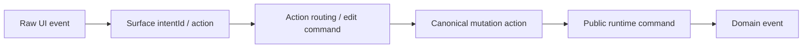

# Canvas Runtime Event-Command Mapping

작성일: 2026-03-26  
상태: Draft  
범위: `m2 / canvas-runtime-contract`  
목표: 현재 UI 표면에서 발생하는 event가 어떤 intent, 중간 command, canonical mutation을 거쳐 public runtime command로 수렴해야 하는지 한 문서에서 보이게 한다.

## 1. 왜 이 문서가 필요한가

지금 코드는 아래 층을 모두 가지고 있다.

1. raw UI event
2. UI surface intent
3. action routing entry
4. edit command
5. canonical mutation action
6. public runtime command

문제를 어렵게 만드는 건 이 중 2-5가 문서마다 따로 보인다는 점이다.

이 문서는 그 중간층을 숨기지 않고 드러낸다.

- 현재 구현이 무엇을 하고 있는지
- 어디가 UI 전용 어댑터 언어인지
- 어디서 aggregate-owned runtime command로 정규화해야 하는지

## 2. 공통 번역 규칙

원칙:

- `intentId`는 public runtime command가 아니다.
- `node.move.absolute`, `selection.style.update` 같은 이름은 현재 adapter 언어다.
- contract 문서에서는 최종적으로 aggregate ownership 기준 이름으로 정렬해야 한다.

## 3. 표면별 매핑

| UI surface | Raw event / action | Current intent / intermediate | Current canonical mutation | Target public runtime command | Expected domain event | 메모 |
|------------|--------------------|--------------------------------|----------------------------|-------------------------------|----------------------|------|
| `canvas-toolbar` | create 버튼 클릭 | `node.create` intent, `create.*` action | `canvas.node.create` 또는 `node.create` | `canvas.node.create` | `CanvasNodeCreated` | 툴바 create는 public contract에서 canvas node 생성으로 수렴 |
| `pane-context-menu` | 빈 pane에서 create | `node.create` intent | `canvas.node.create` 또는 `node.create` | `canvas.node.create` | `CanvasNodeCreated` | 툴바 create와 같은 vocabulary를 재사용해야 한다 |
| `pane-context-menu` | 빈 pane에서 mindmap root create | `node.create` intent + `mindmap-root` placement | `canvas.node.create` | `canvas.node.create` | `CanvasNodeCreated`, `CanvasMindmapMembershipChanged` | root create는 create와 topology change가 함께 보일 수 있다 |
| `node-context-menu` | add mindmap child / sibling | `node.create` intent + child/sibling placement | `canvas.node.create` | `canvas.node.create` | `CanvasNodeCreated`, `CanvasMindmapMembershipChanged` | placement mode가 contract payload에서 구분되어야 한다 |
| `GraphCanvas` | drag stop on absolute node | `node.move.absolute` | `moveNode(...)` / `node.update` 성격의 mutation | `canvas.node.move` | `CanvasNodeMoved` | 현재 구현은 absolute/relative를 나누지만 public contract는 "move"로 묶는 편이 자연스럽다 |
| `GraphCanvas` | drag stop on relative attachment | `node.move.relative` | `node.update` | `canvas.node.move` | `CanvasNodeMoved` | carrier(`gap`, `at.offset`)는 move payload의 variant로 표현 |
| `GraphCanvas` | drag reparent in mindmap | `node.reparent` | `node.reparent` | `canvas.node.reparent` | `CanvasNodeReparented`, `CanvasMindmapMembershipChanged` | 구조 변경이므로 일반 move와 분리 |
| `selection-floating-menu` | font/size/color/bold/align/washi 변경 | `selection.style.update` -> `node.style.update` | `node.update` | `canvas.node.presentation-style.update` 또는 `canvas.node.render-profile.update` | `CanvasNodePresentationStyleUpdated` 또는 `CanvasNodeRenderProfileUpdated` | style과 render profile은 public contract에서 분리 |
| `selection-floating-menu` | content 편집 | `selection.content.update` -> `node.content.update` | `node.update` | `object.content.update` 우선 | `ObjectContentUpdated` | public contract는 object ownership 기준으로 재정렬 |
| `node-context-menu` | rename | `node.rename` | `node.update` | `canvas.node.rename` | `CanvasNodeRenamed` | ID/display name 경계를 payload에서 명확히 해야 한다 |
| `node-context-menu` | delete | `node.delete` | `node.delete` | `canvas.node.delete` | `CanvasNodeDeleted` | selection delete keyboard도 결국 여기로 수렴 |
| `node-context-menu` | duplicate | `node.duplicate` -> create payload 재생성 | `node.create` | `canvas.node.create` | `CanvasNodeCreated` | duplicate는 별도 public command보다 create replay로 보는 편이 단순하다 |
| `node-context-menu` | lock toggle | `node.lock.toggle` | `node.update` | `canvas.node.presentation-style.update` 또는 별도 lock command | `CanvasNodePresentationStyleUpdated` 또는 별도 lock event | public vocabulary에 lock이 아직 명시적으로 없다 |
| `node-context-menu` | group selection | `selection.group` -> `node.group.update` | `node.group-membership.update` | 아직 미정: `canvas.node.group-membership.update` | 현재 별도 event 부재 | 이 영역은 public contract 문서에 빈칸이 있다 |
| `node-context-menu` | ungroup selection | `selection.ungroup` -> `node.group.update` | `node.group-membership.update` | 아직 미정: `canvas.node.group-membership.update` | 현재 별도 event 부재 | group membership를 event storming에 올려야 한다 |
| `node-context-menu` | bring to front / send to back | `selection.z-order.*` -> `node.z-order.update` | `node.z-order.update` | `canvas.node.z-order.update` | `CanvasNodeZOrderUpdated` | selection batch 처리 여부만 payload에서 추가로 정의하면 된다 |
| `pane-context-menu` | export all | UI-only action | runtime write 없음 | public runtime command 아님 | 없음 | read projection + renderer/export adapter concern |
| `node-context-menu` | export selection / copy as PNG | UI-only action | runtime write 없음 | public runtime command 아님 | 없음 | export는 runtime consumer이지만 mutation contract는 아님 |
| `pane-context-menu` / toolbar | fit view / zoom | viewport action | runtime-only view command | public write command 아님 | 없음 | viewport state는 editor host concern |

## 4. Keyboard 매핑

keyboard는 별도 surface처럼 보이지 않지만, 실제로는 같은 command를 다른 entrypoint에서 여는 레이어다.

| Keyboard command | Bound key examples | Current execution target | Target public runtime command | 비고 |
|------------------|--------------------|--------------------------|-------------------------------|------|
| `selection.delete` | `Backspace`, `Delete` | selection delete action | `canvas.node.delete` batch | node menu delete와 같은 의미 |
| `selection.duplicate` | `Cmd/Ctrl+D` | duplicate selection | `canvas.node.create` batch | duplicate는 create replay |
| `selection.group` | `Cmd/Ctrl+G` | group selection | group membership command 미정 | public contract gap |
| `selection.ungroup` | `Cmd/Ctrl+Shift+G` | ungroup selection | group membership command 미정 | public contract gap |
| `history.undo` / `history.redo` | `Cmd/Ctrl+Z`, `Cmd/Ctrl+Shift+Z`, `Cmd/Ctrl+Y` | history runtime | write result/history contract | mutation command가 아니라 execution control |
| `clipboard.copy-selection` / `clipboard.paste-selection` | `Cmd/Ctrl+C`, `Cmd/Ctrl+V` | clipboard host + create/delete 조합 | paste는 결국 create batch로 수렴 가능 | clipboard 자체는 host concern, paste 결과는 runtime mutation |
| `viewport.zoom-in` / `zoom-out` | `Cmd/Ctrl+=`, `Cmd/Ctrl+-` | viewport host | public write command 아님 | view-only command |
| `selection.select-all` | `Cmd/Ctrl+A` | selection runtime | public write command 아님 | pure read/view concern |

## 5. 지금 문서가 드러낸 contract gap

### 5.1 content update의 aggregate ownership이 아직 UI 코드와 안 맞는다

- 현재 구현은 `selection.content.update -> node.content.update -> node.update` 경로가 강하다.
- 하지만 `canvas-runtime-contract` 문서는 content ownership을 `Canonical Object Aggregate` 쪽에 둔다.
- 따라서 public contract에서는 적어도 아래 둘을 분리해서 봐야 한다.
  - canvas node 자체 label/presentation 변경
  - canonical object content 변경

### 5.2 group membership는 현재 public vocabulary의 빈칸이다

- 구현에는 `node.group.update`, `node.group-membership.update`가 이미 있다.
- 하지만 `README.md`, `EVENT-STORMING.md`의 public command / event 목록에는 아직 대응 이름이 없다.
- 즉 아래 둘 중 하나를 결정해야 한다.
  - 별도 `canvas.node.group-membership.update`를 명시적 public command로 승격

### 5.3 export / viewport는 runtime consumer지만 write contract는 아니다

- 문서에서 자주 섞이는 부분이라 일부러 분리해서 적는다.
- export, fit-view, zoom, selection-only overlay open 같은 행동은 editor UX에서 중요하지만,
  공용 mutation contract에는 올리지 않는 편이 맞다.

## 6. 추천 정리 방향

1. public contract 문서에서는 `surface intent`와 `runtime command`를 같은 표에 계속 두되, 이름을 섞지 않는다.
2. `selection-floating-menu`의 content patch는 `node content`와 `object content`를 나누는 결정을 먼저 내린다.
3. group/ungroup을 계속 지원할 생각이라면 public command/event vocabulary에 정식으로 추가한다.
4. export/viewport/selection-only action은 "runtime consumer UI behavior"로 남기고 write vocabulary에는 넣지 않는다.
