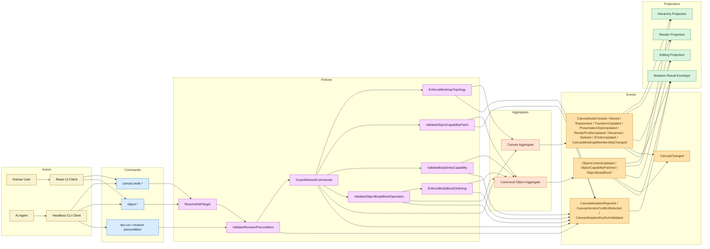

# Canvas Runtime Contract Event Storming

작성일: 2026-03-25  
상태: Draft  
범위: `m2 / canvas-runtime-contract`  
목표: `canvas runtime contract`의 command, actor, aggregate, event, policy, projection 경계를 문서 차원에서 먼저 잠근다.

## 1. 이 문서의 역할

이 문서는 구현 설계서가 아니라 boundary clarification 문서다.

- 어떤 actor가 어떤 command를 발생시키는지
- command가 어떤 aggregate 경계로 들어가는지
- 어떤 policy가 command를 가드하는지
- 결과가 어떤 event와 projection으로 흘러가는지
- UI / CLI / MCP가 어떤 지점까지만 runtime contract를 공유하는지

즉 이 문서는 "무엇을 구현할까"보다 "어디서 무슨 책임이 끝나는가"를 맞추기 위한 event-storming 기록이다.

## 2. Mermaid 사용 가능 여부

가능하다. 다만 Mermaid는 workshop-style sticky board를 그대로 재현하는 도구라기보다,
저장 가능한 boundary map과 흐름 문서화에 더 적합하다.

이 문서에서는 Mermaid를 다음 용도로 사용한다.

- actor -> command -> policy -> aggregate -> event -> projection 흐름 정리
- runtime contract의 public boundary 시각화
- README 옆에 두고 계속 diff 가능한 living document 유지

Mermaid의 한계:

- 실제 event storming 워크숍처럼 자유 배치 sticky note 감각은 약하다.
- 폭넓은 브레인스토밍보다는 정리된 결과물 표현에 더 적합하다.

더 시각적인 대안이 필요하면 다음이 더 낫다.

1. `Magam` 기반 sticky-note 보드
2. Excalidraw / FigJam / Miro 같은 자유 배치 보드
3. Mermaid는 저장용 canonical 문서, 보드는 논의용 보조 아티팩트로 병행

## 3. Domain Events

이 문서에서 event는 "runtime contract가 흘려보내야 하는 변화의 의미 단위"로 본다.

### Canvas Events

- `CanvasNodeCreated`: canvas 안에 새로운 node가 생성되었음을 뜻한다.
- `CanvasNodeMoved`: 기존 node의 좌표나 배치 위치가 변경되었음을 뜻한다.
- `CanvasNodeReparented`: node의 부모-자식 계층 위치가 바뀌었음을 뜻한다.
- `CanvasNodeResized`: node의 크기나 scale 계열 값이 변경되었음을 뜻한다.
- `CanvasNodeRotated`: node의 회전 값이 변경되었음을 뜻한다.
- `CanvasNodePresentationStyleUpdated`: node의 공통 시각 스타일 값이 변경되었음을 뜻한다.
- `CanvasNodeRenderProfileUpdated`: roughness, wobble, ink profile 같은 renderer 감성 파라미터가 변경되었음을 뜻한다.
- `CanvasNodeRenamed`: node의 식별용 이름 또는 표시 이름이 변경되었음을 뜻한다.
- `CanvasNodeDeleted`: node가 canvas 구조에서 제거되었음을 뜻한다.
- `CanvasNodeZOrderUpdated`: node의 렌더 순서가 변경되었음을 뜻한다.
- `CanvasMindmapMembershipChanged`: node의 mindmap 소속 또는 root/child topology가 변경되었음을 뜻한다.

한줄 설명:

- canvas의 구조, 배치, 계층, z-order, mindmap topology가 바뀌었을 때 발생하는 이벤트다.
- 특히 move, resize, rotate, 공통 스타일, 감성 렌더 프로필은 서로 다른 의미 단위로 분리해 본다.
- resize는 raw drag vector보다 `handle + nextSize + constraint` 결과로 해석하는 편이 적절하다.
- rotate는 `nextRotation`만 public contract에 두고, pivot은 policy가 해석하는 편이 적절하다.
- `nextRotation`은 absolute clockwise degrees이며 public contract에서는 `[0, 360)`로 정규화하는 편이 적절하다.

### Object Events

- `ObjectContentUpdated`: object의 대표 content 본문이 수정되었음을 뜻한다.
- `ObjectCapabilityPatched`: object가 가진 capability payload 일부가 변경되었음을 뜻한다.
- `ObjectBodyBlockInserted`: object body에 새로운 block이 추가되었음을 뜻한다.
- `ObjectBodyBlockUpdated`: 기존 body block의 내용이나 속성이 수정되었음을 뜻한다.
- `ObjectBodyBlockRemoved`: 기존 body block이 object body에서 제거되었음을 뜻한다.
- `ObjectBodyBlockReordered`: object body 내부에서 block 순서가 바뀌었음을 뜻한다.

한줄 설명:

- object aggregate 내부의 content, capability, ordered body block collection이 바뀌었을 때 발생하는 이벤트다.

추가 설명:

- body block은 단건 필드가 아니라 순서가 있는 컬렉션이다.
- 따라서 "블록의 위치를 바꾼다"는 것은 canvas 배치 변경이 아니라 object body 내부 순서 변경이다.
- 하나의 node는 하나의 canonical object를 가리킬 수 있고, 그 object 내부에는 여러 body block이 존재할 수 있다.
- body block 위치는 raw block id보다 `selection`, `anchor`, `ordered index` 같은 위치 참조로 표현하는 편이 자연스럽다.
- 대신 editing projection은 각 block에 대한 `selectionKey`, `content/before/after anchor`, `ordered index`를 함께 publish해야 한다.
- history는 그 position ref를 그대로 replay하지 않고 `blockId` 기준 canonical replay form으로 정규화해 저장하는 편이 안전하다.
- reorder 결과 event도 `start/end/before-block/after-block` 같은 canonical placement vocabulary로 표현하는 편이 안전하다.

### Failure / Control Events

- `CanvasMutationDryRunValidated`: 실제 반영 없이 mutation 가능 여부와 예상 변경 범위를 계산했음을 뜻한다.
- `CanvasMutationRejected`: validation 또는 policy 검사로 인해 mutation이 거절되었음을 뜻한다.
- `CanvasVersionConflictDetected`: revision precondition 불일치로 충돌이 감지되었음을 뜻한다.

한줄 설명:

- 실제 변경이 확정되지 않았더라도 dry-run, validation failure, version conflict 같은 실행 제어 결과를 나타내는 이벤트다.

### Integration Events

- `CanvasChanged`: canvas 전반에 invalidate/sync가 필요한 변경이 확정되었음을 뜻한다.

한줄 설명:

- sync / invalidate publish의 기준이 되는 통합 이벤트다.

## 4. Event Flow

브레인스토밍은 보통 이벤트를 먼저 펼치고, 그 다음 command와 aggregate를 붙인다.

이 문서에서 우선 보는 핵심 흐름은 다음이다.

### Canvas Structure Flow

1. `CanvasNodeCreated`
2. `CanvasNodeMoved`
3. `CanvasNodeReparented`
4. `CanvasNodeResized`
5. `CanvasNodeRotated`
6. `CanvasNodePresentationStyleUpdated`
7. `CanvasNodeRenderProfileUpdated`
8. `CanvasNodeZOrderUpdated`
9. `CanvasMindmapMembershipChanged`
10. `CanvasNodeDeleted`

### Object Content Flow

1. `ObjectContentUpdated`
2. `ObjectCapabilityPatched`
3. `ObjectBodyBlockInserted`
4. `ObjectBodyBlockUpdated`
5. `ObjectBodyBlockReordered`
6. `ObjectBodyBlockRemoved`

### Failure / Control Flow

1. `CanvasMutationDryRunValidated`
2. `CanvasMutationRejected`
3. `CanvasVersionConflictDetected`

## 5. Commands

이 feature에서 고정한 public command vocabulary는 다음이다.

### Canvas Node Commands

- `canvas.node.create`: 새로운 canvas node를 생성하라는 의도다.
- `canvas.node.move`: node의 배치 위치를 옮기라는 의도다.
- `canvas.node.reparent`: node의 부모 계층을 바꾸라는 의도다.
- `canvas.node.resize`: 선택된 resize handle을 기준으로 node의 최종 크기를 바꾸라는 의도다.
- `canvas.node.rotate`: node의 최종 회전 값을 바꾸라는 의도다. pivot은 policy가 해석한다.
- `canvas.node.presentation-style.update`: node의 공통 시각 스타일을 바꾸라는 의도다.
- `canvas.node.render-profile.update`: node의 감성적 렌더 프로필을 바꾸라는 의도다.
- `canvas.node.rename`: node 이름을 바꾸라는 의도다.
- `canvas.node.delete`: node를 제거하라는 의도다.
- `canvas.node.z-order.update`: node의 렌더 순서를 조정하라는 의도다.

### Object Commands

- `object.content.update`: object의 대표 content를 수정하라는 의도다.
- `object.capability.patch`: object capability payload 일부를 패치하라는 의도다.
- `object.body.block.insert`: 현재 selection/anchor 또는 ordered index 기준 위치에 새 block을 추가하라는 의도다.
- `object.body.block.update`: 현재 selection/anchor 또는 ordered index가 가리키는 body block 내용을 수정하라는 의도다.
- `object.body.block.remove`: 현재 selection/anchor 또는 ordered index가 가리키는 body block을 제거하라는 의도다.
- `object.body.block.reorder`: 선택된 body block을 다른 selection/anchor 또는 ordered index 위치로 옮기라는 의도다.

### Contract-Level Execution Controls

- `dry-run`: 실제 반영 없이 검증과 예상 변경 범위만 계산하라는 실행 옵션이다.
- `revision precondition`: 현재 revision이 기대값과 일치할 때만 mutation을 허용하라는 실행 조건이다.

이 문서에서 중요한 원칙:

- command는 UI event가 아니다.
- command는 raw DB patch가 아니다.
- direct UI command와 CLI batch mutation은 같은 domain intent vocabulary로 수렴해야 한다.

## 6. Actors

이 경계에서 중요한 actor는 다음이다.

- Human User
  - UI를 통해 canvas를 편집하거나 AI에게 편집 의도를 전달하는 사람 사용자다.
- AI Agent
  - CLI 또는 향후 MCP를 통해 projection을 읽고 command를 조합하는 자동화 주체다.
- React UI Client
  - `GraphCanvas`, `CanvasEditorPage` 등 interactive adapter
  - runtime projection을 소비하고 command만 방출해야 하는 UI adapter다.
- Headless CLI Client
  - 동일한 runtime contract를 터미널/자동화 환경에서 소비하는 headless client다.

## 7. Aggregates

현재 runtime contract 관점에서 우선 잠그는 aggregate 경계는 다음이다.

간단히 구분하면:

- `CanvasNode`는 "어디에 어떻게 보이느냐"를 담당하는 배치/계층 단위다.
- `Object`는 그 node가 가리키는 실제 content/capability/body 정보를 담당하는 도메인 단위다.
- 즉 `CanvasNode`는 placement와 structure, `Object`는 meaning과 content를 소유한다.
- node 내부에서도 정확한 데이터 모델과 렌더 감성 파라미터는 같은 층으로 보지 않는다.
- 예를 들어 `node`, `edge`, `annotation`, `highlight`, `doodle`, `sticker`, `text-run` 같은 모델과,
  `roughness`, `wobble`, `pressure variance`, `angle variance`, `ink profile`, `paper blend` 같은 렌더 파라미터는 분리된 의미를 가진다.

### Canvas Aggregate

한줄 설명:

- canvas 전체와 그 안의 node 구조/배치 invariant를 소유하는 aggregate다.

CanvasNode 내부 구성 원칙:

- `CanvasNode`는 독립 aggregate라기보다 `Canvas Aggregate` 안의 entity로 본다.
- 다만 entity 내부는 하나의 거대한 속성 묶음보다 typed component / value object 조합으로 나누는 것이 낫다.
- 이때 목표는 게임 엔진식 완전 자유 ECS가 아니라, 도메인 의미가 고정된 composition이다.
- 즉 아무 component나 붙이는 확장형 모델이 아니라, 계약으로 잠근 component 집합을 가진다.

예시 component/value object:

- `NodeIdentity`
- `Transform`
- `Hierarchy`
- `PresentationStyle`
- `RenderProfile`
- `MindmapMembership`
- `ObjectLink`
- `InteractionCapabilities`

이 구성의 의미:

- `Transform`은 위치, 크기, 회전 같은 배치 값을 담당한다.
- `PresentationStyle`은 공통 시각 스타일을 담당한다.
- `RenderProfile`은 roughness, wobble, ink profile 같은 감성적 렌더 파라미터를 담당한다.
- `ObjectLink`는 node가 어떤 canonical object를 참조하는지 담당한다.
- `InteractionCapabilities`는 편집 가능성, selection/anchor 관련 의미를 담당한다.

소유 책임:

- canvas revision
- node hierarchy / parent-child topology
- surface membership
- z-order
- mindmap membership/topology
- changed-set의 canvas-side 영향 범위

대표적으로 받는 command:

- `canvas.node.create`
- `canvas.node.move`
- `canvas.node.reparent`
- `canvas.node.resize`
- `canvas.node.rotate`
- `canvas.node.presentation-style.update`
- `canvas.node.render-profile.update`
- `canvas.node.rename`
- `canvas.node.delete`
- `canvas.node.z-order.update`

### Canonical Object Aggregate

한줄 설명:

- node가 참조하는 실제 content, capability, body block collection을 소유하는 aggregate다.

소유 책임:

- object content
- object capability payload
- ordered body block collection
- object body block mutation
- body block 순서와 인접 관계

BodyBlock 해석 원칙:

- `BodyBlock`은 `Canonical Object Aggregate` 내부의 entity-like member로 본다.
- 각 block은 식별자와 순서를 가지며, insert/update/remove/reorder 대상이 된다.
- block type은 추후 `/` command 기반 확장처럼 다양해질 수 있지만, 그 확장은 aggregate 내부 멤버 다양성으로 다룬다.
- `BodyBlock` 자체를 별도 aggregate로 분리하지는 않는다.
- 다만 public command에서 block 위치는 raw block id보다 `selection`, `anchor`, `ordered index` 같은 위치 참조로 받는 편이 자연스럽다.

대표적으로 받는 command:

- `object.content.update`
- `object.capability.patch`
- `object.body.block.insert`
- `object.body.block.update`
- `object.body.block.remove`
- `object.body.block.reorder`

### Workspace Scope

한줄 설명:

- mutation이 실행되는 작업 공간과 bootstrap 문맥을 정하는 실행 범위다.

`workspace`는 현재 command scope / bootstrap context로는 중요하지만,
이 문서에서는 primary mutation aggregate보다는 execution scope로 둔다.

## 8. Policies

이 경계에서 중요한 policy는 다음이다.

- `ResolveEditTarget`
  - editing projection과 command payload를 바탕으로 실제 edit target을 해석
- `ValidateRevisionPrecondition`
  - mutation 전 revision conflict 가능성 검사
- `GuardAllowedCommands`
  - command capability set과 target type을 기준으로 허용 여부 판정
- `ResolveRotationPivot`
  - rotate command 실행 시 실제 pivot 기준을 정책으로 해석
- `NormalizeHistoryReplayTargets`
  - selection/anchor/index 기반 body block target을 block-id 기반 replay form으로 정규화
- `EnforceMindmapTopology`
  - mindmap root/child/sibling 제약을 검증
- `ValidateObjectCapabilityPatch`
  - capability 이름과 payload shape를 검증
- `ValidateBodyEntryCapability`
  - body entry 가능 여부와 entry mode를 검증
- `ValidateObjectBodyBlockOperation`
  - block 추가/수정/삭제 대상과 payload shape를 검증
- `EnforceBodyBlockOrdering`
  - body block reorder 시 selection/anchor/index 해석 결과와 최종 순서 일관성을 검증
- `ProduceChangedSet`
  - 성공한 mutation의 영향 범위를 result envelope로 정리
- `MapFailureToStructuredEnvelope`
  - validation failure / version conflict / retryable 여부를 구조화된 오류로 변환
- `AlignFailureCodeVocabulary`
  - application rejection event와 write-result envelope가 같은 failure code vocabulary를 쓰도록 정렬
- `PublishCanvasChanged`
  - 성공한 mutation 후 invalidate/sync 이벤트를 발행
- `RebuildRuntimeProjections`
  - hierarchy / render / editing projection을 갱신

## 9. History / Undo / Redo

한줄 설명:

- undo/redo는 UI 이벤트 기록이 아니라, 성공한 mutation transaction을 기준으로 관리하는 write-side history 기능이다.

핵심 원칙:

- undo/redo는 `GraphCanvas` 같은 UI adapter가 직접 소유하지 않는다.
- write application service 또는 별도 history service가 관리한다.
- 단위는 pointer drag 같은 raw UI event가 아니라, 하나의 semantic mutation batch다.
- 예를 들어 "노드 3개를 함께 이동"은 undo 1번이어야 한다.
- "body block 여러 개 순서 변경"도 사용자 의도 1건이면 undo 1번이어야 한다.

권장 history entry:

- `historyId`: history 항목 식별자
- `canvasId`: 어느 canvas에서 발생한 변경인지
- `actorId`: 누가 실행했는지
- `sessionId`: 어떤 세션의 undo stack에 속하는지
- `mutationId`: 원래 성공한 mutation 식별자
- `forwardMutation`: 원래 실행된 mutation
- `inverseMutation`: undo 시 재실행할 반대 mutation
- 다만 history에는 user-facing raw payload를 그대로 두지 않고, replay 가능한 canonical form으로 정규화해 저장한다.
- replay batch는 원래 request의 `dryRun` / `preconditions`를 상속하지 않고, 실행 가능한 정규화 artifact만 남긴다.
- `revisionBefore`: 실행 전 revision
- `revisionAfter`: 실행 후 revision
- `changedSet`: 영향 범위
- `undoable`: 되돌릴 수 있는지 여부

Undo 동작 원칙:

- 같은 actor/session 범위에서 마지막 undoable mutation을 찾는다.
- 그 mutation의 `inverseMutation`을 실행한다.
- revision이 맞지 않으면 conflict로 실패시킨다.

Redo 동작 원칙:

- 마지막 undo의 `forwardMutation`을 다시 실행한다.
- undo 이후 새로운 forward mutation이 들어오면 redo stack은 비운다.

Trade-off:

- v1에서는 actor/session scoped semantic undo가 가장 단순하고 안전하다.
- 다른 사용자의 변경이 끼어든 뒤 자동 rebase undo까지 가면 복잡도가 크게 증가한다.
- 따라서 초기 계약은 "revision-aware undo, conflict 시 명시적 실패"가 적절하다.

## 10. Projections

이 feature에서 read side는 아래 3개 projection으로 고정한다.

### Hierarchy Projection

- 구조 이해용
- tree-first
- mindmap membership / topology 포함
- AI/CLI가 가장 먼저 읽는 projection

### Render Projection

- flat rendering용
- rendered node / edge / mindmap group 포함
- renderer가 framework-specific shape로 재해석하기 전의 공용 projection

### Editing Projection

- editability / capability / target identity / anchor metadata 포함
- UI helper가 아니라 runtime contract가 제공하는 편집용 projection
- body block별 ordered index / selectionKey / before-after anchor를 포함해 non-interactive consumer도 임의 block을 안정적으로 가리킬 수 있어야 한다.

## 11. Boundary Map

## 12. 해석 원칙

- Actor는 command를 보낼 수 있지만 domain event를 직접 만들지 않는다.
- Policy는 command를 받아 aggregate 경계로 넘기기 전에 의미 검증을 수행한다.
- Aggregate는 state ownership과 invariant enforcement의 기준점이다.
- Event는 성공/실패 의미를 드러내고 projection/result/sync로 흘러간다.
- Projection은 write 규칙을 소유하지 않는다.
- Result envelope는 projection은 아니지만, 외부 소비자에게 노출되는 공용 runtime contract이므로 같은 boundary map에 둔다.

## 13. Open Questions

이 문서를 기준으로 다음 논의는 아래 순서가 적절하다.

1. `Canvas Aggregate`와 `Canonical Object Aggregate` 사이 ownership 재확정
2. `ResolveEditTarget`과 `GuardAllowedCommands`가 editing projection에 얼마나 의존하는지 명시
3. write result / dry-run / conflict envelope를 어떤 event/policy 결과로 볼지 세분화
4. CLI 문서와 CQRS 문서가 이 event-storming 용어를 그대로 재사용하도록 정렬
