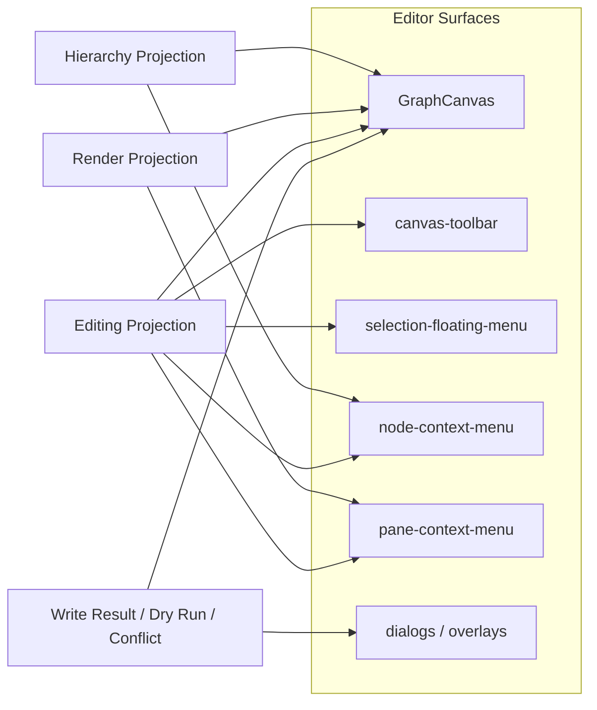

# Canvas Runtime Contract Mockup Wireframe

작성일: 2026-03-26  
상태: Draft  
범위: `m2 / canvas-runtime-contract`  
목표: 현재 목업 UI를 `canvas runtime contract` 관점에서 다시 보이도록, 실제 코드 표면 이름 기준 와이어프레임을 만든다.

## 1. 이 문서의 역할

이 문서는 픽셀 단위 디자인 시안이 아니다.

대신 아래를 한 장에서 보이게 만드는 목적의 문서다.

- 지금 우리가 실제로 가지고 있는 editor surface가 무엇인지
- 각 surface가 어떤 projection을 읽는지
- 어디서 UI event가 발생하고 어디서 runtime command로 수렴해야 하는지
- 어떤 UI는 runtime contract 바깥의 host concern인지

즉 "예쁘게 그린 화면"보다 "경계가 보이는 와이어프레임"에 가깝다.

## 2. 기준 표면

와이어프레임은 현재 코드 기준으로 아래 표면을 중심에 둔다.

- `CanvasEditorPage`
- `GraphCanvas`
- `canvas-toolbar`
- `selection-floating-menu`
- `node-context-menu`
- `pane-context-menu`
- `QuickOpenDialog`
- `SearchOverlay`
- `ExportDialog`
- `ErrorOverlay`
- `StickerInspector`

주의:

- 아직 고정되지 않은 inspector/right panel은 중심 표면으로 넣지 않았다.
- 이후 inspector가 다시 들어오더라도 `editing projection`을 읽고 같은 command vocabulary를 방출해야 한다.

## 3. 화면 와이어프레임

```text
+--------------------------------------------------------------------------------------------------+
| [A] Header / Workspace / Canvas identity / global open actions                                   |
|     - CanvasEditorPage shell                                                                      |
|     - canvas title, workspace context, quick access entry                                        |
+---------------------------+----------------------------------------------------------------------+
| [B] Workspace / canvas    | [C] Canvas toolbar overlay                                           |
|     navigation shell      |     - interaction.pointer / interaction.hand                         |
|     (optional lane)       |     - create.*                                                      |
|                           |     - viewport.zoom-in / zoom-out / fit-view                        |
|                           +----------------------------------------------------------------------+
|                           |                                                                      |
|                           | [D] GraphCanvas viewport                                             |
|                           |     - flat render surface                                            |
|                           |     - node/edge rendering                                            |
|                           |     - drag / select / marquee / zoom / context capture               |
|                           |                                                                      |
|                           |        [E] selection-floating-menu                                   |
|                           |        - style patch                                                 |
|                           |        - content patch                                               |
|                           |                                                                      |
|                           |        [F] node-context-menu      [G] pane-context-menu             |
|                           |        - node-scoped actions       - empty-pane create/export/view  |
|                           |                                                                      |
+---------------------------+----------------------------------------------------------------------+
| [H] Modal / overlay lane                                                                      |
|     - QuickOpenDialog / SearchOverlay / ExportDialog / ErrorOverlay / StickerInspector         |
+--------------------------------------------------------------------------------------------------+
```

## 4. Projection overlay

| Zone | Primary read dependency | Why it needs that projection |
|------|-------------------------|------------------------------|
| `[A]` | runtime contract 바깥 shell state | workspace, canvas routing, host navigation이 중심이다 |
| `[B]` | runtime contract 바깥 shell state | canvas list, workspace registry는 runtime consumer를 감싼다 |
| `[C]` | `editing projection` + 부분적으로 viewport state | 생성 가능 여부, pending state, interaction mode gating이 필요하다 |
| `[D]` | `render projection` 중심, `hierarchy projection` 보조 | flat render, bounds, edge, group, topology 해석이 모두 필요하다 |
| `[E]` | `editing projection` | 어떤 control이 가능한지, 어떤 key만 수정 가능한지 알아야 한다 |
| `[F]` | `editing projection` + `hierarchy projection` | rename, group, mindmap child/sibling, z-order 가능 여부를 판단한다 |
| `[G]` | `editing projection` + viewport position | pane create 가능 여부와 화면 좌표를 함께 쓴다 |
| `[H]` | `write result contract` + host UI state | export, error, search, quick-open은 결과 표시 또는 host concern이다 |

## 5. 데이터 흐름 와이어프레임



## 6. 이 와이어프레임이 말해 주는 것

### 6.1 중심 표면은 `GraphCanvas`지만, 계약 소비자는 그보다 넓다

- 눈에 가장 크게 보이는 것은 `GraphCanvas`다.
- 하지만 실제로는 toolbar, floating menu, context menu도 모두 runtime contract consumer다.
- 따라서 contract를 문서화할 때 "canvas viewport만 보면 된다"는 식으로 보면 빠지는 표면이 많다.

### 6.2 `selection-floating-menu`는 장식이 아니라 `editing projection`의 핵심 consumer다

- 어떤 control을 보여 줄지
- 어떤 patch key를 허용할지
- content 편집이 가능한지

위 세 가지가 모두 `editing projection`의 품질에 달려 있다.

### 6.3 pane/node menu는 "UI 메뉴"가 아니라 command entrypoint다

- `pane-context-menu`는 create/export/view entrypoint다.
- `node-context-menu`는 rename/group/z-order/mindmap structural action entrypoint다.
- 즉 menu는 단순 UX 부속물이 아니라 command vocabulary를 바깥에서 관찰하기 가장 쉬운 지점이다.

### 6.4 modal lane은 write result contract를 눈으로 확인하는 자리다

- conflict
- dry-run preview
- validation failure
- export success/failure

이런 결과는 결국 사용자에게 이 레이어에서 드러난다.

## 7. 후속 문서 연결

- 이벤트와 커맨드 흐름은 `EVENT-COMMAND-MAPPING.md`에서 이어서 본다.
- 이 문서는 "어디서 눌리는가"를 보여주고,
- 다음 문서는 "그 클릭/드래그가 어떤 intent와 command로 번역되는가"를 보여준다.
