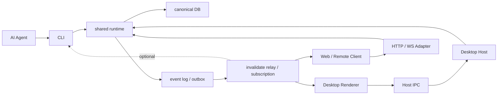

# Runtime Access Refactoring

작성일: 2026-03-28  
상태: Draft  
범위: `m2`  
목표: AI 에이전트와 데스크톱 앱이 같은 `shared runtime` 을 사용하되 서로 직접 의존하지 않도록 runtime access 구조를 재정의하고, 그 하위 작업으로 compatibility hard removal 을 통합한다.

## 1. 이 문서의 목적

이 문서는 `HTTP/WS 를 없앨 것인가?`, `CLI 와 desktop 중 누가 진짜 runtime 인가?`, `compatibility 를 어디서 어떻게 걷어낼 것인가?` 를 하나의 상위 구조 안에서 답하는 문서다.

이번 문서가 고정하려는 핵심은 아래 한 문장이다.

- `shared runtime + canonical DB + collaboration event log` 가 코어다.

그 위에서 각 surface 의 역할은 아래처럼 분리한다.

- AI 에이전트는 `CLI` 를 통해 접근한다.
- 데스크톱 앱은 `host/main process` 를 통해 접근한다.
- renderer 는 `IPC client` 다.
- `HTTP/WS` 는 필요할 때 남기는 thin adapter 다.
- legacy `compatibility` 는 별도 문서 세트가 아니라, 이 문서 안의 하위 제거 slice 다.

즉 이번 리팩터링의 핵심은 `transport 제거` 가 아니라, **runtime ownership, access surface, collaboration event, compatibility removal 순서를 한 구조로 정렬하는 것** 이다.

## 2. 왜 이 리팩터링이 필요한가

현재 코드베이스는 이미 canonical DB 와 shared runtime 방향으로 이동 중이지만, access 구조는 아직 과도기 흔적이 남아 있다.

- UI는 일부 편집 의미와 sync 책임을 여전히 transport 경계와 같이 끌어안고 있다.
- WS 는 invalidate relay 를 넘어서 full-RPC 허브 성격이 남아 있다.
- compatibility layer 는 file-first write ownership 흔적을 계속 유지한다.
- CLI는 강력한 headless surface 여야 하지만, 전체 구조상 "AI 협업의 1급 진입점" 으로 명시돼 있지는 않다.

이 상태는 특히 AI 협업에서 문제가 된다.

1. AI 에이전트가 어디로 붙어야 하는지 모호하다.
2. CLI, desktop, web surface 가 같은 runtime 규칙을 쓴다는 사실이 구조적으로 드러나지 않는다.
3. transport 와 runtime ownership 이 섞이면, AI 에이전트가 팀원이 아니라 우회 클라이언트처럼 보인다.
4. compatibility removal 이 transport refactor 와 따로 놀면 순서가 뒤집히기 쉽다.

우리가 원하는 것은 아래다.

- AI 에이전트도 사람 UI 와 같은 canonical rule 을 쓴다.
- 다만 AI 에이전트의 주 진입점은 `CLI` 다.
- desktop 과 CLI 는 서로를 몰라도 된다.
- 협업의 기준점은 runtime mutation / revision / event log 다.
- compatibility removal 은 상위 ownership 정리 이후 하위 작업으로 안전하게 진행된다.

## 3. 핵심 결정

### 3.1 `shared runtime` 이 유일한 write owner 다

- mutation validation
- revision / conflict 처리
- projection 생성
- diagnostics / dry-run / changed-set

이 규칙은 UI, CLI, HTTP, WS 어디서 접근하든 바뀌지 않는다.

### 3.2 AI 에이전트의 공식 진입점은 `CLI` 다

AI 에이전트는 desktop IPC 나 raw DB 수정이 아니라, **CLI contract** 를 통해 접근해야 한다.

좋은 경로:

- `AI Agent -> CLI -> shared runtime -> DB`

나쁜 경로:

- `AI Agent -> raw DB patch`
- `AI Agent -> desktop internal IPC`
- `AI Agent -> compatibility patch path`

### 3.3 데스크톱의 runtime owner 는 renderer 가 아니라 host 다

데스크톱 앱에서는 renderer 가 privileged runtime owner 가 되면 안 된다.

좋은 경로:

- `Desktop Renderer -> IPC -> Desktop Host -> shared runtime -> DB`

즉 renderer 는 view / interaction client 이고, host/main process 가 runtime access owner 다.

### 3.4 `HTTP/WS` 는 코어가 아니라 adapter 다

`HTTP/WS` 를 반드시 없애야 하는 것은 아니다.  
다만 더 이상 아래 역할을 가지면 안 된다.

- primary write owner
- runtime lifecycle owner
- desktop 과 CLI 사이의 필수 의존 연결

남겨도 되는 역할은 아래다.

- web / remote surface
- invalidate relay
- projection / command access adapter

### 3.5 협업의 중심은 `event log / outbox` 다

멀티 클라이언트 협업에서 필요한 것은 "누가 서버를 켜고 있느냐" 가 아니다.

진짜 필요한 것은 아래다.

- 누가 변경했는가
- 어떤 canvas 에 어떤 revision change 가 생겼는가
- 어떤 command 가 적용됐는가
- 어떤 changed set 이 생겼는가

즉 협업의 기준점은 DB row change 가 아니라 **semantic collaboration event** 다.

### 3.6 `compatibility removal` 은 하위 태스크다

compatibility removal 은 이 문서 밖의 별도 top-level 구조가 아니다.  
정확한 위치는 아래와 같다.

- 상위: runtime access topology 재정렬
- 하위: legacy file-first compatibility hard removal

즉 `compatibility` 는 ownership 을 다시 정렬한 뒤 걷어내야 한다.

## 4. 우리가 원하는 최종 구조

이 구조에서 중요한 점은 아래 넷이다.

1. 코어는 `runtime + DB + event log`
2. AI 는 `CLI` 로만 접근
3. transport 는 adapter 일 뿐 ownership 을 가지지 않음
4. compatibility removal 은 이 구조 안에서 마지막 legacy cleanup 으로 처리

## 5. 컴포넌트 책임

### 5.1 Core

#### `shared runtime`

- command contract 소유
- query / projection contract 소유
- write result envelope 소유
- revision / conflict / dry-run semantics 소유

#### `canonical DB`

- 유일한 persistence truth
- canvas / object / relation / revision 저장

#### `event log / outbox`

- 협업용 semantic change record
- 최소 포함 요소
  - `actorId`
  - `commandId`
  - `canvasId`
  - `canvasRevision`
  - `changedSet`
  - `timestamp`

### 5.2 Agent Surface

#### `CLI`

- AI 에이전트의 공식 접근면
- machine-readable JSON
- stable noun command + batch mutation
- dry-run / conflict / diagnostics support
- direct DB patch 금지

### 5.3 Desktop Surface

#### `Desktop Host`

- workspace / file system / app-state / OS integration owner
- renderer 대신 runtime 을 직접 호출
- outbox / event log 를 보고 renderer invalidate 전달 가능

#### `Desktop Renderer`

- 화면 렌더링
- 입력 수집
- IPC client
- runtime / DB 직접 접근 금지

### 5.4 Remote / Web Surface

#### `HTTP / WS Adapter`

- web / remote client access 용 adapter
- runtime access proxy
- invalidate relay
- primary write owner 금지

## 6. Access 경로 원칙

각 surface 의 경로는 아래처럼 고정한다.

### AI 에이전트

- `AI Agent -> CLI -> shared runtime -> DB`

### 데스크톱

- `Desktop Renderer -> IPC -> Desktop Host -> shared runtime -> DB`

### 웹 / 원격

- `Web Client -> HTTP/WS -> shared runtime -> DB`

이때 어떤 경로도 아래를 가지면 안 된다.

- `CLI -> Desktop`
- `Desktop -> CLI`
- `Renderer -> DB`
- `Renderer -> shared runtime`
- `HTTP/WS -> compatibility write owner`

## 7. AI 팀원 모델

이번 구조의 중요한 목표는 AI 에이전트를 "특수한 자동화 도구" 가 아니라 **정식 협업 팀원** 으로 취급하는 것이다.

이를 위해 AI surface 는 아래 조건을 만족해야 한다.

- 읽기 쉽다
  - hierarchy / render / editing projection 제공
- 쓰기 쉽다
  - semantic command surface 제공
- 실패를 이해할 수 있다
  - structured error / diagnostics / retryability 제공
- 협업에 안전하다
  - `actorId`, `commandId`, revision 기준 제공
- 따라잡기 쉽다
  - event log / invalidate 기준 제공

즉 AI 의 주 surface 는 `CLI` 지만, 협업 규칙은 사람 UI 와 분리되면 안 된다.  
둘 다 같은 runtime contract 위에서 동작해야 한다.

## 8. 하위 태스크: Compatibility Removal

이제부터 `compatibility removal` 은 별도 폴더가 아니라, 이 문서 안의 하위 태스크로 읽는다.

### 8.1 현재 compatibility 레이어 정의

현재 compatibility 레이어는 단일 파일이 아니라, `file-first write ownership` 을 유지하기 위해 남아 있는 여러 조각의 합이다.

#### WS executor 계층

- `app/ws/filePatcher.ts`
  - AST 기반 TSX patch executor
  - `patchFile`, `patchNode*` helper 소유
- `app/ws/methods.ts`
  - runtime mutation 과 compatibility patch 를 같은 RPC surface 안에서 같이 수행
- `app/ws/handlers/compatibilityHandlers.ts`
  - `file.subscribe`, `file.unsubscribe`, compatibility path / baseVersion / file mutex 보유
- `app/ws/server.ts`
  - watcher 기반 `file.changed`, `files.changed` bridge
- `app/ws/shared/params.ts`
  - `filePatcher.ts` 타입 의존

#### UI / store meta 계층

- `app/store/graph.ts`
  - `currentCompatibilityFilePath`
  - `sourceVersion`
  - `sourceVersions`
  - `compatibilityFilePath`
- `app/features/editor/pages/CanvasEditorPage.tsx`
  - compatibility file identity 추적
- `app/features/editing/actionPayloadNormalizer.ts`
  - `baseVersion` fallback 이 `sourceVersions` 에 기대고 있음
- `app/features/editing/actionRoutingBridge/*`
  - `compatibility-mutation` dispatch kind 유지

#### Host / API contract 계층

- `app/app/api/canvases/route.ts`
  - `sourceVersion` export
- `app/features/host/renderer/rpcClient.ts`
  - `sourceVersion` 계약 유지
- `app/processes/canvas-runtime/bindings/actionDispatch.ts`
  - `compatibilityFilePath` 전달

### 8.2 무엇이 아직 compatibility 경로에 묶여 있는가

현재 기준으로 아래 기능은 아직 compatibility 흔적에 묶여 있다.

- compatibility 전용 또는 compatibility 우선 intent
  - rename
  - lock toggle
  - group membership / ungroup
- runtime fallback 이 있지만 compatibility 분기가 남아 있는 intent
  - style
  - content
  - create / duplicate
  - delete
  - reparent
  - z-order
- watcher / file bridge
  - `file.subscribe`
  - `file.changed`
  - `files.changed`
- host / API contract
  - `sourceVersion`
  - `compatibilityFilePath`

### 8.3 무엇을 먼저 제거할 수 있고, 무엇은 runtime 대체가 먼저 필요한가

먼저 제거 가능한 것:

- style
- content
- create / duplicate
- delete
- reparent
- z-order
- `filePatcher.ts` 타입 의존
- `baseVersion` file hash fallback

runtime 대체가 먼저 필요한 것:

- rename
- lock toggle
- group membership / ungroup
- plugin/file-scoped runtime 밖 상태
- watcher 제거 이후 external invalidation 전략

### 8.4 제거 순서

1차: import 차단

- `filePatcher.ts` 직접 import 금지
- `app/ws/shared/params.ts` 의 타입 의존 제거
- `compatibility-mutation` 생성 지점 inventory 고정

2차: 호출 경로 제거

- runtime command 가 이미 있는 intent 부터 compatibility executor 제거
- `baseVersion` file hash fallback 제거

3차: watcher / file bridge 제거 또는 재정의

- `file.subscribe`, `file.unsubscribe` 소비자 정리
- `file.changed`, `files.changed` 를 write correctness 에서 분리

4차: UI / store / host contract 축소

- `compatibilityFilePath`, `sourceVersion`, `sourceVersions` 제거

5차: `filePatcher.ts` 삭제

- 마지막 production import 제거 후 파일 삭제

### 8.5 제거 완료 정의

compatibility removal 완료는 아래 조건이 모두 만족될 때다.

1. 어떤 production file 도 `app/ws/filePatcher.ts` 를 import 하지 않는다.
2. production code 에 `compatibility-mutation` dispatch kind 가 없다.
3. `baseVersion` 이 file hash lock 의미로 사용되지 않는다.
4. routes / handlers 에 compatibility-specific write path 가 없다.
5. UI / CLI 편집이 runtime mutation 만으로 동작한다.
6. `file.subscribe`, `file.changed`, `files.changed` 는 write correctness 전제에서 빠진다.
7. `sourceVersion` / `compatibilityFilePath` 는 public contract 에서 제거된다.

### 8.6 가장 큰 위험

- runtime command 가 아직 불완전한 rename / group / lock
- external file change invalidation 재정의 실패
- host/API 가 `sourceVersion` 을 기대하는 흐름
- tab/sidebar 가 `compatibilityFilePath` 를 현재 문서 identity 로 쓰는 흐름

## 9. 기존 m2 문서와의 관계

이 문서는 `m2` 내 다른 문서들을 대체하기보다, 상위 방향을 묶어 주는 refactoring umbrella 문서다.

- `docs/features/m2/canvas-runtime-contract/README.md`
  - runtime contract 자체를 고정
- `docs/features/m2/canvas-runtime-cqrs/README.md`
  - runtime / read / command / write 분리 기준 정의
- `docs/features/m2/ai-first-canonical-cli/README.md`
  - AI agent primary surface 로서 CLI 정의
- `docs/features/m2/runtimews-refactoring/README.md`
  - transport / handler / RPC 구조 축소

정리하면:

- `runtime-access-refactoring`
  - 상위 구조 재정렬
  - compatibility removal 하위 태스크 포함
- `runtimews-refactoring`
  - transport 축소 slice

## 10. 리팩터링 목표

이번 리팩터링이 끝나면 아래 상태가 보여야 한다.

1. AI 에이전트의 공식 진입점이 `CLI` 로 명확해진다.
2. desktop 과 CLI 는 서로 직접 의존하지 않는다.
3. `shared runtime` 이 유일한 write owner 임이 코드 구조로 드러난다.
4. `HTTP/WS` 는 adapter 로 남더라도 ownership 을 가지지 않는다.
5. collaboration invalidation 은 runtime event / outbox 기준으로 읽힌다.
6. compatibility removal 이 상위 아키텍처 안의 하위 태스크로 정리된다.

## 11. 비목표

이번 문서에서 바로 하지 않는 것:

1. `HTTP/WS` 즉시 삭제
2. always-on runtime daemon 즉시 도입
3. renderer 직접 DB 접근 허용
4. AI agent 의 raw DB access 허용
5. compatibility removal 을 transport refactor 와 분리 없이 한 번에 실행

## 12. 결론

최종 권장 구조는 아래 한 줄로 요약된다.

- `AI Agent -> CLI -> shared runtime -> DB`
- `Desktop Renderer -> IPC -> Desktop Host -> shared runtime -> DB`
- `HTTP/WS -> shared runtime` 는 optional adapter
- 협업의 중심은 `event log / outbox`
- `compatibility removal` 은 이 구조 안의 하위 태스크

이 구조가 좋은 이유는 단순하다.

- AI 가 쓰기 쉽다.
- desktop 과 CLI 의 직접 의존이 없다.
- transport 를 남겨도 코어가 흔들리지 않는다.
- compatibility removal 을 더 안전한 순서로 진행할 수 있다.
