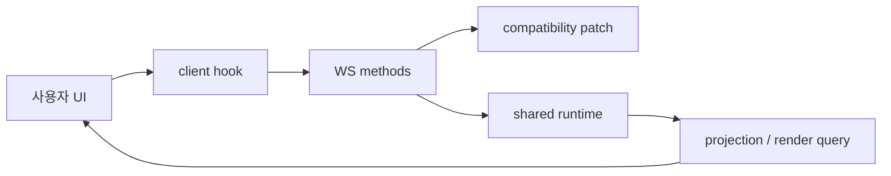
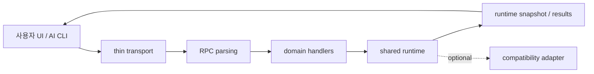

# RuntimeWS Refactoring

작성일: 2026-03-28  
상태: Draft  
범위: `m2`  
목표: `shared runtime` 은 유지하면서, `RuntimeWS` 주변의 과잉 레이어를 줄여 편집 경계를 더 단순하고 일관되게 만든다.

## 1. 이 문서의 목적

이 문서는 `Runtime/WS 를 없앨 것인가?` 를 묻는 문서가 아니다.  
오히려 반대로, `공용 runtime 은 왜 남겨야 하는가` 를 전제로 두고, 그 주변에서 무엇을 줄여야 하는지를 정리하는 리팩터링 작업 문서다.

핵심 결론은 아래 두 문장으로 요약된다.

- `shared runtime` 은 유지 대상이다.
- `RuntimeWS 주변의 과잉 레이어` 는 감량 대상이다.

즉 지금 우리가 줄이려는 것은 `runtime 자체`가 아니라, `runtime 까지 가는 길에 쌓인 중간 레이어` 다.

## 2. 왜 이 작업이 필요한가

현재 구조를 단순하게 표현하면 이렇다.



이 구조의 핵심 문제는 `Runtime` 이 아니라 다음과 같다.

1. 현재 `app/ws/methods.ts` 가 너무 많은 책임을 한 파일에 가진다.
2. WS 가 단순 subscription 채널이 아니라 full-RPC 허브처럼 쓰인다.
3. compatibility patch 가 여전히 1급 write owner 로 남아 있다.
4. client / WS / runtime / parser 에 같은 의미 변환이 중복되어 있다.

결과적으로 편집 액션 하나를 이해하거나 수정할 때:

- client hook
- WS methods
- compatibility patch
- runtime mutation
- projection / parser

를 함께 따라가야 한다.

이건 기능 부족이 아니라 구조적 과밀 문제다.

## 3. 남겨야 하는 것

이 리팩터링에서 줄이지 말아야 하는 축은 분명하다.

### 3.1 Shared Runtime

- UI 와 AI CLI 가 같은 캔버스를 편집하려면 같은 mutation 규칙, 같은 revision 규칙, 같은 projection 규칙을 공유해야 한다.
- 따라서 `shared runtime` 은 축소 대상이 아니라 기준점이다.

### 3.2 Change Subscription

- canvas 변경, 외부 파일 변경, compatibility source 변경은 UI 에 즉시 알려야 한다.
- 따라서 `push subscription` 성격의 채널은 남겨야 한다.

### 3.3 Host Boundary

- 파일 시스템, 로컬 DB, watcher, OS 통합은 renderer 안으로 넣기 어렵다.
- 따라서 privileged host boundary 도 필요하다.

정리하면:

- 유지 대상: `runtime`, `runtime contracts`, `subscription`, `host boundary`
- 감량 대상: `그 사이의 transport / rpc / handler / compatibility 중복층`

## 4. 줄여야 하는 것

## 4.1 현재 `app/ws/methods.ts`, 목표 `app/ws/routes.ts`

### 현재 문제

`app/ws/methods.ts` 는 아래 역할을 한 파일에서 동시에 맡고 있다.

- RPC 파싱
- 입력 검증
- runtime command 생성
- compatibility patch 호출
- file version / conflict 검사
- subscribe / unsubscribe
- projection 조회
- diagnostics 조립

즉 이 파일은 사실상:

- transport layer
- RPC parsing layer
- handler layer
- compatibility bridge

를 한 번에 갖고 있다.

### 목표 방향

최종 네이밍도 `methods.ts` 보다 `routes.ts` 가 더 맞다.

이유는 단순하다.

- `methods.ts` 는 메서드 구현이 모여 있는 파일처럼 들린다.
- 하지만 우리가 원하는 최종 역할은 메서드 구현 허브가 아니라 `RPC route 등록 파일` 이다.

즉 이 리팩터링의 목표는:

- 현재: `methods.ts` 안에 구현과 연결이 같이 있음
- 목표: `routes.ts` 에서는 route 연결만 하고, 실제 구현은 도메인 handler 로 분리

다시 말해 `methods.ts` 는 궁극적으로 `routes.ts` 로 수렴해야 한다.

분리 기준은 transport 도 아니고, `projection`, `subscription` 같은 기술 성격도 아니다.  
분리 기준은 `무엇을 다루는가` 라는 도메인이다.

- `canvas` handler
  - canvas mutate
  - render / editing snapshot 조회
  - canvas subscribe
- `workspace` handler
  - workspace probe
  - canvas 목록 조회
  - canvas 생성
- `appState` handler
  - workspaces
  - session
  - preferences
  - recent canvases
- `compatibility` handler
  - file patch
  - file subscribe / file changed bridge
- `history` 또는 `runtimeSession` handler
  - undo / redo
  - revision / replay 관련 작업

즉 `projection` 과 `subscription` 은 최상위 handler 이름이 아니라, 각 도메인 handler 안의 operation 종류에 가까워야 한다.

목표는 `mutate/query/subscribe 를 도메인 안에 같이 두고, routes.ts 에서는 도메인별 핸들러 연결만 하도록` 구조를 바꾸는 것이다.

## 4.2 full-RPC 형태의 WS 의존

### 현재 문제

WS 가 지금은 단순 알림 채널이 아니라 거의 모든 것을 태우는 full-RPC 통로로 쓰이고 있다.

- mutate
- undo / redo
- subscribe
- projection query
- legacy mutation

이 때문에 `왜 WS 가 필요한가?` 라는 질문에 답하기 어려워진다.

### 목표 방향

WS 의 역할을 줄인다.

- 남길 것
  - `subscription`
  - `canvas.changed`
  - `file.changed`
  - `files.changed`
- 줄일 것
  - mutate / query full-RPC

여기서 핵심은 `web 과 desktop 이 서로 다른 transport 를 써야 하느냐` 가 아니다.

더 중요한 기준은:

- `같은 RPC 규약` 을 유지하고
- mutate/query/subscription 을 도메인 안의 operation 으로 두고
- transport 아래의 handler/service 경계를 정리하는 것

즉 문제는 `WS` 자체보다 `WS 가 모든 RPC surface 를 다 끌어안는 구조` 다.

이번 단계에서 subscription-first posture 는 아래처럼 읽혀야 한다.

- subscription 전용 route
  - `canvas.subscribe`
  - `canvas.unsubscribe`
  - `file.subscribe`
  - `file.unsubscribe`
- push notification
  - `canvas.changed`
  - `file.changed`
  - `files.changed`
- 남아 있는 non-subscription carryover
  - `canvas.runtime.projections`
  - `canvas.runtime.mutate`
  - `canvas.runtime.undo`
  - `canvas.runtime.redo`
  - `canvas.node.create`
  - `object.body.block.insert`
  - `node.update`
  - `node.move`
  - `node.create`
  - `node.delete`
  - `node.reparent`
  - `plugin-instance.*`

즉 WS 는 여전히 일부 mutate/query 를 태우지만, 코드 구조상 `subscription route` 와 `carryover RPC` 가 분리되어 보여야 한다.

## 4.3 compatibility patch 가 1급 write owner 로 남아 있는 상태

### 현재 문제

현재 write owner 가 둘처럼 보인다.

- canonical runtime write
- compatibility source patch write

이중 구조는 다음 문제를 만든다.

- 진짜 데이터의 주인이 흐려진다.
- conflict / history / provenance 가 두 갈래로 갈라진다.
- AI CLI 협업 시 runtime edit 와 file patch edit 가 서로 다른 모델을 만들 수 있다.

### 목표 방향

compatibility patch 를 제거하는 것이 아니라 `격하` 한다.

- 지금: compatibility patch = 1급 write owner
- 목표: compatibility patch = shrinking adapter / export path

즉 앞으로의 기준은:

- 변경의 진실은 runtime 에서 만든다.
- compatibility source 는 필요하면 그 결과를 반영하는 부수 경로로 둔다.

## 4.4 client / WS / runtime 에 흩어진 중복 변환 로직

### 현재 문제

같은 의미가 여러 군데서 다시 해석된다.

예:

- sourceId 해석
- content kind 해석
- create placement 변환
- body block 변환
- alias / canonical normalization

이런 로직이 client hook, WS methods, runtime/service, parser 에 흩어져 있다.

### 목표 방향

의미 변환의 기준점을 하나로 줄인다.

- command 입력 변환: shared codec
- mutation 실행: shared runtime
- read projection: runtime snapshot
- UI adaptation: thin view adapter

이번 세션에서 먼저 줄일 중복은 아래 4가지다.

- create placement 변환
  - `useCanvasRuntime.ts`
  - `canvasHandlers.ts`
- object content update payload 변환
  - `useCanvasRuntime.ts`
  - `canvasHandlers.ts`
- presentationStyle patch 변환
  - `useCanvasRuntime.ts`
  - `canvasHandlers.ts`
- body block insert 변환
  - `useCanvasRuntime.ts`
  - `canvasHandlers.ts`

그리고 read 쪽에서는 legacy content capability 추론이 아래 두 파일에 나뉘어 있었다.

- `app/features/render/parseRenderGraph.ts`
- `app/features/render/aliasNormalization.ts`

이 영역은 render-side canonical boundary 를 `aliasNormalization.ts` 로 두고, parser 는 그 helper 를 재사용하는 방향으로 맞춘다.

즉:

- client 는 UI 입력 수집에 집중하고
- handler 는 route / auth / orchestration 에 집중하고
- 의미 변환은 shared layer 로 모은다

## 5. 우리가 원하는 구조



이 구조에서 중요한 점:

- `transport` 는 얇다.
- `RPC 규약` 은 통일된다.
- `handler` 는 도메인별로 쪼개진다.

여기서 `controller` 대신 `handler` 라는 이름을 쓰는 이유도 분명하다.

- 이 계층은 전통적인 MVC 서버 controller 를 만들려는 것이 아니다.
- 실제 역할은 `RPC method 를 받아 도메인 service/runtime 으로 연결하는 처리 계층` 에 가깝다.
- 따라서 앱/호스트 경계 문맥에서는 `handler` 가 더 중립적이고 역할도 정확하다.

## 6. 목표 폴더 구조

이 리팩터링이 끝났을 때 `app/ws` 는 대략 아래처럼 읽혀야 한다.

```text
app/ws/
  routes.ts
  server.ts
  rpc.ts
  messages.ts
  filePatcher.ts
  handlers/
    canvasHandlers.ts
    workspaceHandlers.ts
    appStateHandlers.ts
    compatibilityHandlers.ts
    historyHandlers.ts
  shared/
    params.ts
    errors.ts
    responses.ts
```

핵심은 이것이다.

- `routes.ts`
  - RPC method name 과 handler 를 연결하는 파일
- `handlers/*`
  - 도메인별 RPC 처리 파일
- `shared/*`
  - 공통 parsing / error / response helper
- `filePatcher.ts`
  - core write owner 가 아니라 compatibility adapter

중요한 점은 `projectionHandlers.ts`, `subscriptionHandlers.ts` 같은 기술 기준 파일을 만들지 않는 것이다.  
그 기능들은 각각 `canvasHandlers.ts`, `compatibilityHandlers.ts` 같은 도메인 handler 안의 operation 으로 들어간다.
- `runtime` 은 공용 엔진으로 남는다.
- `compatibility` 는 코어 write owner 가 아니라 부수 adapter 로 후퇴한다.

### 6.1 구현 앵커

이번 MVP 에서는 아래 파일들이 먼저 구조 기준점이 된다.

- `app/ws/routes.ts`
  - route table / registry 역할만 한다.
  - `handlers/*`, `rpc.ts`, `shared/*` 정도만 참조한다.
- `app/ws/handlers/canvasHandlers.ts`
  - canvas mutate / projection query / canvas subscribe 를 소유한다.
  - runtime mutation / runtime projection 은 사용할 수 있지만 `filePatcher.ts` 는 직접 참조하지 않는다.
- `app/ws/handlers/workspaceHandlers.ts`
  - workspace probe / list / create 같은 workspace surface 의 자리다.
  - MVP 범위에서는 현재 surface inventory 를 반영하는 얇은 registry 로 시작할 수 있다.
- `app/ws/handlers/appStateHandlers.ts`
  - workspaces / session / preferences / recent-canvases 같은 app-state surface 의 자리다.
  - workspace/runtime/compatibility 책임을 다시 끌어오지 않는다.
- `app/ws/handlers/compatibilityHandlers.ts`
  - file patch / file subscribe / file changed bridge 를 소유한다.
  - `filePatcher.ts` 를 참조할 수 있는 유일한 handler 다.
- `app/ws/handlers/historyHandlers.ts`
  - undo / redo / revision 계열 runtime API 를 소유한다.
- `app/ws/shared/params.ts`, `app/ws/shared/errors.ts`, `app/ws/shared/responses.ts`
  - 공통 parsing, diagnostics, notification helper 를 둔다.

즉 `methods.ts` 에 있던 구현은 이 파일들로 분산되고, `routes.ts` 는 등록 파일로만 남아야 한다.

### 6.2 Subscription-First Guardrail

- `routes.ts` 는 subscription routes 와 non-subscription routes 를 구분해 읽을 수 있어야 한다.
- `server.ts` 는 더 이상 `file.subscribe` 같은 개별 문자열을 transport 분기 기준으로 직접 소유하지 않는다.
- `useCanvasRuntime.ts` 는 subscription request/notification 처리와 mutate/query helper 를 분리해 읽을 수 있어야 한다.
- 현재 활성 canvas 에 대해서는 `canvas.subscribe` 와 `file.subscribe` 가 함께 붙어 watcher 기반 `file.changed` 도 invalidate 경로에 들어와야 한다.

## 7. 이 리팩터링이 중요한 이유

이 작업은 단순한 파일 정리가 아니다.

특히 `UI + AI CLI` 가 같은 캔버스를 편집하는 구조를 생각하면, 다음이 중요해진다.

- 같은 명령 의미
- 같은 revision / conflict 기준
- 같은 provenance
- 같은 projection 결과

이걸 만족시키려면 `shared runtime` 은 더 중요해지고, 반대로 `RuntimeWS 허브화` 는 더 줄여야 한다.

즉 이 리팩터링은 `runtime 을 지우는 작업` 이 아니라 `runtime 을 중심으로 주변 구조를 다시 단순화하는 작업` 이다.

## 8. 한 줄 결론

`우리가 줄여야 하는 것은 RuntimeWS가 아니라, shared runtime 으로 가는 길에 쌓인 중간 허브와 중복 계층들이다.`
