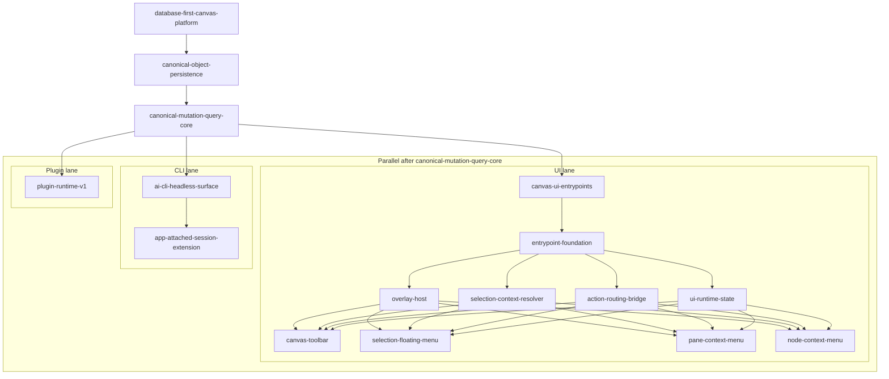

# Database-First Canvas Platform

## 개요

이 폴더는 `database-first-canvas-platform` umbrella feature를 다룬다.

상위 방향은 그대로 유지한다.

- `.tsx` file-first를 canonical editing path로 유지하지 않는다.
- 데이터베이스를 workspace/document의 primary source of truth로 둔다.
- native canvas object는 `Object Core + semantic role + capability/content contract` 기반 canonical model로 정렬한다.
- persistence baseline은 `Drizzle ORM + PGlite(local/embedded) + PostgreSQL/pgvector(compatible production path)`로 둔다.

이제 구현과 speckit은 하나의 거대한 feature가 아니라 아래 6개 slice로 나눠 진행한다.

## 용어: Canonical

이 폴더에서 `canonical`은 시스템이 **정식 기준**으로 취급하는 내부 표준 형태를 뜻한다.

- `public alias`
  - `Node`, `Shape`, `Sticky`, `Image` 같은 작성 편의용 표면
- `canonical model`
  - 저장, 검증, query, mutation의 기준이 되는 내부 표준 형태

즉 사용자는 여러 alias로 작성할 수 있지만, 시스템은 그것들을 하나의 canonical shape로 정규화해서 다룬다.

## Feature Slices

### 1. Canonical Object Persistence

- 폴더: `./canonical-object-persistence/`
- 문서: `./canonical-object-persistence/README.md`
- 목표: canonical object를 DB에 저장하는 최소 persistence contract와 Drizzle/PGlite baseline 고정

### 2. Canonical Mutation Query Core

- 폴더: `./canonical-mutation-query-core/`
- 문서: `./canonical-mutation-query-core/README.md`
- 목표: canonical object/canvas mutation과 query service contract 고정

### 3. Canvas UI Entrypoints

- 폴더: `./canvas-ui-entrypoints/`
- 문서: `./canvas-ui-entrypoints/README.md`
- 목표: database-first runtime에서 `canvas-toolbar`, `selection-floating-menu`, `pane-context-menu`, `node-context-menu`를 병렬 가능한 entrypoint slice로 고정

### 4. AI CLI Headless Surface

- 폴더: `./ai-cli-headless-surface/`
- 문서: `./ai-cli-headless-surface/README.md`
- 목표: 앱 비실행 상태에서도 동작하는 headless AI CLI surface 구현

### 5. App Attached Session Extension

- 폴더: `./app-attached-session-extension/`
- 문서: `./app-attached-session-extension/README.md`
- 목표: 앱 실행 중 selection/session/runtime context를 CLI에 확장

### 6. Plugin Runtime v1

- 폴더: `./plugin-runtime-v1/`
- 문서: `./plugin-runtime-v1/README.md`
- 목표: canonical model/canvas composition 위에 plugin runtime을 얹는 최소 sandboxed runtime 구현

## 의존성 트리 및 병렬 시점

다이어그램 해석:

- `canonical-object-persistence`가 가장 먼저 잠긴다.
- `canonical-mutation-query-core`는 persistence를 전제로 그 위에 올라간다.
- 그 다음부터 두 레인이 병렬로 열린다.
  - UI 레인: `canvas-ui-entrypoints`
  - CLI 레인: `ai-cli-headless-surface` -> `app-attached-session-extension`
- `canvas-ui-entrypoints` 내부는 먼저 `entrypoint-foundation`을 잠그고, 그 내부도 `overlay-host` / `selection-context-resolver` / `action-routing-bridge` / `ui-runtime-state`로 병렬 분리할 수 있다.
- foundation 하위 slice가 잠기면 이후 `canvas-toolbar` / `selection-floating-menu` / `pane-context-menu` / `node-context-menu`를 병렬 분리할 수 있다.
- `plugin-runtime-v1`는 트리상 mutation/query core 아래에 두지만, 실제 의존성은 `canonical-object-persistence` + `canonical-mutation-query-core`다. 즉 UI/CLI 레인이 끝나야만 시작 가능한 것은 아니다.

이 순서를 유지하는 이유는 간단하다.

- persistence가 먼저 고정돼야 mutation/query가 흔들리지 않는다.
- mutation/query core가 먼저 있어야 UI entrypoint와 CLI가 같은 domain action path를 공유할 수 있다.
- `canvas-ui-entrypoints`는 목록상 세 번째 slice지만, 실제 구현 착수는 `implementation-plan.md`의 Canvas Runtime Integration 기반 구조가 잠긴 뒤가 안전하다.
- mutation/query core가 먼저 있어야 CLI가 얇은 transport로 유지된다.
- headless surface가 먼저 있어야 app-attached가 확장 레이어로 남는다.
- plugin runtime은 canonical storage와 command surface를 소비하는 쪽이므로 마지막에 붙는 편이 안전하다.

병렬 시점은 아래처럼 본다.

- `canonical-object-persistence`와 `canonical-mutation-query-core`는 선형으로 잠근다.
- 그 다음부터 두 레인이 열린다.
  - 레인 A: `ai-cli-headless-surface` -> `app-attached-session-extension`
  - 레인 B: `canvas-ui-entrypoints`
- 단, 레인 B는 runtime shell, UI state 경계, entrypoint host 같은 기반 구조가 먼저 잠겨야 한다.
- `canvas-ui-entrypoints` 내부에서는 먼저 foundation 하위 4개 slice를 병렬 진행할 수 있다.
  - `overlay-host`
  - `selection-context-resolver`
  - `action-routing-bridge`
  - `ui-runtime-state`
- 그 다음 `entrypoint-foundation` 이후 다시 4개 UI surface를 병렬로 분리할 수 있다.
  - `canvas-toolbar`
  - `selection-floating-menu`
  - `pane-context-menu`
  - `node-context-menu`
- `plugin-runtime-v1`는 umbrella merge 기준으로는 마지막이지만, 준비 작업 일부는 core contract 안정화 이후 별도 레인에서 탐색할 수 있다.

## 폴더 운영 원칙

- top-level README는 umbrella/index 역할만 담당한다.
- 각 slice 폴더의 `README.md`가 해당 구현 단위의 기준 문서다.
- 공통 계약 문서는 top-level에 유지한다.
  - `entity-modeling.md`
  - `schema-modeling.md`
  - `implementation-plan.md`
  - `ai-cli-tooling.md`

## 관련 문서

- `docs/features/object-capability-composition/README.md`
- `docs/features/database-first-canvas-platform/entity-modeling.md`
- `docs/features/database-first-canvas-platform/schema-modeling.md`
- `docs/features/database-first-canvas-platform/implementation-plan.md`
- `docs/features/database-first-canvas-platform/ai-cli-tooling.md`
- `docs/features/database-first-canvas-platform/canvas-ui-entrypoints/README.md`
- `docs/adr/ADR-0005-database-first-canvas-platform.md`
