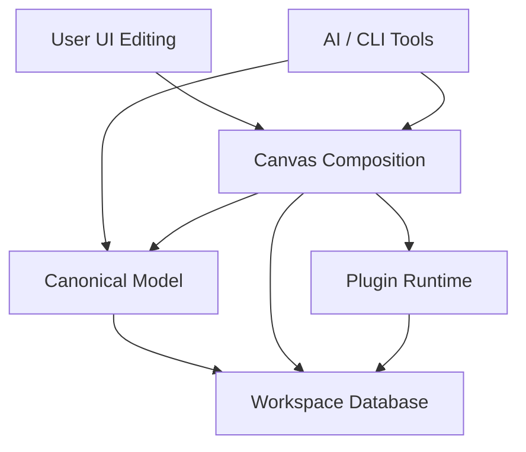

# Database-First Canvas Platform

## 개요

Magam의 다음 단계는 `.tsx` file-first 문서 모델을 기본 경로로 유지하는 것이 아니라, **데이터베이스를 canonical source of truth로 사용하는 canvas platform**으로 전환하는 것이다.

이 전환의 목적은 단순히 storage를 바꾸는 데 있지 않다. 핵심은 다음 세 가지를 동시에 만족하는 제품 구조를 만드는 것이다.

- 사용자가 UI에서 오브젝트를 직접 추가, 수정, 이동, 정렬할 수 있어야 한다.
- 대형 workspace와 다수 문서를 단일 `.tsx` 파일 비대화 없이 관리할 수 있어야 한다.
- 차트, 그래프, 테이블, 캘린더 같은 외부 라이브러리와 사용자 커스텀 요소를 plugin/component 형태로 canvas에 임베딩할 수 있어야 한다.

이 문서는 기능 방향과 제품/아키텍처 범위를 정의하는 README다. 세부 schema와 runtime contract는 후속 계약 문서에서 고정한다.

## 문제 정의

현재 `.tsx` file-first 방식은 분명한 장점이 있다.

- 문서가 명시적이다.
- AI가 파일 시스템을 빠르게 읽고 수정할 수 있다.
- React 컴포넌트 조합 기반으로 표현력이 높다.

하지만 다음 단계의 제품 요구에는 구조적 한계가 명확하다.

### 1. 사용자 레벨의 자유로운 UI 편집이 제한된다

`TSX`를 source of truth로 두면, 오브젝트 추가/수정/위치 변경/재정렬/구조 변경 같은 직접 조작이 결국 AST patch 또는 코드 생성 문제로 돌아간다.

이는 다음 경험을 어렵게 만든다.

- FigJam/whiteboard처럼 즉각적인 direct manipulation
- 코드 구조를 몰라도 되는 일반 사용자 중심 편집
- 문서 의미보다 캔버스 상태를 우선하는 UX

### 2. AI 편집 이점은 다른 인터페이스로 대체 가능하다

기존 file-first의 장점 중 하나는 AI가 raw file을 빠르게 다룰 수 있다는 점이다. 하지만 이 이점은 영구적으로 file-first를 강제하는 이유가 되지 않는다.

CLI/MCP/tool contract를 충분히 제공하면 AI는 다음 방식으로 더 안전하게 작업할 수 있다.

- 부분 조회
- 부분 수정
- 도메인 단위 mutation
- workspace/query 기반 탐색

즉, **AI 친화성은 파일 수정 경로가 아니라 도구 계약으로 회복 가능하다**.

### 3. workspace 관리와 문서 확장이 file-first에서 급격히 어려워진다

캔버스가 커지고 문서 수가 늘어나면 다음 문제가 반복된다.

- 단일 파일이 과도하게 커짐
- 변경 범위가 넓어져 충돌 가능성이 커짐
- workspace 차원의 검색, 인덱싱, 분류, 참조 관리가 어려움
- 문서 일부만 읽고 수정하는 locality가 약함

데이터베이스 기반 canonical storage는 이 문제를 구조적으로 완화한다.

## 목표

### 제품 목표

- database-first 문서 모델을 도입해 UI 직접 편집을 기본 경로로 만든다.
- workspace, 문서, 오브젝트, 관계, 검색 인덱스를 단일 데이터 계층에서 관리한다.
- 사용자 커스텀 컴포넌트와 외부 시각화 라이브러리를 plugin 기반으로 canvas에 올릴 수 있게 한다.
- AI가 raw file edit 대신 도메인 툴 기반으로 문서를 부분 조회/부분 수정할 수 있게 한다.

### 아키텍처 목표

- canonical model과 presentation/composition을 분리한다.
- giant `.tsx` file 없이도 큰 캔버스를 안정적으로 다룬다.
- query, search, embedding, provenance를 데이터 계층에서 일관되게 다룬다.
- plugin/component 확장을 허용하되, canvas document와 실행 코드를 같은 것으로 취급하지 않는다.

## 비목표

- 웹 편집 결과를 다시 `.tsx` 파일로 round-trip 하는 것을 v1 범위에 넣지 않는다.
- 기존 `.tsx` file-first workflow를 canonical editing path로 유지하지 않는다.
- 기존 `.tsx` legacy migration/import tool은 이번 feature 범위에 넣지 않는다.
- plugin package 배포 채널, 마켓플레이스, 결제 모델을 이번 문서에서 고정하지 않는다.
- 실시간 협업 CRDT/OT 세부 구현을 이번 문서에서 확정하지 않는다.
- untrusted plugin sandbox의 최종 보안 구현 세부를 이번 README에서 고정하지 않는다.

## 핵심 사용자 스토리

- 캔버스 사용자로서, 나는 코드 없이도 오브젝트를 추가하고 이동하고 수정해서 문서를 완성하고 싶다.
- 워크스페이스 사용자로서, 나는 큰 문서와 여러 캔버스를 단일 giant file 없이 탐색하고 관리하고 싶다.
- 플러그인 작성자로서, 나는 TypeScript 기반의 테이블/캘린더/차트/그래프 컴포넌트를 등록하고 canvas에 배치 가능하게 만들고 싶다.
- AI 에이전트로서, 나는 전체 파일을 읽고 덮어쓰는 대신 툴 기반으로 필요한 일부만 조회하고 수정하고 싶다.

## 제안 아키텍처

### 1. Workspace Database Layer

모든 문서, 메타데이터, 검색 인덱스, plugin registry는 데이터베이스에서 관리한다.

이 레이어는 최소한 다음을 제공해야 한다.

- workspace 목록과 메타
- 문서/캔버스 목록
- object graph와 relation
- 검색/필터/embedding 인덱스
- plugin/component registry

### 2. Canonical Model Layer

편집 가능한 의미 데이터의 source of truth는 canonical model이다.

여기에는 다음이 포함된다.

- object identity
- parent/child 및 graph relation
- layout anchor 또는 structural metadata
- 검색용 projection
- embedding 대상 텍스트/메타

이 레이어는 canvas mutation과 AI mutation 모두의 기준 데이터가 된다.

### 3. Canvas Composition Layer

canvas document는 “무엇을 어디에 배치했는가”를 기록한다.

- 어떤 native node를 배치했는가
- 어떤 plugin component 인스턴스를 배치했는가
- 어떤 canonical object/query에 바인딩했는가
- 어떤 props/layout/viewport state를 가졌는가

중요한 원칙:

- canvas document는 편집/배치의 진실이다.
- canonical model은 의미/관계의 진실이다.
- 두 레이어가 같은 의미 데이터를 중복 소유하면 안 된다.

### 4. Plugin Runtime Layer

사용자 커스텀 요소와 외부 시각화 라이브러리는 plugin/component runtime으로 수용한다.

지원 대상 예시:

- 차트 라이브러리
- 그래프/다이어그램 렌더러
- 테이블
- 캘린더
- 사용자 정의 시각화 컴포넌트

권장 방향:

- plugin 코드는 별도 component asset 또는 registry entry로 관리한다.
- canvas document는 plugin source 전체를 직접 저장하는 대신, plugin reference + props + binding 중심으로 구성한다.
- plugin은 host API를 통해 필요한 데이터에 접근한다.

### 5. AI/CLI Tooling Layer

AI는 더 이상 `.tsx` 파일 전체를 읽고 수정하는 것이 기본 경로가 아니다.

대신 다음 contract를 제공한다.

- workspace/query read
- object/document mutation
- selection/layout edits
- plugin instance 생성/수정

이 레이어는 file-first가 주던 AI 편집 이점을 도메인 툴 기반으로 대체한다.

## 레이어 관계

## 왜 Database-First인가

### direct manipulation을 중심에 둘 수 있다

오브젝트 이동, 정렬, 재배치, 구조 변경을 AST patch가 아니라 document/object mutation으로 다룰 수 있다.

### workspace와 대형 문서 관리가 쉬워진다

문서가 커질수록 필요한 일부만 읽고 수정하는 locality가 중요해진다. 데이터베이스는 이 요구에 더 잘 맞는다.

### embedding과 search를 저장 모델에 통합할 수 있다

semantic search와 retrieval을 부가 기능이 아니라 데이터 계층의 일부분으로 설계할 수 있다.

### plugin 확장 경로를 자연스럽게 열 수 있다

사용자 커스텀 요소와 외부 렌더러를 “문서 소스”가 아니라 “runtime asset”으로 분리해 수용할 수 있다.

## 예상되는 대가

- raw file inspectability는 약해진다.
- Git diff 중심 워크플로우는 일부 불리해질 수 있다.
- AI와 사용자 모두를 위한 툴 계약이 더 중요해진다.
- plugin runtime, capability, migration, sandbox 같은 새로운 책임이 생긴다.

이 대가는 direct manipulation 중심 제품 경험과 workspace 확장성을 위해 감수할 가치가 있다.

## 성공 기준

- 핵심 캔버스 편집 동작이 `.tsx` AST patch 없이 동작한다.
- 하나의 large workspace를 giant `.tsx` 파일 없이 관리할 수 있다.
- AI가 문서 일부만 조회/수정하는 툴 경로를 사용할 수 있다.
- chart/table/calendar/custom component를 plugin 경로로 canvas에 올릴 수 있다.

## 오픈 질문

- 실제 storage 엔진을 PostgreSQL 계열로 바로 고정할지, PostgreSQL-compatible local/embedded 경로를 먼저 둘지
- plugin runtime을 어떤 capability/sandbox 모델로 제한할지
- embedding index를 object 단위, document 단위, 둘 다로 가질지

## 관련 문서

- `docs/features/technical-design/README.md`
- `docs/features/database-first-canvas-platform/entity-modeling.md`
- `docs/features/database-first-canvas-platform/implementation-plan.md`
- `docs/features/database-first-canvas-platform/schema-modeling.md`
- `docs/features/legacy-tsx-migration/README.md`
- `docs/closed-features/web-editing-board-document/README.md`
- `docs/closed-features/web-editing-board-document/contracts/plugin-registry-contract.md`
- `docs/closed-features/web-editing-board-document/contracts/storage-model-comparison.md`
