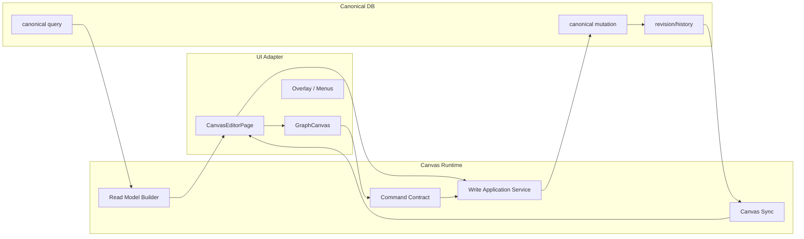

# Canvas Runtime CQRS

작성일: 2026-03-24  
상태: Draft  
범위: `database-first-canvas-platform`  
목표: `GraphCanvas`를 UI renderer로 축소하고, canvas runtime을 `Read / Command / Write`로 분리해 framework-neutral editor architecture를 확정한다.

## 1. 배경

현재 코드베이스는 database-first canonical runtime으로 이동 중이지만, canvas editor의 핵심 편집 의미는 아직 UI 계층에 많이 남아 있다.

- canonical truth와 mutation/query는 이미 DB 중심이다.
  - `libs/shared/src/lib/canonical-persistence/*`
  - `libs/shared/src/lib/canonical-mutation/*`
  - `libs/shared/src/lib/canonical-query/*`
- render source도 canonical DB query로 전환되기 시작했다.
  - `libs/shared/src/lib/canonical-query/render-canvas.ts`
  - `app/app/api/render/route.ts`
  - `libs/cli/src/server/http.ts`
- sync도 `canvasId` 중심으로 옮기고 있다.
  - `app/hooks/useCanvasRuntime.ts`
  - `app/ws/methods.ts`
  - `app/ws/server.ts`

하지만 편집기의 의미 해석은 여전히 React UI 쪽에 크게 남아 있다.

- `GraphCanvas`는 렌더링 외에 create/edit entry, 일부 interaction policy를 가진다.
- `CanvasEditorPage`는 command orchestration, mutation dispatch, optimistic/history 후처리까지 담당한다.
- `workspaceEditUtils.ts`는 사실상 edit target resolution + action routing context builder + error mapping 계층이다.
- `parseRenderGraph.ts`는 단순 parser가 아니라 editability와 graph semantics를 복원하는 read-side engine 역할을 일부 수행한다.

이 상태는 두 가지 문제를 만든다.

1. React UI가 canvas runtime의 사실상 엔진이 된다.  
2. 같은 편집 경험을 Svelte 같은 다른 UI 프레임워크에서 재현하기 어렵다.

즉 지금 필요한 것은 “React 코드 정리”가 아니라, “editor engine을 UI adapter 밖으로 분리하는 구조적 기준”이다.

## 2. 핵심 문제

### 2.1 `GraphCanvas`가 Read/View가 아니라 mini-editor engine이다

현재 `GraphCanvas`는 다음 역할이 섞여 있다.

- read
  - graph render
  - overlay anchor 계산
- command
  - pointer/drag/menu를 create/move/reparent/rename 의도로 해석
- write-adjacent policy
  - create 직후 즉시 편집 진입
  - mindmap reparent 판정
  - body entry 조건 판단

이 구조에서는 UI 교체가 곧 편집 엔진 교체가 된다.

### 2.2 `CanvasEditorPage`가 application service를 직접 품고 있다

현재 페이지 레벨은 다음을 동시에 한다.

- render response 적용
- node edit target/source identity 해석
- command envelope 생성
- bridge dispatch
- optimistic/history replay
- error -> user-facing message 매핑

즉 “화면 조립”이 아니라 “편집 runtime orchestration”에 가깝다.

### 2.3 read model과 write model의 경계가 약하다

현재 read side는 다음을 UI에서 복원한다.

- alias normalization
- mindmap grouping
- editability meta
- 일부 source identity

반대로 write side는 다음을 UI에서 조립한다.

- move/create/reparent/update command
- target/source scope
- allowed command gating

CQRS 기준으로 보면 read projection과 write command preparation이 UI에 남아 있다.

### 2.4 framework portability가 구조적으로 보장되지 않는다

우리가 원하는 것은 “React로만 가능한 editor”가 아니다.

원하는 상태:

- canonical DB + runtime contract는 UI 프레임워크와 무관하다.
- React client도 같은 runtime contract를 소비한다.
- 필요하면 Svelte client도 같은 runtime contract를 소비할 수 있다.
- Electron은 host일 뿐이며, editor engine의 핵심 단위가 아니다.

즉 portability 목표는 “Electron 제거”가 아니라 “UI framework-neutral runtime 확보”다.

## 3. 목표

이 feature의 목표는 canvas editor를 명확한 CQRS 구조로 다시 정의하는 것이다.

1. `GraphCanvas`를 rendering + interaction capture 전용 adapter로 축소한다.
2. canvas read model을 UI parser/renderer 밖의 runtime contract로 승격한다.
3. user action은 UI에서 직접 mutation하지 않고 command/intention으로만 올린다.
4. write/application service가 command validation, dispatch, optimistic/history, error mapping을 담당한다.
5. React에 묶인 편집 규칙을 framework-neutral runtime contract로 이동시킨다.

## 4. 아키텍처 원칙

### 4.1 DB가 canonical truth다

- canvas shell, object body, relation, persisted layout, revision은 DB가 소유한다.
- UI는 truth를 소유하지 않는다.

### 4.2 `GraphCanvas`는 engine이 아니라 adapter다

`GraphCanvas`는 최종적으로 다음만 해야 한다.

- read model 렌더링
- pointer/keyboard/menu 입력 수집
- selection/hover/open overlay 같은 순간 UI state 유지
- command emit

다음은 가지면 안 된다.

- editability 규칙 해석
- source target resolution
- mutation dispatch
- write rollback/history 정책
- mindmap 구조 규칙의 최종 판정

### 4.3 CQRS를 명확하게 분리한다

#### Read

- canonical DB query -> canvas view model
- parser-compatible graph payload -> render node tree
- editability/capability/mindmap membership 같은 읽기용 메타 포함

#### Command

- UI interaction -> domain command
- 예:
  - `node.move.requested`
  - `node.rename.requested`
  - `canvas.node.create.requested`
  - `mindmap.reparent.requested`
  - `object.body.block.insert.requested`

#### Write

- command validation
- canonical mutation dispatch
- optimistic state
- rollback/history replay
- version conflict 처리
- invalidate publish

### 4.4 React/Svelte는 같은 runtime contract를 먹어야 한다

장기 목표는 다음이다.

- React canvas client
- Svelte canvas client
- headless CLI/client

이들이 같은 read model과 같은 command contract를 공유해야 한다.

## 5. 제안 구조



### 5.1 Read Model

read model은 단순 `ReactFlow Node[]`가 아니다.

필요한 포함 요소:

- rendered node/edge/mindmap group
- source identity
- editability meta
- command capability set
- body entry capability
- selection/overlay가 필요한 anchor metadata

즉 `parseRenderGraph.ts`가 지금 일부 담당하는 의미 복원을 upstream read model builder로 올려야 한다.

### 5.2 Command Contract

UI는 command만 방출한다.

예시:

```ts
type CanvasCommand =
  | { type: 'node.move.requested'; canvasId: string; nodeId: string; next: { x: number; y: number } }
  | { type: 'node.rename.requested'; canvasId: string; nodeId: string; nextId: string }
  | { type: 'canvas.node.create.requested'; canvasId: string; payload: CreatePayload }
  | { type: 'mindmap.reparent.requested'; canvasId: string; nodeId: string; nextParentId: string | null }
  | { type: 'object.body.block.insert.requested'; canvasId: string; objectId: string; block: ContentBlock };
```

중요:

- UI는 command를 만들지만, command의 허용 여부를 최종 판정하지 않는다.
- command는 framework-neutral해야 한다.

### 5.3 Write Application Service

현재 `CanvasEditorPage`와 `workspaceEditUtils.ts`에 섞인 책임을 이 계층으로 모은다.

이 서비스가 담당할 것:

- edit target/source resolution
- command gating
- bridge/action routing dispatch
- optimistic mutation registration
- rollback/history replay
- error classification -> user-facing domain error
- immediate edit follow-up decision

### 5.4 Canvas Sync

sync는 더 이상 file sync가 아니다.

- 기준 단위: `canvasId`
- invalidate 이벤트: `canvas.changed`
- UI는 동일 canvas를 보고 있는 세션끼리만 live update 받는다.

## 6. 현재 UI에 남아 있는 engine 책임

현재 기준으로 우선 분리해야 할 항목은 아래와 같다.

### 6.1 `workspaceEditUtils.ts`

현재 역할:

- edit target resolution
- action routing context 구성
- command gating helper
- immediate edit mode 결정
- edit error mapping

판단:

- UI utility가 아니라 application/runtime adapter 계층이다.
- 우선 분해 대상 1순위다.

### 6.2 `editability.ts`

현재 역할:

- node family 판정
- allowed command 계산
- style editable key whitelist
- readOnly reason 결정

판단:

- 이것은 UI helper가 아니라 read model metadata 규칙이다.
- runtime contract 또는 shared domain layer로 이동해야 한다.

### 6.3 `CanvasEditorPage.tsx`

현재 역할:

- command 생성
- bridge dispatch
- create/edit follow-up
- history replay invalidate
- render graph 적용

판단:

- page가 너무 많은 write/application 책임을 가진다.
- 최종적으로는 thin screen-composition layer가 되어야 한다.

### 6.4 `GraphCanvas.tsx`

현재 역할:

- renderer
- interaction state
- 일부 reparent/create/edit policy

판단:

- `Read + Input -> Command emit`까지만 남겨야 한다.
- 특히 mindmap reparent 최종 판정과 immediate edit policy는 제거 대상이다.

### 6.5 `parseRenderGraph.ts`

현재 역할:

- render payload parsing
- graph normalization
- mindmap edge/group 복원
- editability derivation 일부 포함

판단:

- parser를 넘어서 read-side projection engine 역할을 한다.
- 장기적으로는 `read model builder -> UI parser` 구조로 분리해야 한다.

## 7. 구현 순서 제안

이 작업은 한 번에 하지 않는다. 아래 순서로 잘라서 진행한다.

### Phase A. Command Boundary

- `GraphCanvas`에서 command emit interface를 명시적으로 만든다.
- UI interaction은 command object만 내보낸다.
- direct mutation call 또는 page-specific callback 조합을 줄인다.

### Phase B. Application Service Extraction

- `workspaceEditUtils.ts`를 해체한다.
- edit target resolution, command gating, error mapping, immediate edit policy를 `canvas application service` 계층으로 옮긴다.

### Phase C. Read Model Builder

- `parseRenderGraph.ts` 바깥에 read model builder를 만든다.
- editability/capability/source identity/mindmap membership를 upstream에서 확정한다.

### Phase D. Framework-neutral Contract

- React-specific 타입을 runtime contract에서 제거한다.
- Svelte에서도 같은 read model/command contract를 소비할 수 있게 정리한다.

## 8. 비목표

이번 문서에서 바로 다루지 않는 것:

1. ReactFlow 자체 제거
2. Svelte renderer 즉시 구현
3. 모든 overlay/menu state의 전역 runtime 이전
4. realtime multi-user collaboration 전체 설계
5. import/export product flow 완성

## 9. 성공 기준

다음이 만족되면 이 feature는 성공이다.

1. `GraphCanvas`가 더 이상 mutation semantics를 직접 소유하지 않는다.
2. editability와 command capability가 UI helper가 아니라 runtime contract로 제공된다.
3. `CanvasEditorPage`가 편집 application service를 직접 구현하지 않는다.
4. read model과 command contract가 React 타입에 묶이지 않는다.
5. 같은 runtime contract로 다른 UI framework client를 설계할 수 있다.

## 10. 다음 작업의 기준

이 문서를 기준으로 다음 개선 작업은 아래 단위로 정의한다.

1. `workspaceEditUtils` extraction feature
2. `GraphCanvas command-boundary` feature
3. `read-model builder` feature
4. `framework-neutral canvas contract` feature

즉 이 문서는 단일 리팩터 작업이 아니라, canvas editor를 platform-owned runtime과 UI-owned adapter로 재구성하는 상위 아키텍처 feature의 시작점이다.
