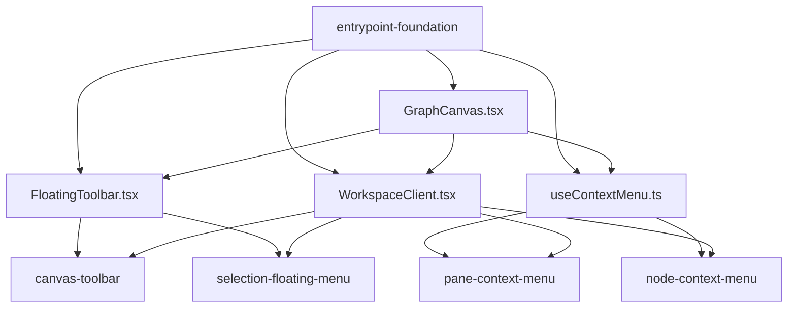
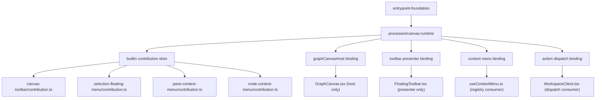

# Shell Adapter Boundary

## 개요

이 sub-slice는 `canvas-ui-entrypoints`에서 shared shell hot spot을 FSD 친화적인 canvas runtime composition 구조로 바꾸는 선행 작업이다.

현재 `GraphCanvas.tsx`, `FloatingToolbar.tsx`, `useContextMenu.ts`, `WorkspaceClient.tsx`가 여러 surface의 open/close, anchor, callback, intent wiring을 함께 들고 있어서, feature slice를 나눠도 결국 같은 파일에서 다시 충돌한다.

이 slice의 목표는 `GraphCanvas`를 feature owner가 아니라 host로 축소하고, `processes/canvas-runtime`가 feature contribution을 조립하는 composition root가 되도록 만드는 것이다.

## 범위

- `processes/canvas-runtime` composition root
- fixed contribution slot contract
- `GraphCanvas` host boundary
- `FloatingToolbar` presenter boundary
- context menu registry / overlay binding boundary
- action dispatch binding boundary

## 비범위

- toolbar 실제 control inventory
- selection floating menu 실제 action set
- pane/node context menu 실제 item inventory
- overlay host 자체 구현
- canonical mutation/query contract 자체 정의

## 선행조건

- `entrypoint-foundation`
- `canonical-mutation-query-core`

## 왜 먼저인가

foundation은 host/resolver/routing/state contract를 고정하지만, feature가 그 contract를 앱 shell에 어떻게 연결할지는 아직 남는다.

후속 feature slice가 병렬 작업 가능하려면 다음을 먼저 만들어야 한다.

- `GraphCanvas.tsx`는 feature branching이 없는 host가 된다.
- `FloatingToolbar.tsx`는 feature logic이 없는 presenter가 된다.
- `useContextMenu.ts`는 pane/node inventory owner가 아니라 registry consumer가 된다.
- `WorkspaceClient.tsx`는 surface-specific dispatch owner가 아니라 binding consumer가 된다.
- surface feature는 고정된 slot에 자기 contribution만 채운다.

## 목표 구조

권장 구조는 아래와 같다.

- `app/features/canvas-ui-entrypoints/contracts.ts`
- `app/processes/canvas-runtime/types.ts`
- `app/processes/canvas-runtime/createCanvasRuntime.ts`
- `app/processes/canvas-runtime/builtin-slots/canvasToolbar.ts`
- `app/processes/canvas-runtime/builtin-slots/selectionFloatingMenu.ts`
- `app/processes/canvas-runtime/builtin-slots/paneContextMenu.ts`
- `app/processes/canvas-runtime/builtin-slots/nodeContextMenu.ts`
- `app/processes/canvas-runtime/bindings/graphCanvasHost.ts`
- `app/processes/canvas-runtime/bindings/toolbarPresenter.ts`
- `app/processes/canvas-runtime/bindings/contextMenu.ts`
- `app/processes/canvas-runtime/bindings/actionDispatch.ts`

참고:

- 현재 저장소는 `app/components`, `app/features` 중심 구조를 쓰고 있으므로, 첫 단계에서는 `GraphCanvas.tsx`를 유지하되 role을 host로 축소한다.
- `ui-runtime-state`, toolbar presenter, context-menu type이 `GraphCanvas.drag.ts`나 `contextMenu.ts`를 통해 서로 간접 결합되지 않도록 공용 entrypoint contract를 먼저 낮은 위치로 뺀다.
- 장기적으로는 이 host를 `widgets/canvas-shell` 수준으로 보는 것이 맞다.

## Contribution Contract

후속 feature는 공통 runtime contract에 맞는 contribution 하나를 export한다.

```ts
export interface CanvasRuntimeContribution {
  toolbarSections?: ToolbarSectionContribution[];
  selectionMenuItems?: SelectionMenuItemContribution[];
  paneMenuItems?: PaneMenuItemContribution[];
  nodeMenuItems?: NodeMenuItemContribution[];
  shortcuts?: CanvasShortcutContribution[];
  intents?: CanvasIntentContribution[];
}
```

중요한 점은 feature가 `GraphCanvas.tsx`를 직접 import하지 않고, runtime이 feature contribution을 수집한다는 점이다.

## Fixed Slot 규칙

중앙 register 파일 하나를 모든 워크트리가 같이 편집하면 또 다른 merge hotspot이 생긴다.

그래서 shell-adapter-boundary는 고정 slot 파일을 먼저 만든다.

| Slot | Feature가 채우는 고정 경로 |
|------|--------------------------|
| toolbar | `app/features/canvas-ui-entrypoints/canvas-toolbar/contribution.ts` |
| selection floating menu | `app/features/canvas-ui-entrypoints/selection-floating-menu/contribution.ts` |
| pane context menu | `app/features/canvas-ui-entrypoints/pane-context-menu/contribution.ts` |
| node context menu | `app/features/canvas-ui-entrypoints/node-context-menu/contribution.ts` |

runtime은 이 고정 경로만 소비한다. 따라서 후속 lane은 중앙 register 파일을 다시 수정하지 않고 자기 `contribution.ts`만 채우면 된다.

## 의존성 그래프

### 현재 병목



해석:

- feature가 자기 파일만 수정하지 못하고 shared shell 파일을 먼저 통과한다.
- 그래서 병렬 레인을 나눠도 같은 파일에서 merge conflict가 난다.

### 분리 후 목표 구조



해석:

- `GraphCanvas.tsx`는 더 이상 feature별 callback과 branching owner가 아니다.
- 후속 feature는 자기 `contribution.ts`와 내부 model/inventory만 주로 수정한다.
- 병렬 레인의 hot spot이 shared shell file에서 feature-owned contribution 파일로 이동한다.

## 완료 기준

- 후속 surface slice는 대부분 `app/features/canvas-ui-entrypoints/<surface>/**`와 자기 `contribution.ts`만 수정한다.
- `GraphCanvas.tsx`, `FloatingToolbar.tsx`, `useContextMenu.ts`, `WorkspaceClient.tsx`는 one-time adoption 이후 direct feature branching이 크게 늘지 않는다.
- `processes/canvas-runtime`가 feature contribution을 조립하는 composition root가 된다.

## 관련 문서

- `./implementation-plan.md`
- `./tasks.md`
- `../README.md`
- `../entrypoint-foundation/README.md`
