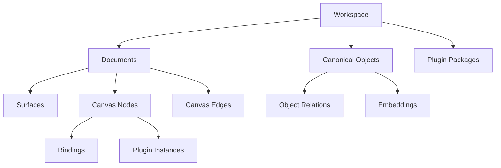

# Database-First Canvas Platform 스키마 모델링

> Drizzle 기반 애플리케이션 모델 관점은 [entity-modeling.md](./entity-modeling.md)를 우선 참고한다. 이 문서는 DB 테이블과 관계 모델 중심의 하위 레퍼런스다.

## 1. 문서 목적

이 문서는 database-first 전환을 위한 **논리 스키마**와 **PostgreSQL 친화적 관계 모델**을 정의한다.

여기서 중요한 점은 “어떤 테이블을 만들지”보다 “어떤 레이어가 어떤 진실을 소유하는지”를 먼저 고정하는 것이다.

## 2. 모델링 원칙

1. workspace database가 최상위 저장 경계다.
2. canonical model과 canvas composition은 서로 다른 진실을 가진다.
3. plugin source, plugin registry, plugin instance는 분리 저장한다.
4. schema consumer는 모르는 plugin/extension payload를 손실 없이 보존해야 한다.
5. query/search/embedding은 나중 확장이 아니라 초기 모델의 일부로 둔다.

## 3. 레이어 모델

## 4. 핵심 도메인 구분

### Workspace

- 문서, 오브젝트, 플러그인, 에셋, 인덱스를 담는 상위 경계

### Canonical Object

- 의미 데이터와 관계 데이터의 진실
- 예: 아이디어 카드, 개념 노드, 일정 엔트리, 업무 항목

### Canvas Document

- 배치와 표현의 진실
- 예: 어떤 surface에 어떤 노드가 어떤 위치와 z-order로 놓였는가

### Plugin Package / Version

- 실행 가능한 사용자 확장 코드 자산

### Plugin Instance

- 특정 문서에 배치된 widget 인스턴스

## 5. 논리 엔티티

## 5.1 Workspace and Document

### `workspaces`

용도:

- 문서, 오브젝트, 플러그인, 인덱스가 속하는 최상위 경계다.
- 권한, 검색 범위, 백업/내보내기, 멀티 워크스페이스 분리를 이 레벨에서 관리한다.

| 필드 | 타입 | 설명 |
|------|------|------|
| `id` | uuid | workspace 식별자 |
| `slug` | text unique | URL/CLI 친화 식별자 |
| `name` | text | 표시 이름 |
| `settings` | jsonb | workspace 레벨 설정 |
| `created_at` | timestamptz | 생성 시각 |
| `updated_at` | timestamptz | 수정 시각 |

### `documents`

용도:

- 사용자가 여는 개별 board/canvas/note 문서의 루트 엔티티다.
- 문서 제목, 상태, 메타데이터, schema version을 소유한다.
- 배치 데이터는 직접 담지 않고 `surfaces`, `canvas_nodes`, `canvas_edges`로 분리한다.

| 필드 | 타입 | 설명 |
|------|------|------|
| `id` | uuid | document 식별자 |
| `workspace_id` | uuid fk | 소속 workspace |
| `kind` | text | `board`, `note`, `canvas` 등 |
| `title` | text | 문서 이름 |
| `schema_version` | integer | 문서 schema version |
| `status` | text | `active`, `archived` |
| `metadata` | jsonb | 문서 메타 |
| `created_at` | timestamptz | 생성 시각 |
| `updated_at` | timestamptz | 수정 시각 |

### `document_revisions`

용도:

- 문서 변경 이력을 추적하는 append-only 로그다.
- 누가 어떤 mutation batch를 적용했는지 기록해 rollback, audit, export 기준점으로 쓴다.

| 필드 | 타입 | 설명 |
|------|------|------|
| `id` | uuid | revision 식별자 |
| `document_id` | uuid fk | 대상 문서 |
| `revision_no` | bigint | 단조 증가 revision |
| `author_kind` | text | `user`, `agent`, `system` |
| `author_id` | text | 작성자 식별자 |
| `mutation_batch` | jsonb | 적용된 mutation 집합 |
| `snapshot_ref` | text nullable | snapshot 또는 export 참조 |
| `created_at` | timestamptz | 생성 시각 |

## 5.2 Canonical Model

### `objects`

용도:

- 캔버스에 표현될 수 있는 의미 데이터의 canonical entity다.
- 여러 문서가 같은 object를 서로 다른 방식으로 재사용할 수 있게 workspace 범위에서 관리한다.
- 그래서 기본 모델에서는 `document_id`를 두지 않고 `workspace_id`만 둔다.

중요한 해석:

- `objects`는 "문서 안에 그려진 노드"가 아니라 "문서들이 참조할 수 있는 의미 객체"다.
- 특정 문서에서만 보이는 배치 정보는 `canvas_nodes`가 담당한다.
- 표시용 레이블이 꼭 필요한 object kind만 `title`을 가질 수 있으므로, base field는 optional로 본다.

| 필드 | 타입 | 설명 |
|------|------|------|
| `id` | uuid | object 식별자 |
| `workspace_id` | uuid fk | 소속 workspace |
| `object_kind` | text | `concept`, `task`, `event`, `asset-ref` 등 |
| `title` | text nullable | 선택적인 대표 레이블 |
| `canonical_text` | text | 검색/embedding용 정규화 텍스트 |
| `metadata` | jsonb | 구조화 메타 |
| `extensions` | jsonb | namespaced 확장 데이터 |
| `created_at` | timestamptz | 생성 시각 |
| `updated_at` | timestamptz | 수정 시각 |

### `object_relations`

용도:

- object 사이의 구조와 의미 관계를 저장한다.
- parent/child, reference, schedule, dependency 같은 graph를 문서와 분리해 유지한다.

| 필드 | 타입 | 설명 |
|------|------|------|
| `id` | uuid | relation 식별자 |
| `workspace_id` | uuid fk | 소속 workspace |
| `from_object_id` | uuid fk | 출발 object |
| `relation_type` | text | `parent-of`, `references`, `scheduled-on` 등 |
| `to_object_id` | uuid fk | 도착 object |
| `sort_key` | numeric nullable | 정렬 가능한 관계용 |
| `metadata` | jsonb | 관계 메타 |
| `created_at` | timestamptz | 생성 시각 |

### `embedding_records`

용도:

- semantic search와 retrieval에 쓰는 벡터 인덱스 저장소다.
- object, document, plugin-instance 같은 여러 owner를 공통 포맷으로 인덱싱한다.

| 필드 | 타입 | 설명 |
|------|------|------|
| `id` | uuid | embedding 식별자 |
| `workspace_id` | uuid fk | 소속 workspace |
| `owner_kind` | text | `object`, `document`, `plugin-instance` |
| `owner_id` | uuid | 임베딩 대상 id |
| `model_name` | text | 임베딩 모델 이름 |
| `source_text` | text | 벡터화 기준 텍스트 |
| `embedding` | vector or jsonb | pgvector 또는 대체 저장 |
| `created_at` | timestamptz | 생성 시각 |

## 5.3 Canvas Composition

### `surfaces`

용도:

- 하나의 document 안에서 실제 편집 가능한 scene root를 나타낸다.
- 예를 들어 한 문서에 메인 보드와 보조 surface가 함께 있을 수 있다.
- viewport 상태와 surface-level 설정도 이 레벨에서 관리한다.

| 필드 | 타입 | 설명 |
|------|------|------|
| `id` | uuid | surface 식별자 |
| `document_id` | uuid fk | 소속 문서 |
| `surface_kind` | text | `canvas`, `board`, `mindmap-surface` |
| `name` | text | 표시 이름 |
| `viewport_state` | jsonb | 줌/오프셋/가이드 상태 |
| `settings` | jsonb | surface 설정 |
| `created_at` | timestamptz | 생성 시각 |
| `updated_at` | timestamptz | 수정 시각 |

### `canvas_nodes`

용도:

- 화면에 배치되는 모든 시각 노드의 persisted 표현이다.
- native node, plugin node, canonical object에 바인딩된 node를 공통 구조로 담는다.
- 의미 자체보다 위치, 크기, 스타일, 컨테이너 소속 같은 배치 책임을 가진다.

| 필드 | 타입 | 설명 |
|------|------|------|
| `id` | uuid | node 식별자 |
| `document_id` | uuid fk | 소속 문서 |
| `surface_id` | uuid fk | 소속 surface |
| `node_kind` | text | `native`, `plugin`, `binding-proxy` |
| `node_type` | text | `sticky`, `shape`, `text`, `mindmap-node`, `plugin-instance` 등 |
| `parent_node_id` | uuid nullable | 그룹/프레임/컨테이너 부모 |
| `canonical_object_id` | uuid nullable | 연결된 canonical object |
| `plugin_instance_id` | uuid nullable | 연결된 plugin instance |
| `props` | jsonb | 노드 props |
| `layout` | jsonb | 좌표, 크기, 회전 |
| `style` | jsonb | 시각 스타일 |
| `persisted_state` | jsonb | 접힘, 잠금 등 저장 상태 |
| `z_index` | integer | 렌더 순서 |
| `created_at` | timestamptz | 생성 시각 |
| `updated_at` | timestamptz | 수정 시각 |

### `canvas_edges`

용도:

- surface 위의 연결선을 저장한다.
- pure visual edge일 수도 있고, canonical relation을 투영한 edge일 수도 있다.
- routing과 anchor 같은 시각 배치 책임은 여기서 가진다.

| 필드 | 타입 | 설명 |
|------|------|------|
| `id` | uuid | edge 식별자 |
| `document_id` | uuid fk | 소속 문서 |
| `surface_id` | uuid fk | 소속 surface |
| `edge_kind` | text | `native`, `relation-proxy`, `plugin-owned` |
| `from_node_id` | uuid fk | 시작 노드 |
| `to_node_id` | uuid fk | 도착 노드 |
| `props` | jsonb | edge props |
| `layout` | jsonb | routing / anchor |
| `persisted_state` | jsonb | 저장 상태 |
| `created_at` | timestamptz | 생성 시각 |
| `updated_at` | timestamptz | 수정 시각 |

### `canvas_bindings`

용도:

- canvas node와 canonical data 사이의 연결 규칙을 저장한다.
- 특정 object를 직접 바인딩할 수도 있고, query 결과를 widget에 연결할 수도 있다.
- 이 레이어 덕분에 "의미 데이터"와 "표현 인스턴스"를 느슨하게 결합할 수 있다.

| 필드 | 타입 | 설명 |
|------|------|------|
| `id` | uuid | binding 식별자 |
| `document_id` | uuid fk | 소속 문서 |
| `node_id` | uuid fk | 대상 canvas node |
| `binding_kind` | text | `object`, `query`, `relation-set`, `field-map` |
| `source_ref` | jsonb | object id 또는 query spec |
| `mapping` | jsonb | props/data 매핑 규칙 |
| `created_at` | timestamptz | 생성 시각 |
| `updated_at` | timestamptz | 수정 시각 |

## 5.4 Plugin Registry and Runtime

### `plugin_packages`

용도:

- 유저 또는 시스템이 등록한 plugin의 논리적 패키지 단위다.
- 소유자, 이름, workspace 소속 같은 관리 메타를 가진다.

| 필드 | 타입 | 설명 |
|------|------|------|
| `id` | uuid | package 식별자 |
| `workspace_id` | uuid nullable | workspace-local package면 값 존재 |
| `package_name` | text | namespaced package 이름 |
| `display_name` | text | 표시 이름 |
| `owner_kind` | text | `workspace`, `user`, `system` |
| `owner_id` | text | 소유자 식별자 |
| `created_at` | timestamptz | 생성 시각 |
| `updated_at` | timestamptz | 수정 시각 |

### `plugin_versions`

용도:

- 같은 plugin package의 버전별 실행 자산을 관리한다.
- manifest, bundle ref, integrity hash를 통해 실행 가능한 artifact를 식별한다.

| 필드 | 타입 | 설명 |
|------|------|------|
| `id` | uuid | version 식별자 |
| `plugin_package_id` | uuid fk | 대상 package |
| `version` | text | semver 또는 revision |
| `manifest` | jsonb | 선언적 메타 |
| `bundle_ref` | text | 빌드 산출물 참조 |
| `integrity_hash` | text | 무결성 확인용 |
| `status` | text | `active`, `disabled`, `deprecated` |
| `created_at` | timestamptz | 생성 시각 |

### `plugin_exports`

용도:

- 하나의 plugin version이 외부에 공개하는 widget/panel/inspector entry를 나타낸다.
- host는 이 테이블을 보고 어떤 props schema와 capability를 가진 export인지 안다.

| 필드 | 타입 | 설명 |
|------|------|------|
| `id` | uuid | export 식별자 |
| `plugin_version_id` | uuid fk | 대상 version |
| `export_name` | text | 예: `chart.bar` |
| `component_kind` | text | `widget`, `panel`, `inspector` |
| `prop_schema` | jsonb | props 스키마 |
| `binding_schema` | jsonb | binding 스키마 |
| `capabilities` | jsonb | 선언된 capability |
| `created_at` | timestamptz | 생성 시각 |

### `plugin_instances`

용도:

- 특정 문서의 특정 surface에 실제로 배치된 plugin widget 인스턴스다.
- 같은 `chart.bar` export라도 문서마다 다른 props/state/binding으로 여러 개 존재할 수 있다.

| 필드 | 타입 | 설명 |
|------|------|------|
| `id` | uuid | instance 식별자 |
| `document_id` | uuid fk | 소속 문서 |
| `surface_id` | uuid fk | 소속 surface |
| `plugin_export_id` | uuid fk | 사용 중 export |
| `plugin_version_id` | uuid fk | 고정된 version |
| `display_name` | text | 인스턴스 이름 |
| `props` | jsonb | 인스턴스 props |
| `binding_config` | jsonb | object/query binding 설정 |
| `persisted_state` | jsonb | plugin 자체 저장 상태 |
| `created_at` | timestamptz | 생성 시각 |
| `updated_at` | timestamptz | 수정 시각 |

### `plugin_permissions`

용도:

- plugin version이 요청하는 capability를 정규화해 저장한다.
- sandbox와 host bridge가 허용/차단 결정을 할 때 기준 데이터로 사용한다.

| 필드 | 타입 | 설명 |
|------|------|------|
| `id` | uuid | permission 식별자 |
| `plugin_version_id` | uuid fk | 대상 version |
| `permission_key` | text | `query:objects`, `selection:read`, `network:allowlist` 등 |
| `permission_value` | jsonb | 권한 값 |

## 6. 권장 인덱스

- `documents(workspace_id, updated_at desc)`
- `objects(workspace_id, object_kind)`
- `object_relations(workspace_id, from_object_id, relation_type)`
- `canvas_nodes(document_id, surface_id, z_index)`
- `canvas_bindings(document_id, node_id)`
- `plugin_packages(workspace_id, package_name)`
- `plugin_versions(plugin_package_id, version desc)`
- `embedding_records(owner_kind, owner_id)`

임베딩 경로를 PostgreSQL로 확정하면 `embedding_records.embedding`에는 `pgvector` 인덱스를 추가한다.

## 7. 정규화와 JSONB 경계

### 명시 컬럼으로 둘 것

- join/filter/sort에 자주 쓰는 식별자
- version, status, kind, z-index 같은 제어 필드
- workspace/document 소속 관계

### `jsonb`로 둘 것

- plugin props
- plugin capability 상세 값
- 노드 style 확장 값
- object 확장 메타데이터
- query spec과 binding mapping

원칙은 단순하다.

- 제품 핵심 질의는 명시 컬럼
- 빠르게 변할 확장 payload는 `jsonb`

## 8. 플러그인 런타임 모델

유저 커스텀 요소를 받는 이상, plugin은 “문서에 저장된 코드”가 아니라 “등록된 실행 자산”이어야 한다.

### 권장 실행 경계

- package/version은 DB와 asset storage에 저장
- 실제 UI 실행은 `iframe sandbox`
- host와 plugin은 `postMessage bridge`로 통신

### Host API 최소 계약

- `queryObjects`
- `getObject`
- `getBindings`
- `getSelection`
- `updateInstanceProps`
- `emitAction`
- `requestViewportChange`

### 저장 책임

- plugin source: `plugin_packages`, `plugin_versions`
- plugin declaration: `plugin_exports`, `plugin_permissions`
- plugin placement: `plugin_instances`, `canvas_nodes`

이 분리가 중요한 이유는 다음과 같다.

- 문서가 plugin code와 강하게 결합되지 않는다.
- plugin 업그레이드와 문서 데이터 마이그레이션을 분리할 수 있다.
- plugin 미설치/실패 시 placeholder fallback이 가능하다.

## 9. 예시 흐름

### 차트 위젯 배치

1. 사용자가 `chart.bar` export를 가진 plugin을 설치한다.
2. `plugin_packages`, `plugin_versions`, `plugin_exports`가 생성된다.
3. 캔버스에 차트 위젯을 배치하면 `plugin_instances` row가 생성된다.
4. 같은 시점에 `canvas_nodes`에는 `node_kind='plugin'`, `plugin_instance_id=<id>`인 노드가 생성된다.
5. 위젯이 canonical object query에 바인딩되면 `canvas_bindings` row가 추가된다.

## 10. 오픈 질문

- plugin asset binary를 DB에 직접 둘지, 별도 object storage ref만 둘지
- `document_revisions`를 full snapshot과 mutation log 중 어디에 더 가깝게 둘지
- object와 canvas node를 어느 범위까지 1:1로 묶고, 어느 범위부터 자유 배치를 허용할지
- embedding을 object/document/plugin-instance 모두에 일괄 적용할지, 우선순위를 둘지

## 11. 요약

이 모델의 핵심은 세 문장으로 정리된다.

- canonical object는 의미의 진실이다.
- canvas node는 배치의 진실이다.
- plugin package/version은 실행 자산의 진실이다.

이 셋을 분리해야 database-first 전환이 giant TSX file 문제를 해결하면서도 plugin-capable canvas runtime으로 확장될 수 있다.
