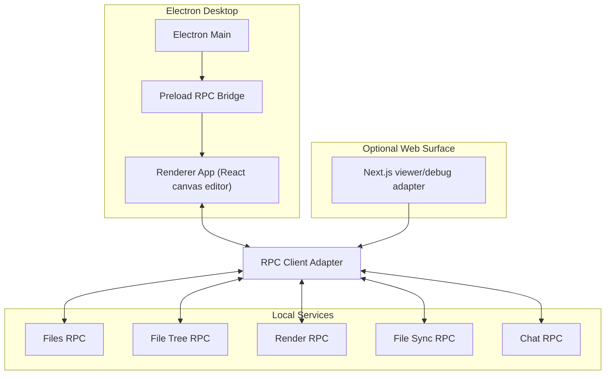
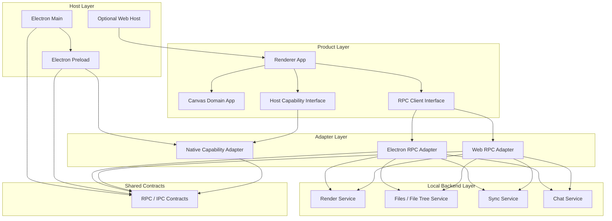

# Electron Desktop Host

## 개요

이 작업은 Magam의 primary host를 `Next.js` 웹 셸에서 `Electron` 데스크톱 셸로 옮기는 것을 다룬다.

핵심 전제는 다음과 같다.

- 제품의 주요 소비 경로는 브라우저가 아니라 데스크톱 앱이다.
- 기존 `RPC` 기반 통신 모델은 유지한다.
- `Next.js`는 더 이상 제품의 canonical runtime host가 아니다.
- `Next.js`가 맡고 있던 얇은 프록시와 셸 책임은 `Electron main/preload/renderer + RPC backend` 경계로 재배치한다.

이 작업은 곧바로 웹 표면을 삭제하는 작업이 아니라, host ownership을 바꾸는 작업이다.

## 문제 정의

현재 루트 진입 지연은 domain logic보다 host 구조에서 더 크게 발생한다.

- 루트 셸은 `Next.js`가 호스팅하지만, 실제 제품 로직은 대부분 client renderer와 local backend에 있다.
- `/api/files`, `/api/file-tree`, `/api/render`는 대부분 local service를 향한 thin proxy다.
- cold start 시 `Next.js`가 `/`, `/api/files`, `/api/file-tree`, `/api/render`를 순차 또는 경합 상태로 compile 하면서 초기 진입 시간이 커진다.
- 이 비용은 SSR, SEO, edge runtime 같은 웹 호스트 이점을 거의 사용하지 않는 데스크톱 중심 제품에 대해 정당화되기 어렵다.

즉 현재 병목의 상당 부분은 "앱이 느린 것"이라기보다 "데스크톱 앱에 웹 프레임워크 호스트를 얹어 둔 것"에 가깝다.

## 목표

- `Electron`을 Magam의 primary application host로 채택한다.
- renderer는 `Next.js` route handler 없이 에디터 UI를 직접 띄운다.
- 기존 `RPC` 구조를 유지해 파일 목록, 파일 트리, 렌더, 편집, 채팅, 동기화 경계를 그대로 재사용한다.
- `WorkspaceClient`, `GraphCanvas`, store/process/runtime 계층을 host-agnostic renderer app으로 분리한다.
- `Next.js`는 남더라도 viewer/debug/review 용 secondary surface로만 둔다.

## Non-Goals

- 이번 작업에서 웹 surface를 즉시 완전 삭제하지 않는다.
- 기존 domain RPC method를 전부 재설계하지 않는다.
- persistence 방향을 다시 정하지 않는다.
- auto-update, code signing, 배포 채널은 이번 작업의 결정 범위에 넣지 않는다.

## Target Shape

## 의존성 관계

Electron host를 도입하더라도 가장 중요한 제약은 **의존성 방향을 단방향으로 고정**하는 것이다.

이 다이어그램은 다음을 의미한다.

- `Electron Main`은 app lifecycle과 backend orchestration을 소유한다.
- `Preload`는 최소 권한 bridge만 제공한다.
- `Renderer App`은 host를 직접 보지 않고 interface만 본다.
- host별 차이는 adapter layer에서만 처리한다.
- backend는 renderer를 import하지 않는다.

## 의존성 규칙

### 허용되는 의존성

- `Renderer App -> Canvas Domain App`
- `Renderer App -> RPC Client Interface`
- `Renderer App -> Host Capability Interface`
- `Electron Preload -> Shared Contracts`
- `Electron RPC Adapter -> Shared Contracts + Local Backend`
- `Web RPC Adapter -> Shared Contracts + Local Backend`
- `Electron Main -> backend bootstrap/orchestration`

### 금지되는 의존성

- `Renderer App -> electron` 직접 의존
- `Canvas Domain App -> Next.js` 직접 의존
- `Backend -> Renderer App` import
- `Electron Main -> Canvas Domain App` 직접 소유
- `Preload -> domain mutation logic` 직접 소유

즉 `main`과 `preload`는 제품 로직의 owner가 아니라 host adapter여야 한다.

## 구조 원칙

### 1. Host와 Product Logic 분리

- renderer app은 `Electron` 없이도 렌더 가능한 순수 React application이어야 한다.
- host별 차이는 adapter layer에서만 처리한다.
- 제품 로직이 `Next.js` route handler에 잠기면 안 된다.

### 2. RPC를 canonical boundary로 유지

- transport 구현은 바뀔 수 있어도 logical contract는 유지한다.
- renderer는 `/api/*` 같은 host-specific URL에 직접 의존하지 않는다.
- `files`, `file-tree`, `render`, `edit`, `chat`, `watch`는 transport-independent API로 노출한다.

### 3. Next는 optional adapter로 강등

- 웹 surface가 필요하면 유지할 수 있다.
- 단, 웹 surface가 primary runtime이 되면 안 된다.
- 향후 `Next.js`를 유지하더라도 Electron/CLI와 같은 RPC contract를 소비하는 얇은 host여야 한다.

## 작업 범위

### 1. Renderer App 추출

- `WorkspaceClient`, `GraphCanvas`, store/hooks/processes를 host-agnostic renderer entry로 재구성한다.
- renderer에서 직접 호출하는 `/api/files`, `/api/file-tree`, `/api/render`를 RPC client adapter 호출로 교체한다.
- 현재 `app/app/page.tsx` 같은 `Next.js` entry는 renderer app을 감싸는 thin host wrapper만 남긴다.

### 2. Electron Shell 도입

- `main` 프로세스에서 window lifecycle, workspace bootstrap, backend process orchestration을 담당한다.
- `preload`에서 최소 권한 RPC bridge를 노출한다.
- renderer는 `contextBridge`를 통해 host API에 접근한다.

### 3. RPC Adapter 정렬

- 기존 JSON-RPC/HTTP/WS 기반 surface를 정리해 renderer가 하나의 adapter를 통해 접근하게 한다.
- 데스크톱 초기 진입 시 필요한 최소 호출 순서를 명시한다.
- `Next.js` adapter와 `Electron` adapter가 동일 logical method를 공유하게 한다.

### 4. Dev Bootstrap 재구성

- 기본 `bun dev`가 `Electron + local backend`를 함께 기동해야 한다.
- `Next.js` dev server는 선택적 보조 경로로만 유지한다.
- primary dev loop에서 route compile waterfall이 startup critical path를 점유하지 않게 한다.

### 5. Web Surface 정리

- share/review/viewer가 필요하면 별도 web surface 요구사항으로 분리한다.
- product-critical authoring flow는 web host availability에 의존하지 않게 한다.

### 6. Secondary Surface Note

- 현재 구현 기준 `Next.js` route handler는 desktop renderer가 직접 쓰는 canonical backend가 아니라 compatibility adapter다.
- 현재 구현 기준 repo root와 `app/` workspace의 기본 `bun dev`는 모두 Electron desktop bootstrap을 가리킨다.
- 기존 web host bootstrap은 보조 경로인 `bun run web:dev`로 유지한다.
- `bun run desktop:dev -- --headless` 검증 경로는 `Electron + local backend`만으로 authoring bootstrap을 완료하며, `Next.js` dev server를 요구하지 않는다.
- renderer product logic은 `app/features/host/renderer/*` 경계 뒤에서 web/desktop host 차이를 흡수한다.

## 권장 책임 분리

실제 구현에서는 아래처럼 책임을 나누는 것이 안전하다.

- `Electron Main`
  - window 생성/종료
  - backend process spawn/shutdown
  - workspace bootstrap
- `Electron Preload`
  - `contextBridge` 기반 capability 노출
  - native dialog/menu/path 선택 같은 OS 기능 노출
- `Renderer App`
  - 현재 `WorkspaceClient`, `GraphCanvas`, store/process/features
  - host-neutral product logic
- `Local Backend`
  - files, file-tree, render, sync, chat, edit command
- `Optional Web Host`
  - viewer/debug/review surface
  - primary authoring host가 아님

## Acceptance Criteria

- 데스크톱 renderer는 `Next.js` route handler 없이 workspace를 열 수 있다.
- renderer 코드에 필수 `/api/*` fetch dependency가 남지 않는다.
- 파일 목록, 파일 트리, 렌더, 편집, 동기화, 채팅 경로가 RPC adapter를 통해 동작한다.
- primary startup path에서 `Next.js` cold route compile이 제거된다.
- `Next.js`가 남더라도 product logic owner가 아니라 compatibility adapter로만 동작한다.

## Risks

### Electron 보안 경계

- `preload`가 과도한 Node 권한을 그대로 renderer에 노출하면 안 된다.
- RPC surface는 capability 단위로 제한해야 한다.

### Host Drift

- Electron과 optional web host가 서로 다른 contract를 가지면 다시 복잡도가 커진다.
- renderer가 host-neutral API만 보도록 강제해야 한다.

### Process Orchestration

- main process가 backend spawn/shutdown/watch lifecycle을 소유하면 운영 경계가 새로 생긴다.
- `cli.ts`와 desktop bootstrap 사이의 책임 중복을 피해야 한다.

### Packaging Footprint

- Electron은 배포 크기와 메모리 비용이 있다.
- 대신 현재 Node/TS 기반 backend 재사용성과 host 단순화 이점을 얻는다.

## 첫 구현 순서

1. renderer에서 `/api/*` 호출을 추상화하는 RPC client interface를 도입한다.
2. 기존 `Next.js` route를 사용하는 web adapter를 그 interface 뒤로 넣는다.
3. Electron main/preload skeleton을 추가하고 desktop adapter를 붙인다.
4. primary dev command를 Electron 기준으로 재조정한다.
5. `Next.js`는 viewer/debug adapter로 남길지 별도 결정한다.

## 관련 문서

- `docs/adr/ADR-0010-electron-primary-host-and-nextjs-de-emphasis.md`
- `docs/adr/ADR-0004-unified-dev-bootstrap-and-dynamic-port-injection.md`
- `docs/features/database-first-canvas-platform/README.md`
- `docs/features/technical-design/README.md`
