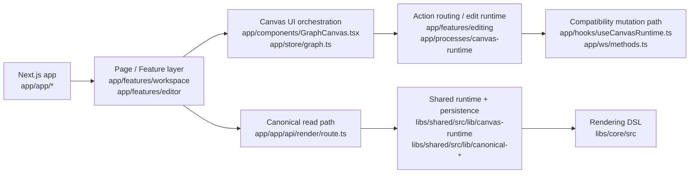

# Codebase Quick Map

작성일: 2026-03-27  
목적: 이 저장소를 처음 다시 볼 때 "어디서 시작하고, 무엇이 핵심이고, 왜 복잡하게 느껴지는지"를 5분 안에 파악하기 위한 짧은 안내서

## 1. 30초 요약

- 이 저장소는 "AI가 설명한 내용을 코드 기반 캔버스로 렌더하고 편집하는 앱"이다.
- 현재 구조는 크게 4축이다.
  - `app/`: 화면, 상태, 편집 오케스트레이션
  - `libs/core/`: Magam DSL과 렌더 계약
  - `libs/shared/`: canonical 도메인 모델, persistence, query, projection
  - `libs/cli/` + `app/ws/`: 로컬 백엔드와 compatibility 경로
- 코드가 산으로 가는 느낌이 드는 가장 큰 이유는 새 canonical 경로와 예전 file-first compatibility 경로가 동시에 살아 있기 때문이다.

## 2. 지금 이 저장소를 이해하는 가장 쉬운 그림

핵심은 이렇다.

- 읽기(read)는 점점 `libs/shared`의 canonical query/projection 쪽으로 모이고 있다.
- 쓰기(write)는 아직 `app/ws/*` compatibility 경로의 비중이 크다.
- 그래서 화면에서 보면 하나의 앱인데, 내부에서는 두 시대의 경로가 같이 존재한다.

## 3. 디렉터리별 역할

| 경로 | 역할 | 먼저 볼 파일 |
|---|---|---|
| `app/app/` | Next.js 라우트와 API 진입점 | `app/app/page.tsx`, `app/app/canvas/[id]/page.tsx`, `app/app/api/render/route.ts` |
| `app/features/workspace/` | 워크스페이스 대시보드/상세 | `app/features/workspace/pages/WorkspaceDashboardPage.tsx`, `app/features/workspace/pages/WorkspaceDetailPage.tsx` |
| `app/features/editor/` | 실제 캔버스 편집 페이지 | `app/features/editor/pages/CanvasEditorPage.tsx` |
| `app/components/` | 실제 UI 컴포넌트와 캔버스 렌더 화면 | `app/components/GraphCanvas.tsx` |
| `app/features/render/` | shared projection을 UI 노드/엣지로 변환 | `app/features/render/parseRenderGraph.ts` |
| `app/features/editing/` | UI 액션을 명령/의도로 정리 | `app/features/editing/commands.ts`, `app/features/editing/actionRoutingBridge/*` |
| `app/processes/canvas-runtime/` | 툴바, 메뉴, 단축키 같은 런타임 조립 | `app/processes/canvas-runtime/createCanvasRuntime.ts` |
| `app/store/` | 클라이언트 전역 상태 | `app/store/graph.ts` |
| `app/ws/` | WebSocket 기반 compatibility edit/file patch 경로 | `app/ws/methods.ts`, `app/ws/filePatcher.ts` |
| `libs/core/` | Magam 컴포넌트 DSL과 렌더 엔진 | `libs/core/src/index.ts`, `libs/core/src/renderer.ts` |
| `libs/shared/` | canonical schema, query, mutation, projection | `libs/shared/src/lib/canonical-query/render-canvas.ts`, `libs/shared/src/lib/canvas-runtime/*` |
| `libs/cli/` | 로컬 서버, headless 실행, CLI entrypoint | `libs/cli/src/server/http.ts`, `libs/cli/src/bin.ts` |
| `docs/`, `specs/` | 설계 배경과 변화 이력 | `docs/features/*`, `specs/007-object-capability-composition/*` |

## 4. 실제로 화면이 뜨는 흐름

### 워크스페이스/캔버스 진입

- 홈은 `app/app/page.tsx`에서 `WorkspaceDashboardPage`로 시작한다.
- 워크스페이스 상세는 `app/app/workspace/[id]/page.tsx`에서 `WorkspaceDetailPage`로 간다.
- 실제 편집기는 `app/app/canvas/[id]/page.tsx`에서 `CanvasEditorPage`로 들어간다.

### 렌더 흐름

1. `CanvasEditorPage`가 현재 캔버스를 기준으로 데이터를 요청한다.
2. 브라우저 쪽 호출은 `app/features/host/rpc/webAdapter.ts`를 통해 `/api/*`로 간다.
3. `/api/render`는 현재 `libs/shared/src/lib/canonical-query/render-canvas.ts`를 직접 호출한다.
4. 응답은 `app/features/render/parseRenderGraph.ts`에서 React Flow용 노드/엣지로 바뀐다.
5. 결과는 `app/store/graph.ts`에 저장되고 `app/components/GraphCanvas.tsx`가 렌더한다.

### 편집 흐름

1. 사용자 액션은 주로 `GraphCanvas.tsx`에서 시작된다.
2. 액션은 `app/features/editing/*`와 `app/processes/canvas-runtime/*`에서 intent/command로 정리된다.
3. 실제 동기화는 `app/hooks/useCanvasRuntime.ts`를 통해 WS RPC로 전달된다.
4. 서버 쪽에서는 `app/ws/methods.ts`가 요청을 받고, 필요한 경우 `app/ws/filePatcher.ts`가 TSX 소스를 직접 고친다.

## 5. 왜 복잡하게 느껴지는가

### 1) 읽기와 쓰기의 중심이 다르다

- 읽기 쪽은 canonical runtime과 projection으로 이동 중이다.
- 쓰기 쪽은 아직 compatibility patch 경로를 강하게 사용한다.
- 즉 "현재 진짜 모델이 어디냐"는 질문에 파일/DB/projection이 동시에 답처럼 보인다.

### 2) 오케스트레이션 파일이 크다

- `app/features/editor/pages/CanvasEditorPage.tsx`
- `app/components/GraphCanvas.tsx`
- `app/store/graph.ts`

이 파일들은 각각 페이지 제어, 캔버스 상호작용, 전역 상태를 많이 떠안고 있어서, 새 기능이 들어올 때 자연스럽게 더 커지기 쉽다.

### 3) 경계 이름은 있는데 체감 경계는 약하다

- `components`, `features`, `processes`가 모두 존재한다.
- 의도는 좋지만 실제 작업 중에는 같은 기능이 여러 층에 나뉘어 흩어지기 쉽다.
- 특히 캔버스 편집 기능은 UI, 상태, runtime binding, WS까지 한 번에 건드리게 된다.

### 4) 문서와 현재 코드가 완전히 일치하지는 않는다

- 기존 `.planning/codebase/*` 문서는 큰 방향을 파악하는 데 유용하다.
- 다만 일부는 현재 코드보다 한 단계 이전 구조를 설명한다.
- 예를 들어 `app/app/api/render/route.ts`는 지금 `libs/shared`를 직접 호출하지만, 예전 문서에는 로컬 HTTP 프록시 설명이 섞여 있다.

## 6. 지금 기준 추천 읽기 순서

새로 합류하거나 오랜만에 다시 볼 때는 이 순서가 가장 덜 힘들다.

1. `app/app/page.tsx`
2. `app/app/workspace/[id]/page.tsx`
3. `app/app/canvas/[id]/page.tsx`
4. `app/features/workspace/pages/WorkspaceDashboardPage.tsx`
5. `app/features/workspace/pages/WorkspaceDetailPage.tsx`
6. `app/features/editor/pages/CanvasEditorPage.tsx`
7. `app/components/GraphCanvas.tsx`
8. `app/features/render/parseRenderGraph.ts`
9. `app/hooks/useCanvasRuntime.ts`
10. `app/ws/methods.ts`
11. `libs/shared/src/lib/canonical-query/render-canvas.ts`
12. `libs/shared/src/lib/canvas-runtime/*`
13. `libs/core/src/index.ts`

## 7. 앞으로 정리할 때 기준점

이 문서는 리팩터링 계획이 아니라, 방향을 잃지 않기 위한 최소 기준이다.

- 새 read 모델을 추가할 때는 가능하면 `libs/shared` 기준으로 설명할 수 있어야 한다.
- 새 UI 동작을 넣을 때는 `CanvasEditorPage`와 `GraphCanvas`에 바로 붙이기 전에 `features` 또는 `processes`로 격리할 수 있는지 먼저 본다.
- file-first compatibility 코드와 canonical 코드가 동시에 필요한 경우, 둘 중 어느 쪽이 임시 경로인지 주석이나 문서에 명시하는 편이 안전하다.
- 문서를 갱신할 때는 "현재 render는 어디서 읽고, 현재 edit는 어디서 쓰는가" 두 문장만이라도 유지하는 것이 중요하다.

## 8. 한 줄 결론

이 저장소는 완전히 무너진 구조라기보다, "새 canonical 아키텍처로 이동하는 중인데 예전 compatibility 경로가 아직 강하게 남아 있는 상태"에 가깝다. 지금 가장 중요한 일은 기능을 더 쌓기 전에 read/write의 기준 축을 더 명확히 분리해서, 사람들이 같은 지도를 보고 작업하게 만드는 것이다.
