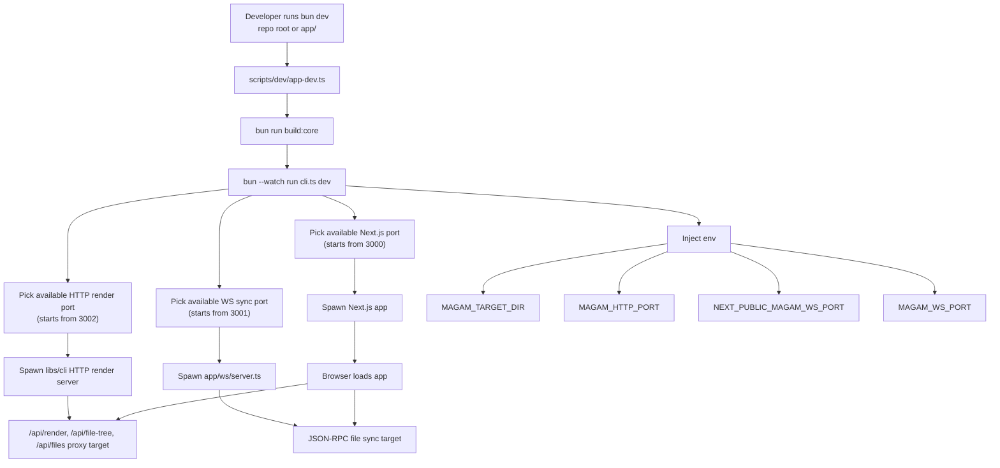
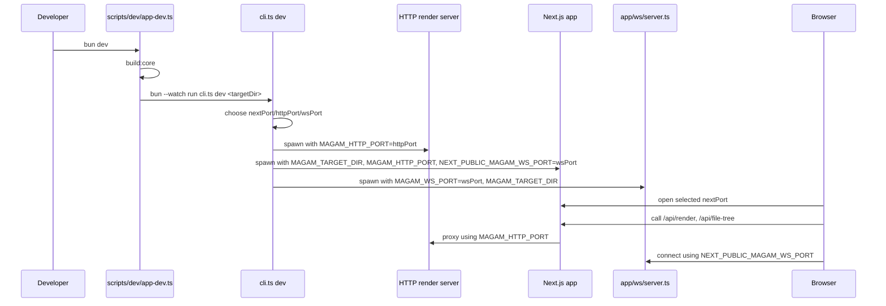

# Dev Startup Flow

`bun dev`가 어떤 프로세스를 띄우고, 포트를 어떻게 선택하고, 그 값이 어디까지 전달되는지 정리한 가이드입니다.

## 현재 실행 구조



## 프로세스별 책임

| Process | 역할 | 핵심 env |
|---|---|---|
| `scripts/dev/app-dev.ts` | 공통 bootstrap, root/app 진입점 통일 | `MAGAM_TARGET_DIR` |
| `cli.ts dev` | 포트 선택, child process orchestration | `MAGAM_HTTP_PORT`, `NEXT_PUBLIC_MAGAM_WS_PORT`, `MAGAM_WS_PORT` |
| `libs/cli/src/bin.ts serve` | TSX render, file tree, files API 제공 | `MAGAM_HTTP_PORT` |
| `app` Next.js dev server | 브라우저 UI, API proxy 제공 | `MAGAM_TARGET_DIR`, `MAGAM_HTTP_PORT`, `NEXT_PUBLIC_MAGAM_WS_PORT` |
| `app/ws/server.ts` | JSON-RPC edit/file-sync 처리 | `MAGAM_WS_PORT`, `MAGAM_TARGET_DIR` |

## 포트 주입 순서



## 실제 예시

포트가 이미 점유되어 있으면 이렇게 올라갈 수 있습니다.

```text
Next.js: 3007
HTTP render server: 3008
WebSocket file-sync server: 3009
```

중요한 점은 세 포트가 각각 독립적으로 선택되지만, `cli.ts dev`가 그 값을 모두 알고 각 프로세스에 정확히 주입한다는 점입니다.

## 현재 명령

- repo root: `bun dev`
- `app` 폴더: `bun dev`
- raw Next만 필요할 때: `bun run dev:next`

## 관련 파일

- `scripts/dev/app-dev.ts`
- `cli.ts`
- `package.json`
- `app/package.json`
- `app/ws/server.ts`
- `app/hooks/useFileSync.ts`
- `app/app/api/render/route.ts`
- `app/app/api/file-tree/route.ts`
