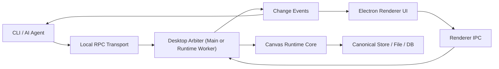

# App-Attached CLI Arbiter

## 개요

이 문서는 "현재 실행 중인 데스크톱 앱"과 "같은 머신에서 실행되는 CLI"가 같은 캔버스 편집 엔진을 공유해야 할 때 필요한 local arbiter 모델을 설명한다.

핵심 요구는 다음 두 가지다.

- 사용자는 데스크톱 UI로 캔버스를 편집한다.
- AI 에이전트는 MCP 없이 CLI를 통해 현재 실행 중인 앱과 상호작용한다.

이 경우 중요한 것은 transport 자체가 아니라 **단일 조정자(single writer)** 의 존재다.

## 왜 아비터가 필요한가

UI와 CLI가 같은 캔버스에 동시에 쓰기 작업을 할 수 있다면, 다음 문제를 한 군데에서 풀어야 한다.

- 현재 문서/캔버스의 active revision 확인
- mutation 직렬화
- conflict detection
- undo/redo ownership
- projection invalidation
- watcher/event fan-out

각 클라이언트가 각자 파일이나 DB에 직접 쓰면, "누가 최신 기준 버전을 소유하는가"가 흐려진다.

따라서 app-attached 모델에서는 메인 프로세스 또는 전용 runtime worker가 아래 책임을 독점해야 한다.

- write command 수락
- canonical mutation 실행
- version/revision 갱신
- UI/CLI에 event broadcast

## 권장 구조



이 구조의 핵심은 transport가 둘이어도 write owner는 하나라는 점이다.

## 권장 기술 선택

### 1. 내부 UI 경로

- `renderer -> preload -> ipcMain`
- 또는 `renderer -> MessagePort -> runtime worker`

이 경로는 앱 내부 통신이므로 Electron IPC를 사용하는 것이 자연스럽다.

### 2. 외부 CLI 경로

- macOS / Linux: Unix domain socket
- Windows: named pipe

이 경로는 앱 외부 프로세스인 CLI가 붙어야 하므로 Electron IPC만으로는 부족하다.

### 3. JSON-RPC 사용 여부

가능하다. 오히려 권장된다.

JSON-RPC는 HTTP/WS 전용 규약이 아니라 message envelope 규약이므로 다음 transport 위에 그대로 올릴 수 있다.

- Electron IPC
- MessagePort
- Unix domain socket
- Windows named pipe
- stdio

즉 `ipcMain.handle(...)`를 직접 method별로 노출하는 대신, 공통 JSON-RPC dispatcher를 두고 다음 형태로 정리할 수 있다.

```json
{"jsonrpc":"2.0","id":"1","method":"canvas.applyBatch","params":{"canvasId":"doc-1","commands":[]}}
```

```json
{"jsonrpc":"2.0","id":"1","result":{"ok":true,"canvasRevision":12}}
```

event는 notification으로 보낼 수 있다.

```json
{"jsonrpc":"2.0","method":"canvas.changed","params":{"canvasId":"doc-1","canvasRevision":12}}
```

## 왜 WebSocket/HTTP보다 이쪽이 나은가

local-only app-attached 모델에서는 굳이 TCP port를 열 필요가 없다.

- domain socket / named pipe는 local process 간 통신에 더 직접적이다.
- port 충돌과 외부 접근 surface가 줄어든다.
- "앱이 자기 내부 런타임을 소유한다"는 모델과 더 잘 맞는다.

즉 여기서 필요한 것은 "로컬 통신"이지 "네트워크 서버"가 아니다.

## 단일 조정자 후보

### A. Electron Main Process

가장 단순한 선택이다.

- 장점
  - app lifecycle과 연결되어 있음
  - renderer IPC와 외부 CLI socket을 한곳에서 받기 쉬움
  - 별도 프로세스 관리가 줄어듦
- 단점
  - 메인 프로세스가 비대해질 수 있음
  - CPU-heavy projection이나 mutation batch가 길어지면 UI host와 경쟁 가능

### B. Runtime Worker Thread

더 깔끔한 분리다.

- 장점
  - 메인 프로세스는 lifecycle/orchestration만 유지
  - runtime 계산과 command serialization을 워커에 격리 가능
  - UI와 CLI 모두 같은 worker에 붙게 만들 수 있음
- 단점
  - worker lifecycle, reconnect, error propagation을 설계해야 함

현재 요구에는 `Main Process broker + Runtime Worker` 조합이 가장 균형이 좋다.

## 권장 command surface

CLI와 UI는 DOM 이벤트를 공유하면 안 된다. 둘 다 동일한 문서 명령 surface를 사용해야 한다.

- `canvas.getProjection`
- `canvas.applyBatch`
- `canvas.undo`
- `canvas.redo`
- `canvas.getSession`
- `canvas.subscribe`
- `canvas.unsubscribe`

batch 내부 operation 예시는 다음과 같다.

- `canvas.node.create`
- `canvas.node.move`
- `canvas.node.delete`
- `canvas.node.reparent`
- `object.content.update`
- `object.body.block.insert`

## Session / Discovery

CLI가 현재 실행 중인 앱에 붙으려면 discovery 경로가 필요하다.

권장 방식:

- 앱 시작 시 session file 생성
- session file에 다음 정보 기록
  - socket path 또는 pipe name
  - session id
  - ephemeral auth token
  - workspace path
  - pid

CLI는 이 session file을 읽고 현재 실행 중인 앱에 attach한다.

## 인증

local-only 환경에서도 최소 인증은 필요하다.

권장 최소치:

- same-user 권한
- ephemeral session token
- socket file permission 제한

이 문서의 목적은 internet-facing auth가 아니라 "실수로 다른 프로세스가 붙는 것"을 줄이는 것이다.

## 언제 이 모델을 선택해야 하는가

다음 조건이 맞으면 app-attached arbiter 모델이 적합하다.

- 현재 실행 중인 UI state와 CLI가 연결되어야 한다.
- selection, active canvas, live projection invalidation이 중요하다.
- UI와 CLI가 같은 문서에 대해 동시에 mutation할 가능성이 있다.
- undo/redo와 revision ownership을 하나의 runtime에서 관리하고 싶다.

## 비적합한 경우

다음이 목표라면 다른 모델이 더 단순하다.

- 앱이 실행 중이지 않아도 되는 headless batch만 필요하다.
- CLI는 현재 UI session을 몰라도 된다.
- live selection이나 app-attached event가 필요 없다.
- 동시 편집보다 explicit file commit이 더 중요하다.

그 경우에는 별도 headless CLI surface나 direct file-write 모델이 더 적절하다.

## 권장 결론

현재 요구에는 다음 조합을 권장한다.

- UI: `Renderer IPC`
- CLI: `Unix domain socket / named pipe`
- 공통 envelope: `JSON-RPC 2.0`
- write owner: `Main Process broker` 또는 `Runtime Worker`

즉 "WS 서버를 유지하느냐"가 핵심이 아니라, **앱 내부 조정자 하나와 외부 CLI attach 경로 하나를 분리해 갖는 것**이 핵심이다.
