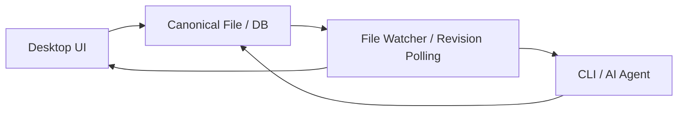

# Direct File Write Model

## 개요

이 문서는 로컬 소켓, IPC 브로커, app-attached session 없이 UI와 CLI가 **각자 직접 파일 또는 DB를 쓰는 방식**을 설명한다.

이 모델의 핵심은 단순하다.

- 데스크톱 앱은 canonical file/DB를 직접 읽고 쓴다.
- CLI도 같은 canonical file/DB를 직접 읽고 쓴다.
- 서로는 직접 통신하지 않는다.
- 동기화는 파일 변경 감지, revision 비교, 재로딩으로 처리한다.

즉 이 모델은 "통신 기반 협업"이 아니라 "공유 persistence 기반 협업"이다.

## 구조

여기에는 local socket, app-attached broker, RPC attach 경로가 없다.

## 어떻게 동작하는가

### UI 측

- 파일 또는 DB에서 projection을 읽는다.
- 사용자가 편집하면 mutation을 직접 persistence에 반영한다.
- 변경 후 최신 revision/version을 다시 읽어 store를 갱신한다.
- 외부 변경은 watcher 또는 polling으로 감지한다.

### CLI 측

- 대상 workspace/document를 명시적으로 입력받는다.
- same persistence를 직접 읽고 mutation을 직접 적용한다.
- 결과로 바뀐 revision/version을 출력한다.

### 통신의 실체

이 모델에서 "통신"은 transport가 아니라 persistence를 통한 간접 통신이다.

- shared DB row
- shared file
- revision number
- source version hash
- append-only journal

## 가능한 구현 방식

### 1. TSX / source file 기준

- UI도 source file patch
- CLI도 source file patch
- render는 source file에서 다시 projection 생성

장점

- source of truth가 분명하다
- 기존 TSX shell 방향과 잘 맞는다

단점

- patch 충돌이 코드 레벨로 발생한다
- AST patch와 file watcher 품질이 매우 중요하다

### 2. Canonical DB 기준

- UI도 canonical DB mutation 적용
- CLI도 canonical DB mutation 적용
- projection은 DB에서 생성

장점

- mutation contract가 더 안정적이다
- source text patch보다 충돌 단위가 명확하다

단점

- DB revision discipline이 약하면 lost update가 생기기 쉽다
- source file과 canonical DB의 관계를 별도로 관리해야 한다

### 3. File-backed journal 기준

- UI와 CLI가 append-only mutation log에 기록
- projector가 그 로그를 읽어 canonical state를 재구성

장점

- event history가 남는다
- replay/debug가 쉽다

단점

- projector/journal compaction까지 설계가 커진다

## 이 모델의 강점

- app-attached 연결이 필요 없다
- 앱이 실행 중이지 않아도 CLI가 동작할 수 있다
- transport/bridge/socket 관리가 없다
- Electron main process를 조정자로 키우지 않아도 된다
- CLI를 완전 headless 도구로 유지하기 쉽다

## 이 모델의 약점

가장 중요한 약점은 **동시성 ownership이 약하다**는 점이다.

- UI와 CLI가 동시에 쓰면 마지막 쓰기 승리나 revision conflict가 발생할 수 있다.
- selection, active canvas, transient UI state를 공유할 수 없다.
- UI undo/redo와 CLI undo/redo가 하나의 session history로 묶이기 어렵다.
- live collaboration 같은 경험을 만들기 어렵다.

즉 이 모델은 "같은 문서를 각자 수정"에는 맞지만, "현재 실행 중인 앱과 상호작용"에는 약하다.

## 필요한 안전장치

이 모델을 쓰려면 최소한 아래는 필요하다.

### 1. Explicit revision precondition

모든 write는 다음 중 하나를 요구해야 한다.

- `expectedRevision`
- `baseVersion`
- `etag` 같은 version token

맞지 않으면 reject하고 재시도해야 한다.

### 2. File/DB watcher

UI는 외부 변경을 감지해야 한다.

- file watcher
- DB notify/listen
- polling

없으면 CLI 변경을 UI가 모르고 stale projection을 계속 보여준다.

### 3. Idempotent / explicit mutation contract

CLI와 UI가 서로 다른 임의 patch를 날리면 충돌 분석이 어렵다.

따라서 direct write 모델이어도 가능한 한 noun/verb 기반 mutation contract를 유지하는 편이 낫다.

- `canvas.node.move`
- `canvas.node.create`
- `object.content.update`

### 4. Conflict UX

충돌은 숨기면 안 된다.

- reject
- reload
- rebase
- retry guidance

중 하나를 명시적으로 선택해야 한다.

## 언제 이 모델이 맞는가

- CLI는 app-attached가 아니라 headless batch 도구다.
- UI와 CLI의 live session 공유가 필요 없다.
- 사용자는 외부 변경 시 reload/retry를 받아들일 수 있다.
- 단순성과 독립 실행성이 실시간 일관성보다 더 중요하다.

## 언제 부적합한가

다음 조건이면 이 모델은 맞지 않는다.

- AI가 현재 실행 중인 앱의 selection/context를 써야 한다.
- UI와 CLI가 같은 mutation timeline을 공유해야 한다.
- undo/redo를 단일 세션처럼 다뤄야 한다.
- 실시간 invalidate/broadcast가 중요하다.

그 경우에는 app-attached arbiter 모델이 더 적합하다.

## 실무적 해석

이 모델은 "로컬 통신이 전혀 없다"기보다, "통신을 persistence layer로 밀어 넣는다"는 설계다.

즉 transport 비용은 줄지만, 그 대신 다음 책임이 커진다.

- revision discipline
- conflict handling
- watcher correctness
- atomic write

## 권장 결론

direct file/database write 모델은 충분히 가능하다. 다만 이 모델은 다음 목적에 맞다.

- headless CLI
- batch mutation
- app 비실행 상태 지원
- 느슨한 결합

반대로 "현재 실행 중인 앱에 CLI가 붙어야 한다"가 핵심이면, 이 모델 하나만으로는 부족하고 app-attached arbiter 모델이 더 잘 맞는다.
