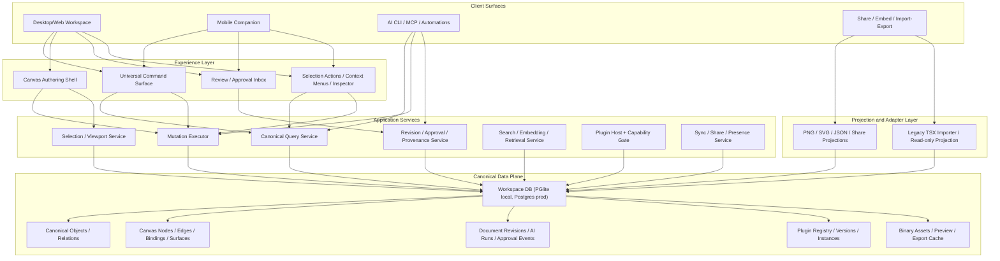
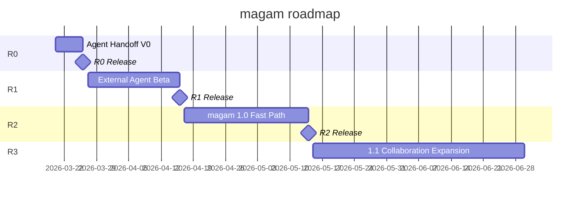

# magam 완성 목표 아키텍처 디자인과 타임라인 중심 실행 로드맵

작성일: 2026-03-19  
범위: magam 완성 목표 아키텍처, 1.0까지의 feature timeline, 1.1 이후 확장 우선순위  
기준 문서:
- `docs/reports/excalidraw-vs-magam/README.md`
- `docs/adr/ADR-0005-database-first-canvas-platform.md`
- `docs/adr/ADR-0006-shared-canonical-contract-and-drizzle-split.md`
- `docs/features/database-first-canvas-platform/README.md`
- `docs/features/database-first-canvas-platform/implementation-plan.md`

## 문서 목적

이 문서는 Excalidraw 비교 보고서를 바탕으로 magam의 최종 제품 형태를 다시 정의하고, 그 목표 상태까지 가기 위한 **feature-first timeline**을 제안한다.

이 문서는 다음 전제를 고정값으로 사용한다.

- canonical DB가 workspace/document의 primary source of truth다.
- `.tsx`는 더 이상 canonical editable artifact가 아니다.
- AI는 file overwrite가 아니라 canonical query/mutation contract를 사용한다.
- 앱 내부에서는 AI chat/session/model picker를 제공하지 않는다.
- AI 입력은 오직 외부 agent, CLI, mobile share handoff 같은 외부 경로를 통해 들어온다.
- mobile은 desktop 축소판이 아니라 별도 shell을 가진다.
- real-time multiplayer는 중요하지만, 1.0의 핵심은 AI-first authoring과 canonical data workflow다.

즉, 이 문서는 "file-first에서 DB-first로 갈지 말지"를 논의하지 않는다. 그 결정은 이미 끝났고, 이제는 **DB-first를 전제로 제품을 완성하는 방법**만 다룬다.

## 한 줄 방향

magam의 완성형은 "AI와 사람이 canonical object를 기반으로 지식 캔버스를 만들고 운영하는 canvas OS"다.  
desktop은 full authoring cockpit, mobile은 review/capture/approve shell, AI는 같은 mutation backbone을 쓰는 first-class operator가 된다.

## 1. 북극성 제품 정의

완성된 magam은 아래 다섯 가지를 동시에 만족해야 한다.

1. direct manipulation과 AI authoring이 같은 mutation engine을 쓴다.
2. 모든 의미 데이터는 canonical DB에 저장되고, canvas는 composition projection으로 동작한다.
3. desktop, mobile, CLI/MCP, automation이 같은 query/mutation contract를 공유한다.
4. plugin/widget은 문서 본문이 아니라 sandboxed runtime asset으로 취급된다.
5. 하나의 오브젝트 안에 markdown, text, chart, table 같은 다양한 block/component를 ordered body로 함께 담을 수 있다.
6. revision, approval, provenance, search, embedding이 모두 canonical data 계층 위에서 작동한다.

## 2. 이미 고정된 전제와 현재 베이스라인

현재 repo와 ADR 기준으로 이미 잠긴 축은 다음과 같다.

- `ADR-0005`: database-first canvas platform 채택
- `ADR-0006`: shared canonical contract와 dedicated canonical Drizzle workflow 채택
- umbrella feature 기준 6개 기반 slice 존재
  - canonical object persistence
  - canonical mutation/query core
  - canvas UI entrypoints
  - AI CLI headless surface
  - app attached session extension
  - plugin runtime v1

따라서 앞으로의 로드맵은 foundation을 처음부터 다시 만드는 계획이 아니라, **이 기반을 완성 제품으로 수렴시키는 계획**이어야 한다.

현재 가장 중요한 해석은 다음이다.

- `app/ws/filePatcher.ts`, `app/hooks/useFileSync.ts`, legacy `.tsx` editing path는 주 경로가 아니라 compatibility/transition adapter가 되어야 한다.
- `libs/shared/src/lib/canonical-persistence/*`, `canonical-mutation-query-core`, CLI/App-attached surface가 앞으로의 중심이다.
- 제품 완성의 핵심은 "기술 slice completion"이 아니라 "사용자 경험으로 수렴된 feature release"다.

## 3. 완성 목표 아키텍처

## 3.1 시스템 레이어

## 3.2 핵심 원칙

### 원칙 1. Canonical DB only truth

문서의 의미 진실은 canonical object와 composition record에 있다. 파일, 이미지 export, TSX, share link payload는 projection이다.

### 원칙 2. One mutation backbone

desktop UI, mobile UI, AI CLI, app-attached AI, future MCP, automation은 모두 같은 mutation executor를 사용한다.

### 원칙 3. 앱 내부 AI chat은 없다

magam 앱은 ChatGPT 스타일의 내장 AI chat/session UI를 제공하지 않는다.

- 앱 안에는 모델 선택기, 채팅 세션, 대화 로그 기반 authoring flow를 두지 않는다.
- AI 입력은 외부 agent host, CLI, MCP, mobile share handoff로만 들어온다.
- 앱 안에는 입력용 chat UI 대신 proposal review/approval surface만 남긴다.

### 원칙 4. Mobile은 별도 product shell

mobile은 별도 shell을 가지지만, canvas의 full editing은 지원한다.

- document open, selection, move, create, delete 같은 핵심 canvas 편집은 mobile에서도 가능해야 한다.
- 문제는 편집 capability가 아니라 AI 활용성이다.
- 그래서 mobile의 AI 경로는 앱 내부 chat이 아니라 `share -> remote agent host -> proposal` 흐름으로 보강한다.

### 원칙 5. Plugin은 확장이고 진실은 아니다

plugin은 canonical schema를 대체하지 않는다. plugin instance는 canonical composition과 binding 위에 놓이는 제한된 runtime이다.

### 원칙 6. BYO Agent Runtime, not provider proxy

magam은 모델 제공자를 대신 호출하는 proxy SaaS가 아니라, 사용자가 이미 가진 AI 도구를 연결하는 orchestration layer가 되어야 한다.

- provider API 키와 모델 트래픽은 가능하면 사용자 소유 환경에 남긴다.
- mobile에서는 직접 편집보다 `share -> remote agent host -> mutation proposal` 경로를 우선한다.
- Codex/Claude Code/Gemini CLI 같은 공식 CLI/agent adapter를 1차 경로로 둔다.
- GUI app 원격 제어는 가능하면 fallback으로만 둔다.

## 3.3 데이터 책임 분리

### Canonical domain

이 레이어는 "무엇이 존재하는가"를 설명한다.

- `workspaces`
- `documents`
- `document_revisions`
- `canonical_objects`
- `object_relations`
- `embedding_records`

여기에는 semantic role, content kind, capability bag, canonical text, provenance가 들어간다.

또한 하나의 오브젝트는 단일 text field가 아니라 ordered `contentBlocks`를 가질 수 있다.

- built-in block
  - `text`
  - `markdown`
- custom/component block
  - `plugin.chart`
  - `plugin.table`
  - 이후 callout, checklist, metric, embed 등

즉, 포스트잇이나 shape 하나 안에서도 markdown 문단 아래에 차트나 표를 같이 넣을 수 있어야 한다.

### Composition domain

이 레이어는 "어떻게 보이는가"를 설명한다.

- `surfaces`
- `canvas_nodes`
- `canvas_edges`
- `canvas_bindings`
- viewport, z-order, parent-child, layout persistence

중요한 점은 `shape 내부 rich block body`의 진실은 composition이 아니라 canonical object 쪽에 있다는 것이다.  
canvas는 그 body를 어떻게 보이게 할지 배치와 크기와 interaction만 책임진다.

### AI and provenance domain

1.0 완성을 위해 아래 개념이 DB 안에 들어와야 한다.

- `external_agent_hosts`
- `agent_jobs`
- `agent_operation_batches`
- `mutation_proposals`
- `approval_events`
- `review_comments`

이 데이터는 채팅 로그가 아니라 "어떤 외부 agent가 어떤 query/mutation을 제안했고, 무엇이 승인되었는가"를 남긴다.

### Plugin domain

- `plugin_packages`
- `plugin_versions`
- `plugin_exports`
- `plugin_instances`

plugin source는 패키지 자산으로 관리하고, 문서는 instance reference만 가진다.

## 3.4 완성형 제품에서 각 surface의 역할

### Desktop

desktop은 full authoring shell이다.

- canvas authoring
- structured selection editing
- shape-local block composition editing
- inspector와 context menu
- universal command surface
- external proposal console
- document/surface navigation
- plugin configuration
- revision/history/approval

### Mobile

mobile은 full editing을 지원한다. 다만 AI 활용은 외부 handoff가 핵심이다.

- canvas full editing
- selection / move / create / delete
- quick style / content edit
- shape-local block composition editing
- proposal inbox 확인
- 승인/거절/코멘트
- 빠른 검색과 점프
- capture-to-canvas
- share/review/presentation
- share-to-agent-host handoff

### Personal Agent Host

완성형 magam에는 사용자 소유 원격 실행 환경이 포함된다. 이 호스트는 magam이 관리하는 모델 서버가 아니라, 사용자의 PC/개인 서버/개인 워크스테이션에서 돌아가는 agent runner다.

- mobile이나 web이 생성한 작업 envelope를 수신한다.
- 사용자의 Codex, Claude Code, Gemini CLI 같은 도구를 직접 실행한다.
- 결과를 raw file overwrite가 아니라 canonical mutation proposal로 반환한다.
- approval 이후에만 document revision으로 반영된다.
- 장기적으로는 pairing, trusted device, queue, retry, resume를 지원한다.

### CLI / MCP / Automation

headless와 app-attached를 같은 contract로 제공한다.

- workspace/document/object/surface query
- structured mutation apply
- dry-run
- revision-aware automation
- background indexing and policy enforcement
- personal agent host adapter execution

## 3.5 file/TSX의 최종 위치

file/TSX는 다음 세 경로로만 남기는 것이 맞다.

1. legacy import
2. optional export/projection
3. plugin or code asset packaging

중요한 점은 `.tsx` round-trip editing을 더 이상 core product loop에 두지 않는 것이다.  
core editing path에 계속 남아 있으면 canonical DB truth 전략이 UX와 운영 양쪽에서 무너진다.

## 3.6 Shape-Local Composable Block Surface

이 기능은 magam의 핵심 차별점으로 봐야 한다.

대부분의 canvas 앱은 도형 안에 다음 둘 중 하나만 넣는다.

- 일반 텍스트
- 제한된 서식 텍스트

magam은 여기서 한 단계 더 가야 한다.

- 하나의 shape/sticky/note object 안에 ordered block body를 가진다.
- block은 markdown만이 아니라 text, chart, table, 이후 다양한 component를 포함할 수 있다.
- 사용자는 Notion의 `/` command와 비슷한 방식으로 블록을 삽입한다.

예시:

- `Sticky`
  - markdown block: 주간 매출 요약
  - chart block: bar chart
  - markdown block: 해석과 액션 아이템

### canonical model 해석

이 기능은 새 임시 UI 해킹이 아니라 기존 canonical `contentBlocks` 모델의 제품화다.

- 오브젝트 하나가 ordered `contentBlocks`를 가진다.
- built-in block은 first-class validation을 받는다.
- custom component block은 namespaced block type으로 들어간다.
- `canonicalText`는 block들의 text projection을 flatten해서 만든다.
- block body는 검색, embedding, AI context assembly의 입력이 된다.

### UI 해석

이 기능은 editor 쪽에서 아래 surface를 요구한다.

- object 내부 caret / selection
- `/` slash command palette
- block reorder
- block insert / delete
- block type convert
- chart/table block의 inline placeholder와 expanded renderer

### plugin과의 관계

chart/table block은 완전 독립 canvas node가 아니라, 우선은 `shape-local block`으로 먼저 보는 편이 맞다.

- object 안에 들어가는 작은 차트/표/지표는 content block
- 문서 전체에 독립 배치되는 복잡 위젯은 plugin instance

이 분리를 지키면 "object 내부 rich body"와 "canvas 위 independent widget"이 충돌하지 않는다.

## 4. 1.0의 정의

magam 1.0은 아래 상태를 의미한다.

- canonical DB 기반 문서 생성/편집/검색/복제가 primary flow다.
- desktop에서 direct manipulation과 AI mutation이 같은 revision path를 쓴다.
- 앱 내부 AI chat 없이 external proposal review와 approval flow를 갖는다.
- mobile share에서 personal agent host로 작업을 보내고 결과를 다시 approval flow로 받을 수 있다.
- 사용자는 magam 제공 프록시가 아니라 자신이 가진 AI 도구를 연결해 쓸 수 있다.
- mobile에서 full canvas editing과 proposal inbox/search/review/approve가 가능하다.
- 하나의 shape/sticky/note 안에 markdown과 chart/table block을 함께 넣을 수 있다.
- plugin widget 3~5개가 production-quality로 동작한다.
- share/export/import가 안정적이다.
- async collaboration이 가능하다.
- 운영자가 revision, audit, backup, restore를 다룰 수 있다.

반대로 아래는 1.0의 필수 조건으로 보지 않는다.

- Excalidraw 수준의 real-time cursor collaboration
- marketplace monetization
- arbitrary trusted code mount
- legacy TSX를 canonical path로 되돌리는 것

## 5. 1.1 이후로 미뤄도 되는 것

- real-time multi-user presence, cursor, live follow
- advanced multiplayer conflict UX
- plugin marketplace distribution
- enterprise permission matrix
- heavy whiteboard facilitation tools

즉, 1.0은 AI-first knowledge canvas를 완성하는 release이고, 1.1은 collaboration scale-up release로 보는 편이 맞다.

현재 이 roadmap에서 가장 먼저 관리해야 할 제품 축은 FigJam, Freeform, Miro, Excalidraw가 제공하는 기본 authoring baseline을 magam의 `workspace -> document -> canvas -> object editing` loop에서 확보하는 일이다. external proposal, host reliability, share/review는 이 core authoring loop를 보강하거나 그 위에서 닫히는 순서로 배치하는 편이 맞다.

## 6. Roadmap

Redmine 스타일로 보면 이 로드맵은 아래 4개 버전으로 관리하는 편이 가장 명확하다.

| Version | Target Date | Status | Goal |
| --- | --- | --- | --- |
| `R0. Agent Handoff V0` | `2026-03-26` | Proposed | mobile/web share에서 personal agent host를 호출하고 proposal 승인까지 닫는다 |
| `R1. External Agent Beta` | `2026-04-16` | Proposed | workspace/document/canvas/object core authoring convergence를 최우선으로 끌어올리고 external proposal beta 기반을 묶는다 |
| `R2. magam 1.0 Fast Path` | `2026-05-14` | Proposed | R1에서 연 core authoring baseline을 1.0 품질로 polish하고 share/review, plugin minimum, export reliability를 완성한다 |
| `R3. 1.1 Collaboration Expansion` | `post-1.0` | Backlog | presence-lite, realtime pilot, legacy TSX migration tool을 후속 버전으로 분리한다 |

## 7. Version R0, Agent Handoff V0

### 목표

`BYO Agent Runtime + Mobile Share Handoff`를 usable path로 연다.

### 포함 기능

- `Personal Agent Host`
  - trusted device 등록
  - pairing token 또는 local credential
  - job queue
  - job status
  - result callback
- `Mobile Share Handoff`
  - document share
  - selection share
  - free-text instruction share
  - host 전달
- `Mutation Proposal Flow`
  - dry-run proposal 생성
  - diff summary
  - approve / reject
  - revision append
- `Minimal Reliability`
  - timeout
  - retry 1회
  - host offline 표시
  - 실패 로그

### 완료 기준

- mobile 또는 web에서 현재 문서/선택 영역/요청을 share로 보낼 수 있다.
- 사용자의 원격 PC 또는 개인 서버에 있는 `Personal Agent Host`가 작업 envelope를 수신한다.
- Host가 사용자의 AI 도구를 직접 실행한다.
- 결과가 raw file patch가 아니라 `canonical mutation proposal`로 돌아온다.
- mobile 또는 desktop에서 proposal을 승인/거절할 수 있다.
- 승인된 결과가 document revision으로 append된다.

### 비포함

- GUI 앱 원격 제어 일반화
- 실시간 cursor collaboration
- plugin marketplace
- 완전한 mobile 편집 parity

## 8. Version R1, External Agent Beta

### 목표

R0를 single-path demo가 아니라 실제로 반복 사용 가능한 beta로 만들고, core authoring 완성도를 제품 중심에 다시 고정한다.

### 포함 기능

- `Core Workspace/Canvas Authoring Convergence`
  - workspace/document primary shell
  - empty canvas -> first object create -> selection/move/delete 기본 루프
  - object quick style/content edit
  - desktop/mobile 공통 canonical editing baseline
  - FigJam/Freeform/Miro/Excalidraw benchmark gap closure
- `External Proposal Console`
  - proposal list
  - 영향 범위
  - retry
  - rollback
- `Composable Block Body v1`
  - object-local ordered block body
  - slash command insert
  - text / markdown / chart / table 기본 block
  - block reorder / remove
- `Universal Command Surface (minimum)`
  - search
  - quick open
  - external handoff entry
- `Host Reliability`
  - reconnect
  - queued jobs
  - resume
- `Mobile Full Editing Shell`
  - full canvas editing
  - proposal inbox
  - proposal approval
  - status 확인
- `Canonical App Convergence`
  - DB-backed open/save 기본 path
  - legacy file path compatibility mode
- `In-App AI Chat Removal`
  - header/chat 진입점 제거
  - chat/session state 제거
  - local AI chat API surface 제거

### 완료 기준

- workspace에서 document create/open/switch가 primary UX로 자연스럽게 연결된다.
- canvas에서 first object create 이후 selection, move, delete, quick edit 흐름이 끊기지 않는다.
- 사용자가 외부에서도 mobile share로 작업을 던질 수 있다.
- desktop과 mobile에서 같은 proposal을 검토할 수 있다.
- 앱 내부에 AI chat/session 진입점이 없다.
- external proposal surface가 실제 작업 큐를 가진다.
- mobile에서 full canvas editing이 가능하다.
- 하나의 object 안에서 text/markdown/chart/table block을 함께 편집할 수 있다.
- 사용자가 magam 제공 프록시가 아니라 본인 도구를 연결해 쓴다.

## 9. Version R2, magam 1.0 Fast Path

### 목표

R1에서 연 core authoring baseline과 이미 열린 primary flow를 제품 품질까지 끌어올린다.

### 포함 기능

- `Revision and Approval Backbone Hardening`
  - rollback
  - audit
  - revision compare
- `Desktop Authoring UX Convergence`
  - floating contextual actions
  - node/pane context menu 정리
  - inspector hierarchy 정리
- `Composable Block Body v2`
  - richer slash command UX
  - block drag reorder polish
  - block-level copy/paste
  - block-level selection behavior
- `Mobile Full Editing Polish`
  - search/jump
  - proposal inbox
  - full editing ergonomics
  - gesture / toolbar polish
- `Share / Review Links`
  - read-only
  - review link
- `Plugin Runtime Productization (minimum)`
  - chart
  - table
  - fallback diagnostics
- `Import / Export Reliability`
  - JSON
  - PNG/SVG
  - document export

### 완료 기준

- BYO Agent Runtime이 stable하다.
- mobile share -> host execution -> proposal -> approval -> revision 흐름이 안정적이다.
- canonical DB path가 primary UX로 완전히 보인다.
- external proposal console이 실제 운영 도구 역할을 한다.
- shape-local composable block editing이 제품 핵심 경험으로 보인다.
- 최소 2종 widget이 production 수준으로 동작한다.

## 10. Version R3, 1.1 Collaboration Expansion

### 목표

1.0 이후 validated demand가 있으면 realtime/presence를 확장한다.

### 포함 기능

- presence-lite
- live selection / follow
- realtime pilot for shared document
- legacy TSX migration / import tooling

### 원칙

- realtime collaboration은 1.0을 막는 선행조건이 아니다.
- provider proxy는 계속 금지한다.
- GUI app automation은 계속 fallback으로만 둔다.

## 11. Roadmap Scope Rules

### 꼭 유지할 것

- `BYO agent runtime`
- `mobile share handoff`
- `canonical mutation proposal flow`
- `approval / revision backbone`
- `shape-local composable block body`
- `CLI/MCP/automation 친화 contract`
- `capability-gated plugin runtime`

### 절대 primary path로 되돌리지 않을 것

- legacy file patch path
- in-app AI chat/session UX
- mobile을 review-only shell로 제한하는 UX
- provider proxy model

### 운영 원칙

- `R0`는 usable path를 연다.
- `R1`은 반복 사용 가능한 beta를 만든다.
- `R2`가 첫 제품 완성 버전이다.
- `R3`는 collaboration scale-up 버전이다.

## 참고 문서

- `docs/adr/ADR-0005-database-first-canvas-platform.md`
- `docs/adr/ADR-0006-shared-canonical-contract-and-drizzle-split.md`
- `docs/features/database-first-canvas-platform/README.md`
- `docs/features/database-first-canvas-platform/implementation-plan.md`
- `docs/features/database-first-canvas-platform/canonical-mutation-query-core/README.md`
- `docs/features/database-first-canvas-platform/ai-cli-headless-surface/README.md`
- `docs/features/database-first-canvas-platform/app-attached-session-extension/README.md`
- `docs/features/database-first-canvas-platform/plugin-runtime-v1/README.md`
- `docs/features/database-first-canvas-platform/canvas-ui-entrypoints/README.md`
- `docs/features/legacy-tsx-migration/README.md`
- `docs/reports/excalidraw-vs-magam/README.md`
