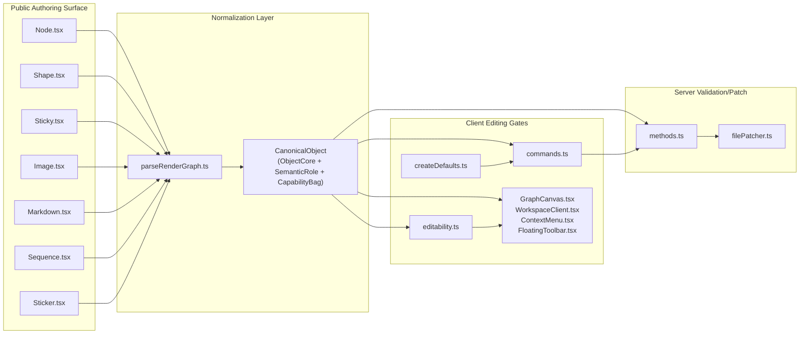
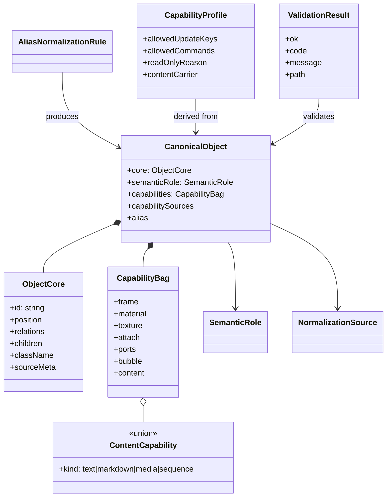
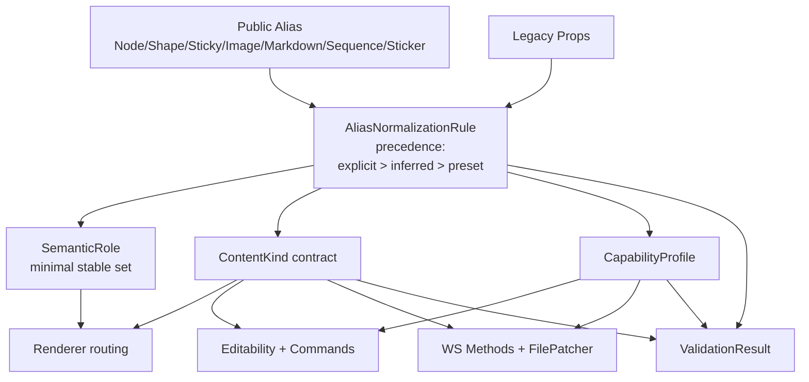

# Structure Reference: Object Capability Composition

This document is a reference-only visual guide for how the feature changes code structure and dependency flow.

## Implementation Status

- Canonical normalization, capability precedence, and legacy inference are implemented in `app/features/render/`.
- Client editability now prefers canonical capability/profile metadata over stored alias-family hints.
- WS patch/method flows now reject content-contract violations with explicit diagnostics.
- Public alias rendering remains intact while internal gates use canonical metadata first.

## Scope of Structural Change

The feature does not replace the public authoring surface. It moves the internal decision center from alias/tag-name branching to canonical object normalization plus capability/content-based routing.

Primary code areas affected:

- `libs/core/src/components/{Node,Shape,Sticky,Image,Markdown,Sequence,Sticker}.tsx`
- `app/features/render/parseRenderGraph.ts`
- `app/features/editing/{editability,commands,createDefaults}.ts`
- `app/ws/{methods,filePatcher}.ts`
- `app/components/{GraphCanvas.tsx,ContextMenu.tsx,FloatingToolbar.tsx}`
- `app/components/editor/{WorkspaceClient.tsx,workspaceEditUtils.ts}`

## Before vs After

### Before

- Public alias identity and JSX tag names tend to drive render, editability, and patch behavior.
- Legacy props and alias-specific defaults are interpreted in multiple places.
- Content contract and style capability boundaries are easy to blur.

### After

- Public aliases remain as authoring sugar.
- `parseRenderGraph.ts` normalizes alias input and legacy props into a canonical object model.
- `editability.ts`, `commands.ts`, `methods.ts`, and `filePatcher.ts` consume canonical metadata instead of alias identity.
- Content contracts remain strict for `media`, `markdown`, and `sequence`.

## Code Structure

## Domain Model

## Dependency Direction

## Key Policy Effects

- Public aliases stay, but they are no longer the internal source of truth.
- Legacy documents are normalized by inference instead of requiring upfront migration.
- Explicit user capability wins over alias preset defaults.
- `Sticky` keeps `sticky-note` semantic even if some sticky-default capabilities are removed.
- Content-kind mismatch is rejected explicitly instead of being silently repaired.
